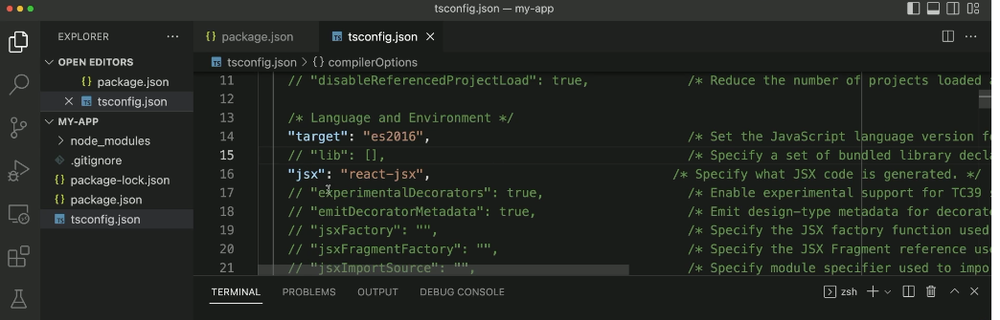
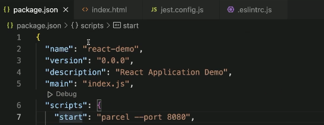

# 0. 프로젝트 세팅

## JavaScript 개발 환경 (Node.js) 세팅

```bash
fnm install --lts
fnm list
node -v
```

## TypeScript + React + Jest + ESLint + Parcel 개발 환경 세팅

먼저, 적절한 작업 폴더를 준비한다.

```bash
mkdir my-app
cd my-app
```

여기서 바로 Visual Studio Code를 열면 편하다.

```bash
code .
```

npm 패키지를 준비하는 게 첫 번째 작업.

```bash
npm init -y
```

잊지 말고 `.gitignore` 파일을 작성한다.  
최소한 `node_modules`를 통째로 커밋하는 황당한 일을 미연에 방지하자.

```jsx
touch .gitignore
```

[https://www.toptal.com/developers/gitignore/](https://www.toptal.com/developers/gitignore/)  
[https://github.com/github/gitignore/blob/main/Node.gitignore](https://github.com/github/gitignore/blob/main/Node.gitignore)

둘 중 어느 것으로 진행하더라도 괜찮지만 아래 내용이 포함되는지 꼭 확인 필수!

```bash
/node_modules/
/dist/
/.parcel-cache/
```

테스트 도구에 따라서 아래 항목도 추가

```text
#codeceptjs
/output/

#playwright
/test-results/
```

타입스크립트 설정

```jsx
npm i -D typescript

npx tsc --init
```

`tsconfig.json` 파일의 jsx 속성 변경한다.
jsx 부분 열어준다.



ESLint 설정

```jsx
npm i -D eslint

npx eslint --init
```

```jsx
✔ How would you like to use ESLint? · style // 마지막 3번째 
✔ What type of modules does your project use? · esm // 맨 위 
✔ Which framework does your project use? · react // 맨 위 
✔ Does your project use TypeScript? · No / Yes // 예스
✔ Where does your code run? · browser // 스페이스 누를 때마다 온오프 가능, 브라우저 선택
✔ How would you like to define a style for your project? · guide // 위에 것, 가이드
✔ Which style guide do you want to follow? · xo-typescript 
// 에어비앤비 스타일이 최근에 빠져서 XO
✔ What format do you want your config file to be in? · JavaScript // 자바스크립트
✔ Would you like to install them now? · No / Yes // 예스
✔ Which package manager do you want to use? · npm // npm
```

`.eslintrc.js` 파일의 `env`에 `jest`를 추가해준다.

```jsx
env: {
    es2021: true,
    node: true,
    jest: true,
  }
```

잊지 않고 `.eslintignore` 파일을 작성한다.

```jsx
touch .eslintignore
```

```bash
/node_modules/
/dist/
/.parcel-cache/
```

아니면 .gitignore에 있는거 통으로 복사해서 넣어도 됨.  

리액트 설치

```bash
npm i react react-dom

npm i -D @types/react @types/react-dom
```

테스팅 도구 설치

```bash
npm i -D jest @types/jest @swc/core @swc/jest \
    jest-environment-jsdom \
    @testing-library/react @testing-library/jest-dom
```

`jest.config.js` 파일을 작성해 테스트에서 SWC를 사용하자.

```bash
touch jest.config.js
```

```bash
module.exports = {
  testEnvironment: 'jsdom',
  setupFilesAfterEnv: [
    '@testing-library/jest-dom',
    './jest.setup', // <- 이런건 지금은 안 쓸 것임! 
  ],
  transform: {
    '^.+\\.(t|j)sx?$': ['@swc/jest', {
      jsc: {
        parser: {
          syntax: 'typescript',
          jsx: true,
          decorators: true,
        },
        transform: {
          react: {
            runtime: 'automatic',
          },
        },
      },
    }],
  },
  testPathIgnorePatterns: [
    '<rootDir>/node_modules/',
    '<rootDir>/dist/',
  ],
};
```

```bash
npx eslint .

npx eslint --fix .
```

Parcel 설치

```bash
npm i -D parcel
```

`package.json` 파일의 scripts를 적절히 수정한다.

```bash
"scripts": {
    "start": "parcel --port 8080",
    "build": "parcel build",
    "check": "tsc --noEmit",
    "lint": "eslint --fix --ext .js,.jsx,.ts,.tsx .",
    "test": "jest",
    "coverage": "jest --coverage --coverage-reporters html",
    "watch:test": "jest --watchAll"
  },
```



main 부분을 `"source": "index.html",` 로 바꿔준다.  

기본 코드 작성

- `index.html`
- `src/main.tsx`
- `src/App.tsx`
- `src/App.test.tsx`
- `src/components/Greeting.test.tsx`
- `src/components/Greeting.tsx`

### HTML, JSX 준비

```bash
touch index.html
```

```bash
mkdir src
```

```bash
touch src/main.tsx
```

eslintrc.js 파일로 가서 extends 부분으로 가서 순서를 좀 바꿔준다. + plugin 추가

```bash
extends: [
    'plugin:react/recommended',
    'plugin:react/jsx-runtime',
    'xo'
  ],
```

```bash
npm run lint
```

## Jest

```bash
touch src/main.test.ts
```

```bash
npm test
```

```bash
touch src/components/Greeting.test.tsx
```

## Parcel

`package.json` 파일에 source 속성 추가.

```bash
"source": "./index.html",
```

[https://github.com/elwin013/parcel-reporter-static-files-copy](https://github.com/elwin013/parcel-reporter-static-files-copy)

패키지 설치 후 `.parcelrc` 파일 작성.
이렇게 하면 static 폴더의 파일을 정적 파일로 Serving할 수 있다(이미지 등 Assets).

```bash
npm i -D parcel-reporter-static-files-copy
```

```bash
touch .parcelrc
```

```bash
{
  "extends": ["@parcel/config-default"],
  "reporters":  ["...", "parcel-reporter-static-files-copy"]
}
```

```bash
mkdir static
```

static 폴더 안에 images 폴더 만들고 삽입할 이미지 넣어주기!
가져다 쓸 때는 아래와 같이 가져다 쓰면 됨.

```html

```

빌드 + 정적 서버 실행

```tsx
npx parcel build
npx servor ./dist
```

## ESLint

```tsx
mkdir .vscode
touch .vscode/settings.json
```

```tsx
{
    "editor.rulers": [
        80
    ],
    "editor.codeActionsOnSave": {
        "source.fixAll.eslint": true
    },
    "trailing-spaces.trimOnSave": true
}
```
