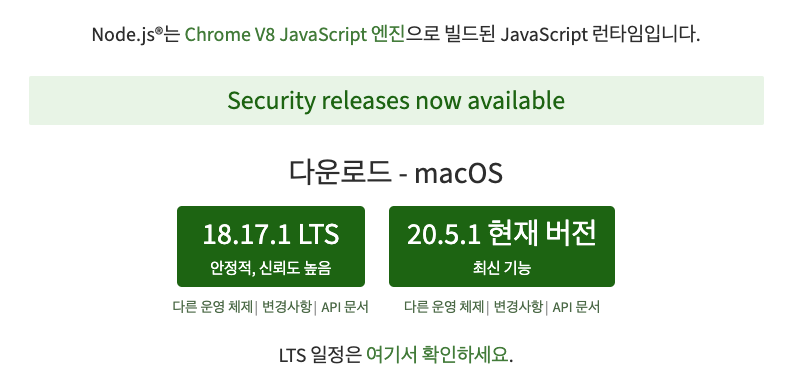
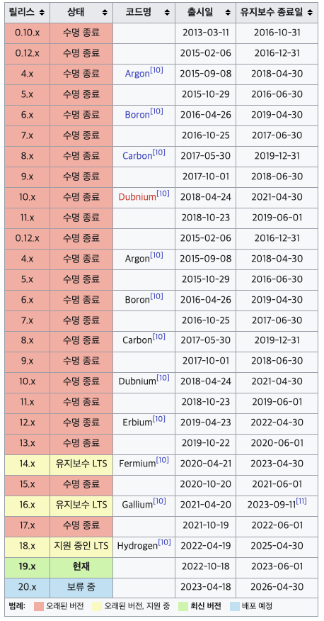
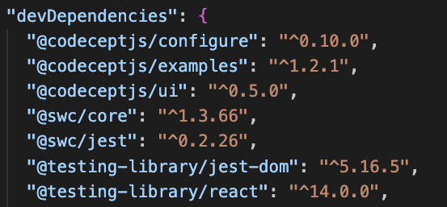
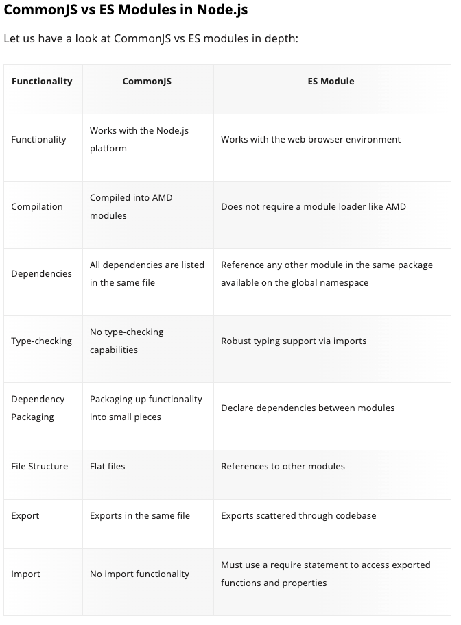

# 1. 개발 환경

## Node.js



[Node.js는 확장성 있는 네트워크 애플리케이션(특히 서버 사이드) 개발에 사용되는 소프트웨어 플랫폼](https://ko.wikipedia.org/wiki/Node.js)이다. 작성 언어로 [자바스크립트](https://ko.wikipedia.org/wiki/%EC%9E%90%EB%B0%94%EC%8A%A4%ED%81%AC%EB%A6%BD%ED%8A%B8)를 활용하며 논블로킹(Non-blocking) I/O와 단일 스레드 이벤트 루프를 통한 높은 처리 성능을 가지고 있다.

내장 HTTP 서버 라이브러리를 포함하고 있어 웹 서버에서 아파치 등의 별도의 소프트웨어 없이 동작하는 것이 가능하며 이를 통해 웹 서버의 동작에 있어 더 많은 통제를 가능케 한다.

[V8](https://ko.wikipedia.org/wiki/V8_(%EC%9E%90%EB%B0%94%EC%8A%A4%ED%81%AC%EB%A6%BD%ED%8A%B8_%EC%97%94%EC%A7%84))으로 빌드된 [이벤트](https://ko.wikipedia.org/wiki/%EC%9D%B4%EB%B2%A4%ED%8A%B8_%EA%B8%B0%EB%B0%98_%EC%95%84%ED%82%A4%ED%85%8D%EC%B2%98) 기반 [자바스크립트](https://ko.wikipedia.org/wiki/%EC%9E%90%EB%B0%94%EC%8A%A4%ED%81%AC%EB%A6%BD%ED%8A%B8) [런타임](https://ko.wikipedia.org/wiki/%EB%9F%B0%ED%83%80%EC%9E%84)이다.

### ****출시****

Node.js의 버전별 출시 및 관리는 규칙적인 주기를 가지고 이루어지고 있으며, v4 이후로 약 6개월 주기로 새로운 버전을 출시하고 있다. 이 중 짝수버전의 경우 장기지원 버전(LTS) 이라고 하여 별도의 코드명을 부여받으며, 약 3년간 유지보수 대상이 된다.



### **이 설명만 읽고서는 Node.js가 뭔지 감이 잘 안와서 쉬운 설명을 찾음!**

⇒ **HTML이라는 언어가 있다.** HTML은 그저 웹페이지를 만들 때 사용하는 언어이다. 웹페이지에 글, 그림, 버튼 이런 걸 넣을 때 사용한다.

그리고 **HTML과 함께 사용하는 JavaScript라는 언어가 있다.** JavaScript는 웹페이지를 움직이게 만들 때 사용하는 언어이다. HTML을 마음대로 조작해서 내용을 바꾸고, 클릭하면 움직이게 만들고 이런 게 가능하다. 그래서 자바스크립트를 사용하면 로그인 모달창, 애니메이션 메뉴 등을 만들 수 있다.

**Javascript 구동 엔진인 V8의 등장!**

크롬, 파이어폭스, 익스플로러 이런 브라우저들이 자바스크립트를 읽고 해석하는 역할을 한다. 자바스크립트를 빠르게 읽고 해석하면 웹사이트 렌더링 성능도 빨라지니 브라우저 개발자들은 자바스크립트를 해석할 수 있는 엔진 개발에 열성이었다. 그러다가 구글 사내에 있던 ‘크롬 브라우저 개발자’들이 엄청난 걸 만들게 된다. 자바스크립트 해석 엔진인 V8이라는 프로그램을 만들었는데 성능이 너무나도 뛰어난 나머지 V8을 자랑하려고 이것만 똑 떼어서 살을 붙여 출시하게 된다. 그리고 그것을 Node.js라고 이름 붙인다.

### **Node.js를 한 줄 요약하자면!!!**

자바스크립트를 브라우저 말고도 로컬 PC에서도 실행시켜줄 수 있는 실행창(런타임)이다. Node.js를 실행하면 자바스크립트 입력란이 하나가 뜨게 되고 그곳에 자바스크립트를 입력하면 바로바로 해석해서 실행시켜준다. 그게 Node.js의 끝이다.

## NPM(Node Package Manager)


**npm**(노드 패키지 매니저/Node Package Manager)은 [자바스크립트](https://ko.wikipedia.org/wiki/%EC%9E%90%EB%B0%94%EC%8A%A4%ED%81%AC%EB%A6%BD%ED%8A%B8) 프로그래밍 언어를 위한 [패키지 관리자](https://ko.wikipedia.org/wiki/%ED%8C%A8%ED%82%A4%EC%A7%80_%EA%B4%80%EB%A6%AC%EC%9E%90)이다. 자바스크립트 런타임 환경 [Node.js](https://ko.wikipedia.org/wiki/Node.js)의 기본 패키지 관리자이다. 명령 줄 클라이언트(npm), 그리고 공개 패키지와 지불 방식의 개인 패키지의 [온라인 데이터베이스](https://ko.wikipedia.org/w/index.php?title=%EC%98%A8%EB%9D%BC%EC%9D%B8_%EB%8D%B0%EC%9D%B4%ED%84%B0%EB%B2%A0%EC%9D%B4%EC%8A%A4&action=edit&redlink=1)(npm 레지스트리)로 이루어져 있다. 이 레지스트리는 클라이언트를 통해 접근되며 사용 가능한 패키지들은 npm 웹사이트를 통해 찾아보고 검색할 수 있다. 패키지 관리자와 레지스트리는 npm사에 의해 관리된다.

### **[About npm Company](https://www.npmjs.com/)**

npm은 2014년에 설립된 회사로 2020년에 GitHub에 인수되었다. npm은 JavaScript 커뮤니티의 중요한 부분이며 세계에서 가장 큰 개발자 생태계 중 하나를 지원하는 데 도움이 된다.

npm은 Node.js의 패키지 관리자이다. JavaScript 개발자가 패키지화된 코드 모듈을 쉽게 공유할 수 있도록 지원하기 위해 2009년에 오픈 소스 프로젝트로 만들어졌다.

npm 레지스트리는 Node.js, 프런트엔드 웹 앱, 모바일 앱, 로봇, 라우터 및 JavaScript 커뮤니티의 수많은 기타 요구 사항을 위한 오픈 소스 코드 패키지의 공개 모음이다.

npm은 개발자가 이러한 패키지를 설치 및 게시할 수 있는 명령줄 클라이언트다.

### npm 좀 더 쉽게 이해하기

LEGO 브릭으로 무엇인가를 만든다고 상상해보자. 필요한 모든 조각을 손으로 만들 수 있지만 많은 시간과 노력이 필요하다. 그래서 우리는 기성품 LEGO 부품을 구입할 수 있는 상점에 방문할 것이다. 이 상점이 컴퓨터 프로그램의 npm(Node Package Manager)과 같다. npm은 코드를 위한 거대한 온라인 상점과 같다.

프로그래밍의 세계에서 개발자는 서로 맞는 레고 조각처럼 특정 작업을 수행하는 작은 코드 조각을 만든다. 프로그래밍에서는 이러한 조각을 “패키지”라고 한다.

npm은 개발자가 이러한 코드 패키지를 쉽게 찾고 사용할 수 있게 해주는 도구이다. 필요한 특정 패키지를 검색할 수 있는 상점과 같다.

처음부터 모든 것을 작성하는 대신 개발자는 npm을 사용하여 필요한 작업을 이미 수행하는 패키지를 찾을 수 있다. 상점에서 LEGO 조각을 얻는 것과 마찬가지로 npm에서 패키지를 받아 프로그램의 일부를 빠르게 빌드할 수 있다.

⇒ npm은 프로그래머가 사전 제작된 코드 패키지를 신속하게 찾고 설치하고 사용할 수 있도록 도와주는 환상적인 도구이다. 상점에서 LEGO 브릭을 조립하는 것처럼 소프트웨어 구축 프로세스를 더 빠르고 쉽고 협력적으로 만들 수 있다.

### [아직도 잘 모르겠다. Node.js랑 npm이 무슨 관련이 있는걸까? 더 쉬운 설명](https://www.zerocho.com/category/NodeJS/post/57387cb8715202c8679b3af1)

Node.js와 뗄레야 뗄 수 없는 관계로 npm이라는 것이 있다. npm은 node package manager의 줄임말이다. Node.js에서는 자주 쓰이고 재사용되는 자바스크립트 코드들을 패키지로 만들어서 사용할 수 있다. 그러한 패키지를 모아놓은 저장소가 npm이다. 만약 자바스크립트로 무언가를 만들고 싶은데 귀찮거나, 너무 어려워서 만들지 못하겠다면 npm 홈페이지에 가서 쇼핑하듯 미리 만들어져 있는 패키지를 고르면 된다.
Node.js를 설치하면 자동으로 npm이 설치된다. `npm -v`로 버전을 체크할수도 있다. 버전은 사람마다 다를 수 있다. 버전이 좀 낮다 싶으면 최신 버전으로 업데이트도 가능하다. 웬만해서는 최신 버전이 좋다. 버전 업데이트는 `npm update -g npm` 하면 된다.
이제 다른 사람의 패키지들을 `npm install [패키지 이름]` 이라는 명령어로 cmd에서 설치할 수 있다.

## package.json / package-lock.json

### [package.json이란?](https://docs.npmjs.com/cli/v9/configuring-npm/package-json)



소프트웨어가 작동하는 데 필요한 모든 코드(패키지)를 나열하는 프로젝트의 특수 파일이다. 프로젝트가 의존하는 코드 패키지의 이름과 버전이 나열된다.

### [package-lock.json이란?](https://docs.npmjs.com/cli/v9/configuring-npm/package-lock-json)

package-lock.json은 npm이 node_modules 트리 또는 package.json을 수정하는 모든 작업에 대해 자동으로 생성된다. 이 파일은 생성된 정확한 트리를 설명하므로 후속 설치에서 중간 종속성 업데이트에 관계없이 동일한 트리를 생성할 수 있다.

이 파일은 소스 리포지토리에 커밋하기 위한 것으로, 다양한 용도로 사용된다:

팀원, 배포 및 지속적 통합이 정확히 동일한 종속성을 설치하도록 종속성 트리의 단일 표현을 설명한다.

사용자가 디렉터리 자체를 커밋하지 않고도 node_modules의 이전 상태로 '시간 여행'할 수 있는 기능 제공.

읽기 쉬운 소스 제어 Diff를 통해 트리 변경 사항에 대한 가시성을 높인다.

npm이 이전에 설치된 패키지에 대해 반복되는 메타데이터 확인을 건너뛸 수 있도록 하여 설치 프로세스를 최적화한다.

npm v7부터 잠금 파일에는 패키지 트리를 전체적으로 파악할 수 있는 충분한 정보가 포함되어 패키지.json 파일을 읽을 필요성이 줄어들고 성능이 크게 향상된다.

⇒ package-lock.json에는 각 패키지에 대한 구체적인 세부 정보가 포함되어 있다. 사용 중인 버전, 출처 및 의존하는 다른 패키지 등

package-lock.json은 프로젝트가 어디에서 실행되든 항상 정확히 동일한 버전의 패키지를 사용하도록 한다.

package-lock.json을 공유하면 프로젝트에서 작업하는 모든 사람이 정확히 동일한 버전의 패키지를 사용하고 있는지 확인할 수 있다.

모든 사람이 사용 중인 패키지 버전을 정확하게 알고 있기 때문에 예상치 못한 문제를 방지하고 실수로 패키지를 업데이트하는 것을 방지할 수 있다.

### ****[Package.json과 Package-lock.json의 차이를 아시나요?](https://velog.io/@songyouhyun/Package.json과-Package-lock.json의-차이)****

### package.json 이해가 잘 됐던 설명

`https://www.zerocho.com/category/NodeJS/post/57387cb8715202c8679b3af1`

`https://www.zerocho.com/category/NodeJS/post/5825a3caaff5c70018279975`

npm에서 패키지를 사용할 것이라면 패키지들을 체계적으로 관리할 필요가 있다. 실제 서비스에서는 패키지를 수십, 수백 개 가량 다운받게 되기 때문에 각각의 패키지에 대한 버전을 기록해야 한다. 버전이 중요한 이유는 버전이 업그레이드 되면서 이전 버전과 호환이 안 될 수도 있기 때문이다. 그래서 패키지명과 함께 패키지 버전도 함께 기록할 필요가 있다. 그 역할을 하는 게 package.json 파일이다. npm은 package.json을 보고 '이 프로젝트는 이런 패키지를 필요로 하는구나'하고 알아차린다.
package.json을 만드는 방법은 두 가지가 있다.
하나는 그냥 직접 만드는 것이고 다른 하나는 cmd에 `npm init` 명령어를 치는 것이다.

### package-lock.json 이해가 잘 됐던 설명

`https://handhand.tistory.com/273`

## node_modules

npm을 통해 프로젝트를 생성하게 되면, node_modules라는 디렉토리가 생성되는데, package.json에는 현재 프로젝트가 의존하고 있는 모듈들에 대한 정보가 나와있고, node_modules 디렉토리 안에는 package.json에 있는 모듈과 그 모듈들이 의존하고 있는 모든 모듈들을 포함하고 있다. 그래서 node_modules 디렉토리 안에는 모듈들의 의존성에 의해 정말 많은 모듈들이 포함되게 된다. npm으로 새로운 모듈을 설치하게 되면 자동으로 package.json과 node_modules에 추가되게 된다.

package-lock.json은 node_modules에 대한 정보를 가지고 있는데, package-lock.json이 업데이트 되는 시점에 node_modules를 재생성할 수 있다. 그래서 package-lock.json 파일이 있다면 `npm install` 로 package.json, package-lock.json에 있는 모듈들이 새로 업데이트 되는 동시에, node_modules가 새로 생성되어, 각 파일이 가지고 있는 모듈의 버전을 동일하게 맞출 수 있게 되는 것이다.

package-lock.json의 모든 모듈의 버전은 `npm install` 을 수행하는 시점에 따라 달라지게 된다. `npm install` 을 수행하는 시점에 업데이트 되어있는 모듈의 저번으로 업데이트가 된다. 이렇게 되면 package.json과 package-lock.json에 있는 모듈이 같은 버전으로 업데이트가 되고, 이때 package-lock.json에 있는 모듈 정보 때문에 node_modules가 재생성되어, 3개의 파일에 있는 모듈이 모두 같은 버전으로 맞춰지게 되어 오류가 안나게 된다.

이러한 이유로 node_modules는 git에 커밋할 경우 빠질 수 있는 파일이지만, package.json과 package-lock.json은 같이 커밋해야 한다.

⇒ node_modules는 실제 코드 패키지(종속성)가 저장되는 곳이다. package.json 파일을 기반으로 자동 생성되며 프로젝트에서 사용하는 도구를 포함한다.

## npx (Node Package eXecute)

### **[npm과 npx의 차이에 대해서](https://ljh86029926.gitbook.io/coding-apple-react/undefined/npm-npx) - 글로벌 모듈을 설치하지 않기 위한 몸부림**

#### 글로벌 모듈은 혼란스럽다

npm을 통해서 모듈을 설치할 때, 한 가지 옵션을 주게 되면 매 프로젝트마다 모듈을 설치해 줄 필요가 없고 그저  내 컴퓨터 안에 글로벌한 공간에 모듈을 설치해 프로젝트마다 같은 모듈을 공유해서 사용할 수 있다.
바로 -g 옵션인데, 사용 방법도 꽤 간단하다.

```tsx
npm install 모듈이름 -g
```

-g를 붙여주기만 하면 글로벌 모듈을 설치할 수 있다.

#### **그러나 이는 좋은 방법이 아니다. why?**

1. 모듈이 업데이트 되었는지 안되었는지 확인이 불가능하다.

    모든 프로젝트마다 모듈을 재설치 하는 것이 아닌, 한 번 설치한 모듈을 그대로 사용하기 때문에 프로그래머가 의식해서 글로벌 모듈을 최신 버전으로 재설치하지 않으면 확인이 어렵다.

2. 업데이트를 진행했을 때 변동사항이 생겨 다른 프로젝트에도 영향을 끼칠 수 있습니다.

    프로젝트 3개를 운영하는데, 같은 모듈의 각각 다른 버전이 필요한 상황이 있을 수 있다. 이럴 때 글로벌 모듈의 버전은 당연히 한 개이기 때문에 문제가 발생하게 된다.

3. create-react-app 같은 보일러플레이트에 치명적이다.

    리액트 프로젝트 생성 도구인 create-react-app 같은 모듈의 경우, 변경사항이 꽤나 잦은 모듈이다. 그렇기 때문에 매 설치 전마다 npm으로 재설치를 하지 않는 경우에는 이전 버전을 사용할 여지가 꽤 있다. 이런 프로젝트 생성 모듈은 매 업데이트마다 새로운 기능과 다양한 버그들이 고쳐진다. 그리고 이런 보일러플레이트 같은 경우에는, 항상 최신 버전을 유지해 주는 것이 좋은데, 매번 설치하는 것은 꽤나 귀찮은 일이다.

#### 해결책, npx

npm 5.2버전부터, npx가 기본 패키지로 제공되기 시작했다. npx도 모듈의 일종이다. 이 모듈은 npm을 통해 모듈을 로컬에 설치했어야 실행시킬 수 있었던 기존 문제점의 해결책이 되었다. 모듈을 로컬에 저장하지 않고, 매번 최신 버전의 파일만을 임시로 불러와 실행 시킨 후에, 다시 그 파일은 없어지는 방식으로 모듈이 돌아가고 있다.

#### npx는 어디에 효과적일까?

create-react-app같은 보일러 플레이트 모듈에 효과적이다. npx를 통해 create-react-app을 설치할 경우에는 매번 최신 버전만을 가져와서 설치해 주기 때문에 지금 어떤 버전을 사용하고 있는지 신경 쓸 필요가 없어진다. 어차피 최신 버전만을 사용할테니까!

#### 요약하자면

프로젝트 내에서 패키지를 설치, 업데이트 및 관리하려면 주로 npm을 사용한다.

전역 또는 로컬 설치 없이 일회성 명령을 실행하고 싶을 때는 npx를 사용한다.

npm : 패키지 관리자, 전역적

npx : 패키지 실행자, 일회성

#### ****[Yes, it’s npx, not npm — the difference explained](https://javascript.plainenglish.io/yes-its-npx-not-npm-the-difference-explained-58cbb202ec33)****

## [ES Modules vs CommonJS](https://www.knowledgehut.com/blog/web-development/commonjs-vs-es-modules#which-one-is-better,-commonjs-or-es?%C2%A0)



함수들끼리 데이터를 공유하고 싶다면 어떻게 해야할까? 전역 scope에 해당 데이터를 둔다면 다른 내부 요소에 의해 망가질 수도 있고, 순서가 뒤엉켜 전역 scope의 요소가 존재하지 않을 수도 있다.

따라서 모듈이라는 방식을 이용하면 각각 필요한 모듈을 import하여 사용함으로써 어디에서 에러가 나는지 파악하기 쉽다. 모듈을 만들고 import, export 하는 시스템을 모듈 시스템이라 하는데 현재 2가지의 모듈 시스템이 활발하게 사용되고 있다.

- CommonJS란?
  - NodeJS 에코 시스템 내의 기본 모듈 시스템이다.
  - Node.js용 JavaScript 코드를 패키징하는 원래 방식이다.
  - 로딩 패러다임 측면에서 모듈은 동기식으로 로드되며 JavaScript 런타임이 모듈을 찾은 순서와 동일한 순서로 처리된다.
  - require가 동기로 이루어지므로 promise를 return 하지 않는다.
  - 따라서 CommonJS는 실행해보아야 import, export 에러를 감지할 수 있다.
  - require()을 사용한다.

```tsx
const module = require('어쩌구');
const { func } = require('어쩌구');

module.exports = '어쩌구'; // default exports
module.exports.func = () => {}; // named exports
```

- ES modules
  - ES modules 사용 형식은 재사용성을 극대화하기 위해 JavaScript를 작성하는 공식 표준이며 대부분의 웹 브라우저에서 기본적으로 지원하는 형식이다.
  - 모듈을 비동기 환경에서 다운로드하며, import / export 구문을 찾아서 파싱한다.
  - 따라서 ES modules는 실행해보지 않아도 import, export 에러를 감지할 수 있다.
  - import export를 사용한다.

```tsx
import a from '어쩌구';
import {func} from '어쩌구';

export const a = '어쩌구'; // default exports
export default func = () => {}; // named exports
```

정리! 대표적인 두 가지의 모듈 시스템 중 CommonJS가 처음에 등장하였으나, 현재는 ES modules 모듈 시스템이 많이 사용되고 있다. CommonJS와 비교하여 ES modules는 비동기로 동작하여 속도가 빠르고 실제 사용되는 부분만을 import(tree shaking) 하여 메모리를 적게 차지하며, 가독성이 좋고 순환 의존성을 지원한다는 이점이 있다.
