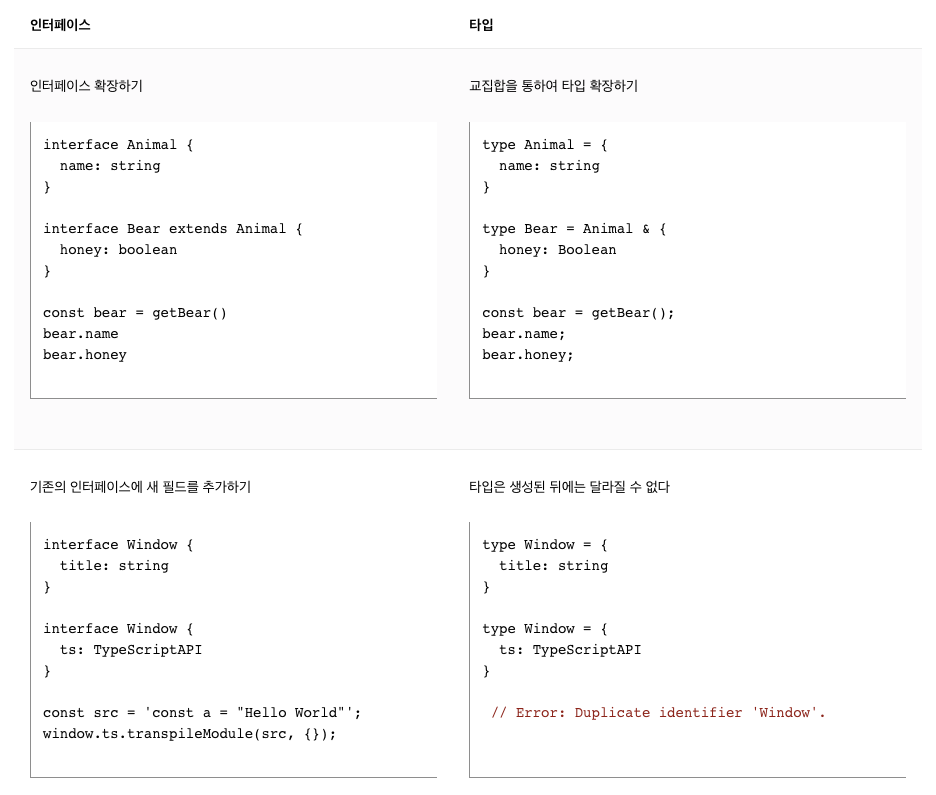

# 2. TypeScript

## [REPL](https://ko.wikipedia.org/wiki/REPL)

**REPL**(read-eval-print loop) 또는 **인터랙티브 톱레벨**(interactive toplevel), **랭기지 셸**(language shell)은 단일 사용자의 입력(예: 단일 [식](https://ko.wikipedia.org/wiki/%EC%8B%9D_(%ED%94%84%EB%A1%9C%EA%B7%B8%EB%9E%98%EB%B0%8D)))을 취하고 이를 평가(실행)하고 결과를 사용자에게 반환시키는 단순한 상호작용 [컴퓨터 프로그래밍](https://ko.wikipedia.org/wiki/%EC%BB%B4%ED%93%A8%ED%84%B0_%ED%94%84%EB%A1%9C%EA%B7%B8%EB%9E%98%EB%B0%8D) 환경이다. REPL 환경으로 작성된 프로그램은 구간마다 실행된다. 이 용어는 보통 클래식 [리스프 머신](https://ko.wikipedia.org/wiki/%EB%A6%AC%EC%8A%A4%ED%94%84_%EB%A8%B8%EC%8B%A0) 상호작용 환경과 유사한 프로그래밍 인터페이스를 의미하기도 한다. 일반적인 예로는 [프로그래밍 언어](https://ko.wikipedia.org/wiki/%ED%94%84%EB%A1%9C%EA%B7%B8%EB%9E%98%EB%B0%8D_%EC%96%B8%EC%96%B4)를 위한 [명령 줄](https://ko.wikipedia.org/wiki/%EB%AA%85%EB%A0%B9_%EC%A4%84_%EC%9D%B8%ED%84%B0%ED%8E%98%EC%9D%B4%EC%8A%A4) [셸](https://ko.wikipedia.org/wiki/%EC%85%B8) 및 유사 환경을 들 수 있으며 기법은 [스크립트 언어](https://ko.wikipedia.org/wiki/%EC%8A%A4%ED%81%AC%EB%A6%BD%ED%8A%B8_%EC%96%B8%EC%96%B4)의 특징과 매우 닮아있다.

## 용도

[셸](https://ko.wikipedia.org/wiki/%EC%85%B8)로서 REPL 환경을 통해 사용자가 운영 체제의 관련 기능에 접근할 수 있고 프로그래밍 기능에도 접근이 가능하다.

REPL은 새로운 언어를 학습하는데 필수적인 부분으로 되고 있는데, 초보자에게 빠른 피드백을 제공하기 때문이다.

## TypeScript : 타입에 대한 syntax가 있는 자바스크립트

**타입스크립트**(TypeScript)는 [자바스크립트](https://ko.wikipedia.org/wiki/%EC%9E%90%EB%B0%94%EC%8A%A4%ED%81%AC%EB%A6%BD%ED%8A%B8)의 슈퍼셋인 [오픈소스](https://ko.wikipedia.org/wiki/%EC%98%A4%ED%94%88_%EC%86%8C%EC%8A%A4_%EC%86%8C%ED%94%84%ED%8A%B8%EC%9B%A8%EC%96%B4) [프로그래밍 언어](https://ko.wikipedia.org/wiki/%ED%94%84%EB%A1%9C%EA%B7%B8%EB%9E%98%EB%B0%8D_%EC%96%B8%EC%96%B4)이다. [마이크로소프트](https://ko.wikipedia.org/wiki/%EB%A7%88%EC%9D%B4%ED%81%AC%EB%A1%9C%EC%86%8C%ED%94%84%ED%8A%B8)에서 개발, 유지하고 있으며 엄격한 문법을 지원한다. [C#](https://ko.wikipedia.org/wiki/C)의 리드 아키텍트이자 [델파이](https://ko.wikipedia.org/wiki/%EB%8D%B8%ED%8C%8C%EC%9D%B4), 터보 파스칼의 창시자인 Anders Hejlsberg가 개발에 참여한다.[[4]](https://ko.wikipedia.org/wiki/%ED%83%80%EC%9E%85%EC%8A%A4%ED%81%AC%EB%A6%BD%ED%8A%B8#cite_note-4) [클라이언트 사이드](https://ko.wikipedia.org/wiki/%ED%81%B4%EB%9D%BC%EC%9D%B4%EC%96%B8%ED%8A%B8_%EC%82%AC%EC%9D%B4%EB%93%9C)와 [서버 사이드](https://ko.wikipedia.org/wiki/%EC%84%9C%EB%B2%84_%EC%82%AC%EC%9D%B4%EB%93%9C)를 위한 개발에 사용할 수 있다.

타입스크립트는 자바스크립트 엔진을 사용하면서 커다란 애플리케이션을 개발할 수 있게 설계된 언어이다.[[5]](https://ko.wikipedia.org/wiki/%ED%83%80%EC%9E%85%EC%8A%A4%ED%81%AC%EB%A6%BD%ED%8A%B8#cite_note-5) 자바스크립트의 슈퍼셋이기 때문에 자바스크립트로 작성된 프로그램이 타입스크립트 프로그램으로도 동작한다.

타입스크립트에서 자신이 원하는 타입을 정의하고 [프로그래밍](https://ko.wikipedia.org/wiki/%ED%94%84%EB%A1%9C%EA%B7%B8%EB%9E%98%EB%B0%8D)을 하면 [자바스크립트](https://ko.wikipedia.org/wiki/%EC%9E%90%EB%B0%94%EC%8A%A4%ED%81%AC%EB%A6%BD%ED%8A%B8)로 컴파일되어 실행할 수 있다.

타입스크립트는 모든 [운영 체제](https://ko.wikipedia.org/wiki/%EC%9A%B4%EC%98%81_%EC%B2%B4%EC%A0%9C), 모든 [브라우저](https://ko.wikipedia.org/wiki/%EB%B8%8C%EB%9D%BC%EC%9A%B0%EC%A0%80), 모든 호스트에서 사용 가능한 [오픈 소스](https://ko.wikipedia.org/wiki/%EC%98%A4%ED%94%88_%EC%86%8C%EC%8A%A4)이다.

## [Interface vs Type](https://www.typescriptlang.org/ko/docs/handbook/2/everyday-types.html#%ED%83%80%EC%9E%85-%EB%B3%84%EC%B9%AD%EA%B3%BC-%EC%9D%B8%ED%84%B0%ED%8E%98%EC%9D%B4%EC%8A%A4%EC%9D%98-%EC%B0%A8%EC%9D%B4%EC%A0%90)

둘은 매우 유사하며, 대부분의 경우 둘 중 하나를 자유롭게 선택하여 사용할 수 있다. interface가 가지는 대부분의 기능은 type에서도 동일하게 사용 가능하다. 이 둘의 가장 핵심적인 차이는 타입은 새 프로퍼티를 추가하도록 개방될 수 없는 반면, 인터페이스의 경우 항상 확장될 수 있다는 점이다.



## 타입 추론

```tsx
let helloWorld = "Hello World";
//  ^?
```

TypeScript는 JavaScript 언어를 알고 있으며 대부분의 경우 타입을 생성해줄 것이다. 예를 들어 변수를 생성하면서 동시에 특정 값에 할당하는 경우, TypeScript는 그 값을 해당 변수의 타입으로 사용할 것이다.

JavaScript가 동작하는 방식을 이해함으로써 TypeScript는 JavaScript 코드를 받아들이면서 타입을 가지는 타입 시스템을 구축할 수 있다. 이는 코드에서 타입을 명시하기 위해 추가로 문자를 사용할 필요가 없는 타입 시스템을 제공한다. 이것이 위의 예제에서 TypeScript가 `helloWorld`가 `string`임을 알게 되는 방식이다.

## Union Type vs Intersection Type

### 유니언 (Unions)

유니언은 타입이 여러 타입 중 하나일 수 있음을 선언하는 방법이다. 예를 들어, `boolean` 타입을 `true` 또는 `false`로 설명할 수 있다.

```tsx
type MyBool = true | false;
```

### Intersection

여러 타입을 모두 만족하는 하나의 타입을 의미한다.

```tsx
type Combined = { a: number } & { b: string };
type Conflicting = { a: number } & { a: string };
```

## [Optional Parameter](https://www.typescripttutorial.net/typescript-tutorial/typescript-optional-parameters/)

자바스크립트에서는 함수에 매개변수가 지정되어 있어도 인수를 전달하지 않고 함수를 호출할 수 있다. 따라서 자바스크립트는 기본적으로 선택적 매개변수를 지원한다.

타입스크립트에서는 컴파일러가 모든 함수 호출을 검사하여 다음과 같은 경우 오류를 발생시킨다.

- 인수의 수가 함수에 지정된 매개변수의 수와 다른 경우
- 인수의 유형이 함수 매개변수의 유형과 호환되지 않는 경우
- 컴파일러는 전달되는 인수를 철저히 검사하므로 인수를 생략할 때 컴파일러가 오류를 발생시키지 않도록 선택적 매개변수에 주석을 달아야 한다.

함수 매개변수를 선택 사항으로 만들려면 매개변수 이름 뒤에 ?를 사용한다.

```tsx
function multiply(a: number, b: number, c?: number): number {

    if (typeof c !== 'undefined') {
        return a * b * c;
    }
    return a * b;
}
```

- 먼저 c 매개변수 뒤에 ? 를 사용한다.
- typeof c !== 'undefined' 식을 사용하여 인수가 함수에 전달되었는지 확인한다.

선택적 매개변수는 매개변수 목록에서 필수 매개변수 뒤에 표시되어야 한다.

예를 들어 b 매개 변수를 선택 사항으로 설정하고 c 매개 변수를 필수로 설정하면 TypeScript 컴파일러에서 오류가 발생한다.

```tsx
function multiply(a: number, b?: number, c: number): number {

    if (typeof c !== 'undefined') {
        return a * b * c;
    }
    return a * b;
}
```

Error

```tsx
error TS1016: A required parameter cannot follow an optional parameter.
```

**요약!!**

- 매개변수를 선택 사항으로 만드려면 parameter?: 유형 구문을 사용한다.
- 매개변수가 초기화되었는지 확인하려면 typeof(parameter) !== ‘undefined’ 식을 사용해라.
