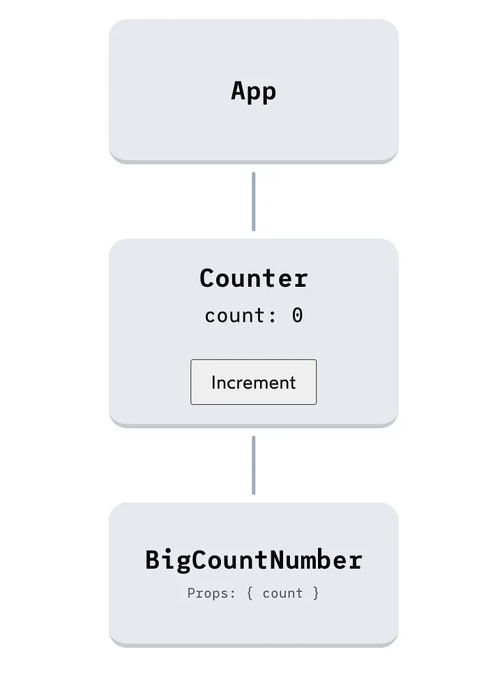
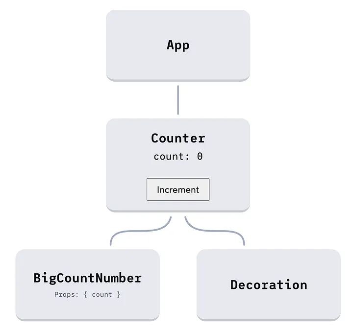

# React란?

**사용자 인터페이스를 만들기 위한 JavaScript 라이브러리**

[자바스크립트 라이브러리](https://ko.wikipedia.org/wiki/%EC%9E%90%EB%B0%94%EC%8A%A4%ED%81%AC%EB%A6%BD%ED%8A%B8_%EB%9D%BC%EC%9D%B4%EB%B8%8C%EB%9F%AC%EB%A6%AC)의 하나로서[[2]](https://ko.wikipedia.org/wiki/%EB%A6%AC%EC%95%A1%ED%8A%B8_(%EC%9E%90%EB%B0%94%EC%8A%A4%ED%81%AC%EB%A6%BD%ED%8A%B8_%EB%9D%BC%EC%9D%B4%EB%B8%8C%EB%9F%AC%EB%A6%AC)#cite_note-react-2) [사용자 인터페이스](https://ko.wikipedia.org/wiki/%EC%82%AC%EC%9A%A9%EC%9E%90_%EC%9D%B8%ED%84%B0%ED%8E%98%EC%9D%B4%EC%8A%A4)를 만들기 위해 사용된다. [페이스북](https://ko.wikipedia.org/wiki/%ED%8E%98%EC%9D%B4%EC%8A%A4%EB%B6%81)과 개별 개발자 및 기업들 공동체에 의해 유지보수된다.

리액트는 [싱글 페이지 애플리케이션](https://ko.wikipedia.org/wiki/%EC%8B%B1%EA%B8%80_%ED%8E%98%EC%9D%B4%EC%A7%80_%EC%95%A0%ED%94%8C%EB%A6%AC%EC%BC%80%EC%9D%B4%EC%85%98)이나 모바일 애플리케이션 개발에 사용될 수 있다. 대규모 또는 복잡한 리액트 애플리케이션 개발에는 보통 [라우팅](https://ko.wikipedia.org/wiki/%EC%9B%B9_%ED%94%84%EB%A0%88%EC%9E%84%EC%9B%8C%ED%81%AC), [API](https://ko.wikipedia.org/wiki/API) 통신 등의 기능이 요구되는데 리액트에는 기본적으로 제공되지 않기 때문에 추가 라이브러리를 사용해야 한다.

### 역사

리액트는 페이스북의 소프트웨어 엔지니어 Jordan Walke가 개발하였다. 그는 [PHP](https://ko.wikipedia.org/wiki/PHP)용 [HTML](https://ko.wikipedia.org/wiki/HTML) 컴포넌트 프레임워크인 [XHP](https://ko.wikipedia.org/w/index.php?title=XHP&action=edit&redlink=1)([영어판](https://en.wikipedia.org/wiki/XHP))에 영향을 받았다.[[8]](https://ko.wikipedia.org/wiki/%EB%A6%AC%EC%95%A1%ED%8A%B8_(%EC%9E%90%EB%B0%94%EC%8A%A4%ED%81%AC%EB%A6%BD%ED%8A%B8_%EB%9D%BC%EC%9D%B4%EB%B8%8C%EB%9F%AC%EB%A6%AC)#cite_note-8) 2011년 페이스북의 뉴스피드에 처음 적용되었다가 2012년 [인스타그램닷컴](https://ko.wikipedia.org/wiki/%EC%9D%B8%EC%8A%A4%ED%83%80%EA%B7%B8%EB%9E%A8)에 적용되었다.[[9]](https://ko.wikipedia.org/wiki/%EB%A6%AC%EC%95%A1%ED%8A%B8_(%EC%9E%90%EB%B0%94%EC%8A%A4%ED%81%AC%EB%A6%BD%ED%8A%B8_%EB%9D%BC%EC%9D%B4%EB%B8%8C%EB%9F%AC%EB%A6%AC)#cite_note-9) 2013년 5월 JSConf US에서 오픈 소스화되었다.

# React 컴포넌트

React는 컴포넌트를 중심으로 동작한다. 간단히 말하면, React에서 컴포넌트는 UI의 일부를 제어하는 재사용 가능한 코드이다. 컴포넌트는 애플리케이션을 논리적이고 재사용 가능한 부분으로 구성하는 데 도움을 준다. 

React에는 두 가지 종류의 컴포넌트가 있다. 함수형 컴포넌트와 클래스 컴포넌트이다. 두 컴포넌트 모두 props라고 불리는 입력 데이터를 받아들이고, 렌더 메서드를 통해 어떤 내용을 표시할지 반환할 수 있다. 

### 함수형 컴포넌트와 클래스 컴포넌트 생성하기

### 함수형 컴포넌트

가장 간단한 유형의 React 컴포넌트이다. React 요소를 반환하는 JavaScript 함수이다. 

```tsx
function Welcome(props) {
  return <h1>Hello, {props.name}</h1>;
}
```

이 예시에서 Welcome은 함수형 컴포넌트로, props를 인수로 받아 React 요소를 반환한다. 

### 클래스 컴포넌트

복잡하고 더 많은 기능을 제공한다. React.Component를 확장한 클래스로 선언되며, render 메서드를 포함해야 한다. 

```tsx
class Welcome extends React.Component {
  render() {
    return <h1>Hello, {this.props.name}</h1>;
  }
}
```

이 예시에서 Welcome은 클래스 컴포넌트이다. 

### 사용 시기 : 함수 컴포넌트 vs. 클래스 컴포넌트

React 함수 컴포넌트와 클래스 컴포넌트는 동일한 작업을 수행할 수 있지만 구문과 특정 기능 사용 방법에서 차이가 있다. React 16.8에서 훅(Hooks)이 도입되면서 클래스를 작성하지 않고도 상태와 다른 React 기능을 사용할 수 있게 되었다. 

함수 컴포넌트 :

- 이해하고 작성하기 쉬워서 가능한 한 많이 사용하는 것이 좋다. 클래스 컴포넌트보다 간결하다.
- useState, useEffect, useContext 등과 같은 React 훅을 사용하려면 함수 컴포넌트를 사용해야 한다. 훅은 클래스에서 동작하지 않는다.
- 프롭스를 전달받아 이를 기반으로 렌더링하는 컴포넌트를 생성하는 경우 함수 컴포넌트가 훌륭한 선택이다.

클래스 컴포넌트 : 

- 레거시 프로젝트나 이전 버전의 라이브러리에서 작업하는 경우 클래스 컴포넌트를 사용해야 할 때가 있다.
- 자식 컴포넌트 트리에서 발생한 오류를 잡아내고 처리하는 React의 ErrorBoundary 기능을 사용하려면 클래스 컴포넌트를 사용해야 한다.

일반적으로 React 커뮤니티와 React 개발자들은 함수 컴포넌트와 훅을 클래스 컴포넌트와 라이프 사이클 메서드보다 선호하는 함수형 접근 방식을 지향하고 있다. 그러나 기존 코드베이스에서는 여전히 클래스 컴포넌트가 일반적이므로 두 가지 접근 방식을 이해하는 것이 도움이 된다. 

# React 리렌더링..!

### [왜 리액트에서 리렌더링이 발생하는가](https://medium.com/@yujso66/%EB%B2%88%EC%97%AD-%EC%99%9C-%EB%A6%AC%EC%95%A1%ED%8A%B8%EC%97%90%EC%84%9C-%EB%A6%AC%EB%A0%8C%EB%8D%94%EB%A7%81%EC%9D%B4-%EB%B0%9C%EC%83%9D%ED%95%98%EB%8A%94%EA%B0%80-74dd239b0063)

**리액트의 모든 리렌더링은 상태 변경에서 시작된다.** 이것은 리액트가 컴포넌트를 다시 리렌더링하는 유일한 “트리거”이다.

*지금은 없지만 이전에는 리렌더를 트리거하는 “forceUpdate()”라는 메서드가 존재했었다.*

컴포넌트가 리렌더링 될 때 모든 하위 요소들도 다시 렌더링된다. 

```jsx
import React from "react";

function App() {
  return (
    <>
      <Counter />
      <footer>
        <p>Copyright 2022 Big Count Inc.</p>
      </footer>
    </>
  );
}

function Counter() {
  const [count, setCount] = React.useState(0);

  return (
    <main>
      <BigCountNumber count={count} />
      <button onClick={() => setCount(count + 1)}>Increment</button>
    </main>
  );
}

function BigCountNumber({ count }) {
  return (
    <p>
      <span className="prefix">Count:</span>
      {count}
    </p>
  );
}

export default App;
```

이 예제에서 3개의 컴포넌트를 확인할 수 있다. `BigCountNumber`, `BigCountNumber`를 렌더링 하는 `Counter`, `Counter`를 렌더링하는 상단의 `App`.

리액트에서 모든 상태 변수는 특정 컴포넌트 인스턴스에 연결되어 있다. 이 예제에서는 `Counter` 컴포넌트와 연결된 단일 상태 `count`가 있다.

`count`가 변경될 때마다 `Counter`가 다시 렌더링 된다. 그리고 `BigCountNumber`는 `Counter`에 의해 렌더링되기 때문에 역시 다시 렌더링 된다.

다음은 이 메커니즘의 실제 동작을 보여주는 **대화형 그래프이**다. “Increment” 버튼을 클릭하면 상태 변경이 트리거 된다. `Counter` 컴포넌트가 리렌더링되고 `BigCountNumber` 도 리렌더링 된다.



**첫 번째 큰 오해**는 **상태 변수가 변경될 때마다 전체 앱이 리렌더링된다.** 이다. 이 오해에 대해 알아보자.

리렌더링은 상태를 가지고 있는 컴포넌트와 해당 컴포넌트의 하위 컴포넌트에만 영향을 준다. 이 예제에서 `App` 컴포넌트는 `count` 상태 변수가 변경될 때 리렌더링할 필요가 없다.

리액트의 “주요 작업”은 애플리케이션 UI를 리액트 상태와 동기화하여 유지하는 것이다. 리렌더링의 요점은 **변경해야 할 사항을 파악**하는 것이다.

위의 “Counter” 예제를 살펴본다. 애플리케이션이 처음 마운트되면 리액트는 모든 컴포넌트를 렌더링하고 DOM이 어떻게 생겼는지에 대한 다음 스케치를 제공한다.

```jsx
<main>
  <p>
    <span class="prefix">Count:</span>
    0
  </p>
  <button>Increment</button>
</main>
<footer>
  <p>Copyright 2022 Big Count Inc.</p>
</footer>
```

사용자가 버튼을 클릭하면 `count` 상태 변수가 `0`에서 `1`로 바뀝니다. 이것이 UI에 어떤 영향을 줄까? 또 다른 렌더링을 확인하여 배울 수 있다!

리액트는 `Counter` 및 `BigCountNumber` 컴포넌트에 대한 코드를 다시 실행하고 원하는 DOM의 새 스케치를 생성한다.

```jsx
<main>
  <p>
    <span class="prefix">Count:</span>
    1
  </p>
  <button>Increment</button>
</main>
<footer>
  <p>Copyright 2022 Big Count Inc.</p>
</footer>
```

각각의 렌더링 결과는 카메라로 찍은 사진과 같은 스냅샷으로, 현재 애플리케이션 상태를 기반으로 UI가 어떻게 생겼는지 보여준다.

리액트는 “차이점 찾기” 게임을 하여 이 두 스냅샷 간에 변경된 사항을 파악한다. 이 경우 `0`에서 `1`로 변경된 텍스트 노드가 있음을 확인하고 스냅샷과 일치하도록 텍스트 노드를 편집한다. 작업이 완료되면 리액트는 다음 상태 변경을 기다린다.

**이것이 리액트의 핵심 루프다.**

이 프레임을 염두에 두고 렌더링 그래프를 다시 살펴보자.

`count` 상태는 `Counter` 컴포넌트와 연결되어 있다. 리액트 애플리케이션에서 데이터는 “위로” 전달될 수 없기 때문에 이 상태 변경이 `<App />`에 영향을 줄 수 없다는 것을 알고 있다. 따라서 해당 컴포넌트를 다시 렌더링할 필요가 없다.

하지만 `Counter`의 자식 `BigCountNumber`를 다시 렌더링해야 한다. 실제로 `count` 상태를 표시하는 컴포넌트다. 렌더링하지 않으면 텍스트 노드가 `0`에서 `1`로 변경되어야 한다는 것을 알 수 없다. 스케치에 이 컴포넌트를 포함해야 한다.

리렌더링의 요점은 상태 변경이 사용자 인터페이스에 어떻게 영향을 미치는지 파악하는 것이다. 따라서 정확한 스냅샷을 얻으려면 잠재적으로 영향을 받을 수 있는 모든 컴포넌트를 다시 렌더링해야 한다.

### **props 때문이 아니다.**

**두 번째 큰 오해**는 **컴포넌트는 props가 변경되기 때문에 다시 렌더링된다.** 이다.

아래 코드에서 “Counter” 앱에 새로운 컴포넌트 `Decoration`이 추가되었다.

```jsx
import React from "react";

import Counter from "./Counter";

function App() {
  return (
    <>
      <Counter />
      <footer>
        <p>Copyright 2022 Big Count Inc.</p>
      </footer>
    </>
  );
}

export default App;
```

```jsx
function BigCountNumber({ count }) {
  return (
    <p>
      <span className="prefix">Count:</span>
      {count}
    </p>
  );
}

export default BigCountNumber;
```

```jsx
import React from "react";

import Decoration from "./Decoration";
import BigCountNumber from "./BigCountNumber";

function Counter() {
  const [count, setCount] = React.useState(0);

  return (
    <main>
      <BigCountNumber count={count} />
      <button onClick={() => setCount(count + 1)}>Increment</button>

      {/* 👇 새로운 친구 👇 */}
      <Decoration />
    </main>
  );
}

export default Counter;
```

```jsx
function Decoration() {
  return <div className="decoration">⛵️</div>;
}

export default Decoration;
```



카운터에는 Decoration 컴포넌트는 count에 의존하지 않으므로 count가 변경될 때 다시 렌더링되지 않을 것이다? 그렇지 않다!

컴포넌트가 다시 렌더링되면 props를 통해 특정 상태 변수가 전달되는지 여부에 관계없이 모든 하위 컴포넌트를 다시 렌더링하려고 시도한다. 

생각했던 것과 다르다.. <Decoration>에 props로 count를 전달하지 않는데 왜 다시 렌더링 해야할까?

리액트에서 <Decoration>이 count 상태 변수에 직간접적으로 의존하는지 여부를 100% 확실하게 아는 것은 어렵다. 이것이 앞의 질문에 대한 답이다.
# IoC(Inversion of Control) : 제어의 역전

**제어 반전**, **제어의 반전**, **역제어**는 프로그래머가 작성한 프로그램이 재사용 라이브러리의 [흐름 제어](https://ko.wikipedia.org/wiki/%ED%9D%90%EB%A6%84_%EC%A0%9C%EC%96%B4)를 받게 되는 [소프트웨어 디자인 패턴](https://ko.wikipedia.org/wiki/%EC%86%8C%ED%94%84%ED%8A%B8%EC%9B%A8%EC%96%B4_%EB%94%94%EC%9E%90%EC%9D%B8_%ED%8C%A8%ED%84%B4)을 말한다. 줄여서 **IoC**(Inversion of Control)이라고 부른다. 전통적인 프로그래밍에서 흐름은 프로그래머가 작성한 프로그램이 외부 라이브러리의 코드를 호출해 이용한다. 하지만 제어 반전이 적용된 구조에서는 외부 라이브러리의 코드가 프로그래머가 작성한 코드를 호출한다. 설계 목적상 제어 반전의 목적은 다음과 같다:

- 작업을 구현하는 방식과 작업 수행 자체를 분리한다.
- 모듈을 제작할 때, 모듈과 외부 프로그램의 결합에 대해 고민할 필요 없이 모듈의 목적에 집중할 수 있다.
- 다른 시스템이 어떻게 동작할지에 대해 고민할 필요 없이, 미리 정해진 협약대로만 동작하게 하면 된다.
- 모듈을 바꾸어도 다른 시스템에 부작용을 일으키지 않는다.

IoC는 소프트웨어 시스템에서 종속성의 제어 및 관리를 외부화하는 것을 강조하는 소프트웨어 설계 원칙이다. React는 props와 context를 사용하여 component-based architecture 내에서 관심사의 분리와 데이터 및 종속성의 외부 관리를 촉진하여 IoC의 원칙에 부합한다.

React는 reactive view update 라는 의미를 가진 라이브러리다. 상태의 변화가 일어나면 자동으로 view를 업데이트하기 때문이다. 

React는 자동으로 view를 업데이트 하기 위해 다음과 같은 부분에서 IoC를 적용하였다.

1. 어떤 방식으로 view를 업데이트 할 것인가
2. 언제 view를 업데이트 할 것인가 

우리는 React 환경에서 view가 무엇을 하는지 정의하지 않고 view가 어떻게 보일지를 선언한다. 어떻게 보일지만 선언하면 언제, 어떻게 render하는지는 신경쓰지 않아도 되는 것이다. 

[제어의 역전](https://martinfowler.com/bliki/InversionOfControl.html)(IoC: Inversion of Control)이 Framework의 주요한 특징이고, React는 IoC를 통해 상태와 업데이트가 얽힌 복잡한 상황을 간단히 선언형 UI로 구성하는 혜택을 누린다(이게 바로 React의 첫 번째 특징이다). 그 누구도 매번 root를 render하는 방식으로 쓰면서 “이게 라이브러리지!”라며 감탄하지 않는다.

# Library vs Framework

### 라이브러리란? 단순 활용이 가능한 도구들의 집합

특정 기능에 대한 도구 or 함수들을 모든 집합이다. 즉, 프로그래머가 개발하는데 필요한 것들을 모아둔 것이다. 

### 프레임워크란? 소프트웨어의 특정 문제를 해결하기 위해서 상호 협력하는 클래스와 인터페이스의 집합

프레임워크는 뼈대나 기반구조를 뜻하는데 Application 개발 시 필수적인 코드, 알고리즘, 데이터베이스 연동 등과 같은 기능들을 위해 어느정도 뼈대(구조)를 제공해주는 것이다. 그러므로 그러한 뼈대 위해 프로그래머가 코드를 작성하여 Application을 완성시켜야 한다. 어느 정도 뼈대를 제공해주기 때문에 객체 지향 개발을 하면서 일관성 부족 등의 문제를 해결해준다. 

### 프레임워크와 라이브러리의 차이 - Inversion Of Control

Framework와 Library의 차이는 Flow(흐름)에 대한 제어 권한이 어디에 있느냐의 차이다. 프레임워크는 전체적인 흐름을 자체적으로 가지고 있으며, 프로그래머가 그 안에 필요한 코드를 작성하는 반면에 라이브러리는 사용자가 흐름에 대해 제어를 하며 필요한 상황에 가져다 쓰는 것이다. 

⇒ 프레임워크에는 제어의 역전(Inversion Of Control)이 적용되어 있다는 것이다.
