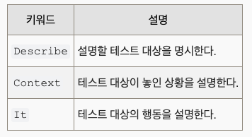
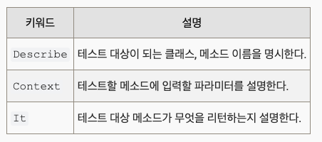

# 4. Testing Library

## Jest

**제스트**`(Jest)`[[1]](https://ko.wikipedia.org/wiki/%EC%A0%9C%EC%8A%A4%ED%8A%B8_(%ED%94%84%EB%A0%88%EC%9E%84%EC%9B%8C%ED%81%AC)#cite_note-1)는 [메타](https://ko.wikipedia.org/wiki/%EB%A9%94%ED%83%80_(%EA%B8%B0%EC%97%85))(구 페이스북)가 [유지보수](https://ko.wikipedia.org/wiki/%EC%86%8C%ED%94%84%ED%8A%B8%EC%9B%A8%EC%96%B4_%EC%9C%A0%EC%A7%80%EB%B3%B4%EC%88%98)하는 [재스민](https://ko.wikipedia.org/w/index.php?title=%EC%9E%AC%EC%8A%A4%EB%AF%BC_(%EC%86%8C%ED%94%84%ED%8A%B8%EC%9B%A8%EC%96%B4)&action=edit&redlink=1) 위에서 빌드되는 테스팅 프레임워크이다.[[2]](https://ko.wikipedia.org/wiki/%EC%A0%9C%EC%8A%A4%ED%8A%B8_(%ED%94%84%EB%A0%88%EC%9E%84%EC%9B%8C%ED%81%AC)#cite_note-2) 바벨, [타입스크립트](https://ko.wikipedia.org/wiki/%ED%83%80%EC%9E%85%EC%8A%A4%ED%81%AC%EB%A6%BD%ED%8A%B8), [Node.js](https://ko.wikipedia.org/wiki/Node.js), [리액트](https://ko.wikipedia.org/wiki/%EB%A6%AC%EC%95%A1%ED%8A%B8_(%EC%9E%90%EB%B0%94%EC%8A%A4%ED%81%AC%EB%A6%BD%ED%8A%B8_%EB%9D%BC%EC%9D%B4%EB%B8%8C%EB%9F%AC%EB%A6%AC)), [앵귤러](https://ko.wikipedia.org/wiki/%EC%95%B5%EA%B7%A4%EB%9F%AC_(%EC%95%A0%ED%94%8C%EB%A6%AC%EC%BC%80%EC%9D%B4%EC%85%98_%ED%94%8C%EB%9E%AB%ED%8F%BC)), [Vue.js](https://ko.wikipedia.org/wiki/Vue.js), [Svelte](https://ko.wikipedia.org/w/index.php?title=Svelte&action=edit&redlink=1)를 사용하는 프로젝트와 동작한다. 제스트는 테스팅 프레임워크의 최초 사용자들에게 많은 설정을 요구하지는 않는다.

## [Describe-Context-It 패턴](https://johngrib.github.io/wiki/junit5-nested/)

BDD(Behavior-driven development : 행위 주도 개발) 테스트 코드 작성 패턴

코드의 행동을 설명하는 테스트 코드를 작성한다.

다른 BDD 패턴인 Given-When-Then과 비슷한 철학을 갖고 있지만 미묘하게 다른 점이 있다.

`Describe` - `Context` - `It` 은 상황을 설명하기보다는 테스트 대상을 주인공 삼아 행동을 더 섬세하게 설명하는 데에 적합하다.



영어로 Context 문을 작성할 때에는 반드시 with 또는 when으로 시작하도록 한다.

It 구문은 It retruns true, It response 404와 같이 심플하게 설명할수록 좋다.

이 방식은 다음과 같은 장점이 있다.

- 테스트 코드를 계층 구조로 만들어 준다.
- 테스트 코드를 추가하거나 읽을 때 스코프 범위만 신경쓰면 된다.
- 빠뜨린 테스트 코드를 찾기 쉽다. (높은 테스트 커버리지가 필요한 경우 큰 도움이 된다. )
- 재미있다. 중독성이 있다.



## [React Testing Library](https://testing-library.com/docs/react-testing-library/intro/)

React 컴포넌트 작업을 위한 API를 추가하여 DOM 테스트 라이브러리 위에 빌드된다. CRA로 생성된 프로젝트는 React Testing Library를 기본적으로 지원한다. 그렇지 않은 경우 다음과 같이 npm을 통해 추가할 수 있다.

```jsx
npm install --save-dev @testing-library/react
```

React Testing Libraray는 React 컴포넌트를 테스트하기 위한 매우 가벼운 솔루션이다.

UI 테스트에 특화된 라이브러리. 거의 E2E Test처럼 쓸 수 있다.

단, “F/E 테스트 = only React 컴포넌트 테스트”가 되는 상황은 최대한 피하는 게 좋다. 본질에 집중하지 못하고 너무 많은 테스트 코드를 작성할 위험이 있다. 유지보수를 돕기 위해 테스트 코드를 작성하는데, 테스트 코드를 잘못 작성하면 오히려 유지보수를 저해할 수 있다.

테스트 코드 예시

```jsx
test('Greeting', () => {
  render(<Greeting name="world" />);

  screen.getByText('Hello, world!');

  screen.getByText(/Hello/);

  expect(screen.queryByText(/Hi/)).not.toBeInTheDocument();
});
```

**react-testing-library**는 **Jest**의 대체품이 아니다..! 리액트 컴포넌트 테스트를 하려면 어차피 둘 다 필요하다.

**Jest** 같은 경우는 test runner이다.(테스트를 실행하도록 해준다.) 테스트를 찾아서 실행하고 해당 테스트가 통과일지 실패일지를 결정한다.

**react-testing-library**는 리액트 컴포넌트 testing을 위한 가상 돔(Virtual DOM)을 제공해준다.

react-testing-library에서 가상 돔을 제공해주기 때문에 웹 브라우저 없이도 app을 렌더할 수 있고 elements와 상호작용 가능하며 관찰할 수도 있게 되는 것이다. (버튼을 눌러서 화면의 너비를 변경하는 행위 같은거..)

디폴트로 CRA(create-react-app)에선 Jest와 testing-library를 둘 다 지원하고 있다.

예시는 아래와 같다.

```jsx
import { render, screen } from '@testing-library/react';
import App from './App';

test('renders learn react link', () => {
  render(<App />);
  const linkElement = screen.getByText(/learn react/i)
  expect(linkElement).toBeInTheDocument();
});
```
