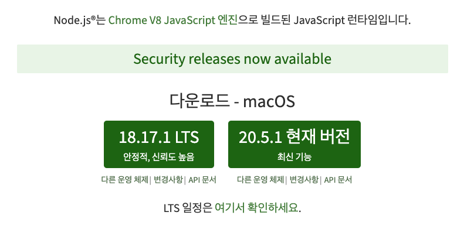

# Node.js

**[Node.js는 확장성 있는 네트워크 애플리케이션(특히 서버 사이드) 개발에 사용되는 소프트웨어 플랫폼](https://ko.wikipedia.org/wiki/Node.js)**이다. 작성 언어로 [자바스크립트](https://ko.wikipedia.org/wiki/%EC%9E%90%EB%B0%94%EC%8A%A4%ED%81%AC%EB%A6%BD%ED%8A%B8)를 활용하며 논블로킹(Non-blocking) I/O와 단일 스레드 이벤트 루프를 통한 높은 처리 성능을 가지고 있다.

내장 HTTP 서버 라이브러리를 포함하고 있어 웹 서버에서 아파치 등의 별도의 소프트웨어 없이 동작하는 것이 가능하며 이를 통해 웹 서버의 동작에 있어 더 많은 통제를 가능케 한다.

[**V8](https://ko.wikipedia.org/wiki/V8_(%EC%9E%90%EB%B0%94%EC%8A%A4%ED%81%AC%EB%A6%BD%ED%8A%B8_%EC%97%94%EC%A7%84))으로 빌드된 [이벤트](https://ko.wikipedia.org/wiki/%EC%9D%B4%EB%B2%A4%ED%8A%B8_%EA%B8%B0%EB%B0%98_%EC%95%84%ED%82%A4%ED%85%8D%EC%B2%98) 기반 [자바스크립트](https://ko.wikipedia.org/wiki/%EC%9E%90%EB%B0%94%EC%8A%A4%ED%81%AC%EB%A6%BD%ED%8A%B8) [런타임](https://ko.wikipedia.org/wiki/%EB%9F%B0%ED%83%80%EC%9E%84)**이다.

## **이 설명만 읽고서는 Node.js가 뭔지 감이 잘 안와서 쉬운 설명을 찾음!**

⇒ **HTML이라는 언어가 있다.** HTML은 그저 웹페이지를 만들 때 사용하는 언어이다. 웹페이지에 글, 그림, 버튼 이런 걸 넣을 때 사용한다. 

그리고 **HTML과 함께 사용하는 JavaScript라는 언어가 있다.** JavaScript는 웹페이지를 움직이게 만들 때 사용하는 언어이다. HTML을 마음대로 조작해서 내용을 바꾸고, 클릭하면 움직이게 만들고 이런 게 가능하다. 그래서 자바스크립트를 사용하면 로그인 모달창, 애니메이션 메뉴 등을 만들 수 있다. 

**Javascript 구동 엔진인 V8의 등장!**

크롬, 파이어폭스, 익스플로러 이런 브라우저들이 자바스크립트를 읽고 해석하는 역할을 한다. 자바스크립트를 빠르게 읽고 해석하면 웹사이트 렌더링 성능도 빨라지니 브라우저 개발자들은 자바스크립트를 해석할 수 있는 엔진 개발에 열성이었다. 그러다가 구글 사내에 있던 ‘크롬 브라우저 개발자’들이 엄청난 걸 만들게 된다. 자바스크립트 해석 엔진인 V8이라는 프로그램을 만들었는데 성능이 너무나도 뛰어난 나머지 V8을 자랑하려고 이것만 똑 떼어서 살을 붙여 출시하게 된다. 그리고 그것을 Node.js라고 이름 붙인다. 

## **Node.js를 한 줄 요약하자면!!!**

자바스크립트를 브라우저 말고도 로컬 PC에서도 실행시켜줄 수 있는 실행창(런타임)이다. Node.js를 실행하면 자바스크립트 입력란이 하나가 뜨게 되고 그곳에 자바스크립트를 입력하면 바로바로 해석해서 실행시켜준다. 그게 Node.js의 끝이다. 

## ****출시****

Node.js의 버전별 출시 및 관리는 규칙적인 주기를 가지고 이루어지고 있으며, v4 이후로 약 6개월 주기로 새로운 버전을 출시하고 있다. 이 중 짝수버전의 경우 장기지원 버전(LTS) 이라고 하여 별도의 코드명을 부여받으며, 약 3년간 유지보수 대상이 된다.

# NPM(Node Package Manager)
## package.json / package-lock.json
## node_modules
## npx
# ES Modules vs CommonJS
