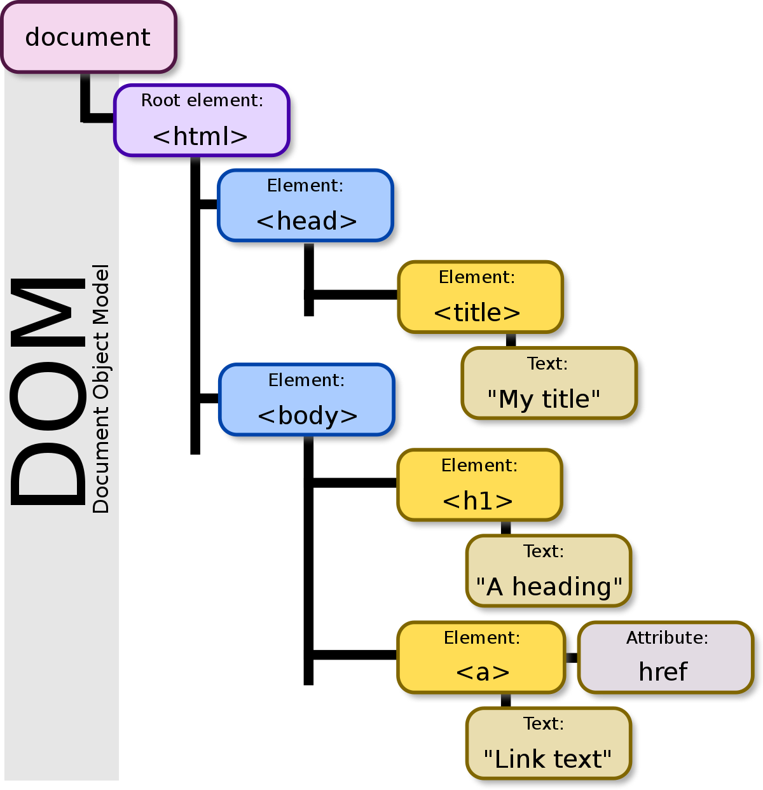

# 1. JSX

## [JSX(JavaScript Syntax Extension)란?](https://en.wikipedia.org/wiki/JSX_(JavaScript))


JavaScript 안에 HTML과 유사한 마크업을 작성할 수 있게 해주는 JavaScript용 구문 확장자이다.  
컴포넌트를 작성하는 다른 방법도 있지만, 대부분의 React 개발자는 JSX의 간결함을 선호하며 대부분의 코드베이스에서 이를 사용한다.

### [JSX : 자바스크립트에 마크업 넣기](https://react.dev/learn/writing-markup-with-jsx)

웹은 HTML, CSS, 자바스크립트를 기반으로 구축되었다. 수년 동안 웹 개발자들은 콘텐츠는 HTML에, 디자인은 CSS에, 로직은 JavaScript에 별도로 보관했다. 콘텐츠는 HTML 안에 마크업하고 페이지의 로직은 자바스크립트에 따로 보관했다.

하지만 웹이 더욱 interactive해지면서 로직이 콘텐츠를 결정하는 비중이 점점 커졌다. HTML은 자바스크립트가 담당했다. 이것이 바로 React에서 렌더링 로직과 마크업이 같은 위치의 컴포넌트에 함께 존재하는 이유이다.

### JSX의 규칙

#### 1. Return a single root element

컴포넌트에서 여러 요소를 반환하려면 단일 부모 태그로 요소를 래핑한다.

예를 들어 `<div>`를 사용할 수 있다.

```javaScript
<div>
  <h1>Hedy Lamarr's Todos</h1>
  
  <ul>
    ...
  </ul>
</div>
```

마크업에 `<div>`를 추가하고 싶지 않다면 대신 `<>`와 `</>`를 쓰면 된다.

```javaScript
<>
  <h1>Hedy Lamarr's Todos</h1>
  
  <ul>
    ...
  </ul>
</>
```

이 빈 태그를 Fragment라고 한다. Fragment를 사용하면 브라우저 HTML 트리에 흔적을 남기지 않고 사물을 그룹화할 수 있다.

#### 2. Close all the tags

JSX에서는 태그가 명시적으로 닫혀야 한다.

```javaScript
<>
  
  <ul>
    <li>Invent new traffic lights</li>
    <li>Rehearse a movie scene</li>
    <li>Improve the spectrum technology</li>
  </ul>
</>
```

#### 3. camelCase all most of the things

React에서는 많은 HTML과 SVG attribute가 대/소문자를 구분하지 않고 대/소문자 구문 없이 camelCase로 작성된다.

```javaScript

```

## React에서 JSX를 사용하는 목적

각 JSX는 `React.createElement(component, props, ...children)`를 호출하기 위한 Syntactic sugar다. 그래서 JSX로 할 수 있는 모든 것은 순수 JavaScript로도 할 수 있다.  
컴포넌트를 작성하는 다른 방법도 있지만 대부분의 React 개발자는 JSX의 간결함을 선호하며, 대부분의 코드베이스에서 이를 사용한다.

예를 들어 다음의 JSX로 작성된 코드는

```javaScript
class Hello extends React.Component {
  render() {
    return <div>Hello {this.props.toWhat}</div>;
  }
}

const root = ReactDOM.createRoot(document.getElementById('root'));
root.render(<Hello toWhat="World" />);
```

아래처럼 JSX를 사용하지 않은 코드로 컴파일 될 수 있다.

```javaScript
class Hello extends React.Component {
  render() {
    return React.createElement('div', null, `Hello ${this.props.toWhat}`);
  }
}

const root = ReactDOM.createRoot(document.getElementById('root'));
root.render(React.createElement(Hello, {toWhat: 'World'}, null));
```

## [Syntactic sugar](https://en.wikipedia.org/wiki/Syntactic_sugar)

프로그래밍 언어 내에서 사물을 더 쉽게 읽거나 표현할 수 있도록 설계된 구문이다. Syntactic sugar를 사용하면 사물을 더 명확하고 간결하게 표현하거나 일부 사람들이 선호하는 다른 스타일로 표현할 수 있어 사람이 사용하기에 "더 달콤한" 언어를 만들 수 있다.

## [React.createElement](https://react.dev/reference/react/createElement#createelement)

createElement를 사용하면 React element를 생성할 수 있다. JSX를 작성하는 대신 사용할 수 있다.

```javaScript
const element = createElement(type, props, ...children)
```

### Reference

`createElement(type, props, ...children)`  
createElement를 호출하여 주어진 `type`, `props`, `children`으로 React element를 생성한다.

```javaScript
import { createElement } from 'react';

function Greeting({ name }) {
  return createElement(
    'h1',
    { className: 'greeting' },
    'Hello'
  );
}
```

### Parameters

- `type` : 유효한 React component type이어야 한다. 예를 들어 tag name 문자열(`div`, `span`) 또는 React component(함수, 클래스 또는 `Fragment`와 같은 특수 컴포넌트)가 될 수 있다.
- `props` : props 인자는 객체이거나 null이어야 한다. null을 전달하면 빈 객체와 동일하게 처리된다. React는 전달한 프로퍼티와 일치하는 프로퍼티를 가진 엘리먼트를 생성한다.
- optional `...children` : 0개 이상의 child nodes. React elements, strings, numbers, portals, empty nodes(`null`, `undefined`, `true`, `false`), and arrays of React nodes

## React Element

### [element란?](https://ko.legacy.reactjs.org/docs/rendering-elements.html)

element는 React 앱의 가장 작은 단위이다.  
element는 화면에 표시할 내용을 기술한다.

```javaScript
const element = <h1>Hello, world</h1>;
```

브라우저 DOM element와 달리 React element는 일반 객체이며(plain object) 쉽게 생성할 수 있다. React DOM은 React element와 일치하도록 DOM을 업데이트 한다.

더 널리 알려진 개념인 "컴포넌트"와 엘리먼트를 혼동할 수 있다. 엘리먼트는 컴포넌트의 "구성 요소"이다.

### DOM에 엘리먼트 렌더링하기

HTML 파일 어딘가에 `<div>`가 있다고 가정해보자.

```javaScript
<div id="root"></div>
```

이 안에 들어가는 모든 엘리먼트를 React DOM에서 관리하기 때문에 이것을 "루트(root)" DOM 노드라고 부른다.

React로 구현된 애플리케이션은 일반적으로 하나의 루트 DOM 노드가 있다. React를 기존 앱에 통합하려는 경우 원하는 만큼 많은 수의 독립된 루트 DOM 노드가 있을 수 있다.

React 엘리먼트를 렌더링 하기 위해서는 우선 DOM 엘리먼트를 ReactDOM.createRoot()에 전달한 다음, React 엘리먼트를 root.render()에 전달해야 한다.

```javaScript
const root = ReactDOM.createRoot(
  document.getElementById('root')
);
const element = <h1>Hello, world</h1>;
root.render(element);
```

위 코드를 실행하면 화면에 "Hello, world"가 보일 것이다.

### 렌더링 된 엘리먼트 업데이트하기

React 엘리먼트는 불변객체이다. 엘리먼트를 생성한 이후에는 해당 엘리먼트의 자식이나 속성을 변경할 수 없다. 엘리먼트는 영화에서 하나의 프레임과 같이 특정 시점의 UI를 보여준다.

### 변경된 부분만 업데이트하기

React DOM은 해당 엘리먼트와 그 자식 엘리먼트를 이전의 엘리먼트와 비교하고 DOM을 원하는 상태로 만드는데 필요한 경우에만 DOM을 업데이트 한다.

element는 user interface의 일부에 대한 가벼운 설명이다. 예를 들어 `<Greeting name="Taylor" />` 와 `createElement(Greeting, { name: 'Taylor' })`는 다음과 같은 객체를 생성한다.

```javaScript
// Slightly simplified(약간 단순화 됨.)
{
  type: Greeting,
  props: {
    name: 'Taylor'
  },
  key: null,
  ref: null,
}
```

이 객체를 생성해도 `Greeting` 컴포넌트가 렌더링되거나 DOM 요소가 생성되지는 않는다.

React Element는 나중에 Greeting 컴포넌트를 렌더링하기 위한 React의 명령어다. App 컴포넌트에서 이 객체를 반환하면 React에게 다음에 수행할 작업을 알려준다.

element 생성은 매우 cheap하므로 최적화하거나 피하려고 노력할 필요가 없다.

## [React StrictMode](https://react.dev/reference/react/StrictMode#strictmode)

[https://ko.legacy.reactjs.org/docs/strict-mode.html](https://ko.legacy.reactjs.org/docs/strict-mode.html)

StrictMode를 사용하면 개발 중에 컴포넌트에서 흔히 발생하는 버그를 조기에 발견할 수 있다. (Strict 모드를 사용하면 내부 컴포넌트 트리에 대한 추가 개발 동작 및 경고를 활성화할 수 있다.)

⚠️ Strict 모드는 개발 모드에서만 활성화되기 때문에, 프로덕션 빌드에는 영향을 끼치지 않는다.

애플리케이션 내 어디서든지 아래와 같이 strict 모드를 활성화할 수 있다.

```javaScript
import React from 'react';

function ExampleApplication() {
  return (
    <div>
      <Header />
      <React.StrictMode>
        <div>
          <ComponentOne />
          <ComponentTwo />
        </div>
      </React.StrictMode>
      <Footer />
    </div>
  );
}
```

위의 예시에서 Header와 Footer 컴포넌트는 Strict 모드 검사가 이루어지지 않는다. 하지만 ComponentOne과 ComponentTwo는 각각의 자손까지 검사가 이루어진다.

StrictMode는 아래와 같은 부분에서 도움이 된다.

- 안전하지 않은 생명주기를 사용하는 컴포넌트 발견
- 레거시 문자열 ref 사용에 대한 경고
- 권장되지 않는 findDOMNode 사용에 대한 경고
- 예상치 못한 부작용 검사
- 레거시 context API 검사
- 재사용 가능한 상태 보장

## [VDOM(Virtual DOM)이란?](https://ko.legacy.reactjs.org/docs/faq-internals.html)

Virtual DOM(VDOM)은 UI의 이상적인 또는 "가상"적인 표현을 메모리에 저장하고 ReactDOM과 같은 라이브러리에 의해 "실제" DOM과 동기화하는 프로그래밍 개념이다. 이 과정을 재조정이라고 한다.

이 접근방식이 React의 선언적 API를 가능하게 한다. React에게 원하는 UI의 상태를 알려주면 DOM이 그 상태와 일치하도록 한다. 이러한 방식은 앱 구축에 사용해야 하는 어트리뷰트 조작, 이벤트 처리, 수동 DOM 업데이트를 추상화한다.

"virtual DOM"은 특정 기술이라기보다는 패턴에 가깝기 때문에 사람들마다 의미하는 바가 다르다. React의 세계에서 "virtual DOM"이라는 용어는 보통 사용자 인터페이스를 나타내는 객체이기 때문에 React elements와 연관된다. 그러나 React는 컴포넌트 트리에 대한 추가 정보를 포함하기 위해 "fibers"라는 내부 객체를 사용한다. 또한 React에서 "virtual DOM" 구현의 일부로 간주할 수 있다.

### 선언적 API란?

React에게 원하는 UI의 상태를 알려주면 DOM이 그 상태와 일치하도록 하는 것이다.

### VDOM을 왜 쓰는 걸까?

 → fast enough  
 → maintainable

### [VDOM의 출현 배경](https://yozm.wishket.com/magazine/detail/1338/)

일반적으로 중요 렌더링 경로는 초당 60회 정도의 주기로 계산을 수행한다. 이때 가장 비용이 많이 드는 단계가 바로 레이아웃 단계와 페인트 단계이다. 때문에 성능 최적화를 위해서는 두 단계에서의 연산을 최소화하는 것이 중요하다.

JavaScript를 이용해 DOM을 직접 조작하면 변경 사항이 있을 때마다 잠재적인 레이아웃 단계와 페인트 단계를 초래하게 된다. 만약 10개의 DOM 노드를 for 문으로 일일이 수정하게 되면, 하나의 노드에 수정 사항이 생길 때마다 화면을 다시 그리는 과정을 거쳐야 할 수 있다. 즉 10개를 한 번에 수정하는 것이 아니라, 하나씩 수정된 노드가 10번에 걸쳐서 다시 화면에 그려질 수 있다는 이야기이다. 때문에 일반적으로 DOM을 직접 조작하는 것은 비용이 크다고 이야기한다.

한편 가상 DOM은 실제로 렌더링 되지는 않았지만, 실제 DOM 구조를 반영한 상태로 메모리에 있는 가상의 DOM이다. 메모리 상에 있고, 실제 화면에 그려야 할 필요는 없기 때문에 실제 DOM보다는 연산 비용이 적다. 가상 DOM은 이러한 특징을 바탕으로 위에서 말한 변경 사항들을 한 번에 묶어서 실제 DOM에 반영한다. 물론 레이아웃 단계와 페인트 단계에서 한 번에 변경되어야 하는 사항은 많아진다. 대신 단 한 번의 계산만으로도 바뀐 DOM을 적용할 수 있기 때문에 연산의 횟수는 최소한이 된다.

사실 이 과정은 DOM에 변경사항을 유발하는 스크립트를 묶어서 실행하는 방법으로도 가능하다. 하지만 가상 DOM을 사용함으로써 이 과정을 모두 자동화할 수 있고, 개발자는 관리할 포인트를 줄일 수 있다. 이러한 가상 DOM을 사용하는 대표적인 라이브러리, 프레임워크가 바로 React와 Vue이다.

### [- DOM(The Document Object Model)이란?](https://developer.mozilla.org/ko/docs/Web/API/Document_Object_Model/Introduction)

[https://ko.wikipedia.org/wiki/%EB%AC%B8%EC%84%9C_%EA%B0%9D%EC%B2%B4_%EB%AA%A8%EB%8D%B8](https://ko.wikipedia.org/wiki/%EB%AC%B8%EC%84%9C_%EA%B0%9D%EC%B2%B4_%EB%AA%A8%EB%8D%B8)



문서 객체 모델(The Document Object Model)은 HTML, XML 문서의 각 항목을 계층으로 표현하여 생성, 변형, 삭제할 수 있도록 돕는 interface이다. DOM은 문서의 구조화된 표현을 제공하며 프로그래밍 언어가 DOM 구조에 접근할 수 있는 방법을 제공하여 그들이 문서 구조, 스타일, 내용 등을 변경할 수 있게 돕는다. DOM은 nodes와 objects로 문서를 표현한다. 이들은 웹 페이지를 스크립트 또는 프로그래밍 언어들에서 사용될 수 있게 연결시켜주는 역할을 담당한다.

웹 페이지는 일종의 문서(document)다. 이 문서는 웹 브라우저를 통해 그 내용이 해석되어 웹 브라우저 화면에 나타나거나 HTML 소스 자체로 나타나기도 한다. 동일한 문서를 사용하여 이처럼 다른 형태로 나타날 수 있다는 점에 주목할 필요가 있다. DOM은 동일한 문서를 표현하고, 저장하고, 조작하는 방법을 제공한다. DOM은 웹 페이지의 객체 지향 표현이며, 자바스크립트와 같은 스크립팅 언어를 이용해 DOM을 수정할 수 있다.

DOM은 프로그래밍 언어는 아니지만 DOM이 없다면 자바스크립트 언어는 웹 페이지 또는 XML 페이지 및 요쇼들과 관련된 모델이나 개념들에 대한 정보를 갖지 못하게 된다.

### - DOM과 Virtual DOM의 차이

DOM은 브라우저가 웹 페이지의 구조와 콘텐츠를 표현한 것으로 개발자가 JavaScript를 직접 사용하여 페이지와 상호작용하고 페이지를 조작할 수 있도록 한다.  
Virtual DOM은 React와 같은 프레임워크에서 실제 DOM과의 직접적인 상호 작용을 최소화하고 UI 업데이트 프로세스를 최적화하여 성능을 향상시키는 데 사용되는 추상화이다.

## [Reconciliation(재조정) 과정은 무엇인가?](https://ko.legacy.reactjs.org/docs/reconciliation.html#gatsby-focus-wrapper)

React는 선언적 API를 제공하기 때문에 갱신이 될 때마다 매번 무엇이 바뀌었는지를 걱정할 필요가 없다. 이는 애플리케이션 작성을 무척 쉽게 만들어주지만, React 내부에서 어떤 일이 일어나고 있는지는 명확히 눈에 보이지 않는다. 우리는 React의 "비교(diffing)" 알고리즘 덕분에 컴포넌트의 갱신이 예측 가능해지면서도 고성능 앱이라고 불러도 손색없을 만큼 충분히 빠른 앱을 만들 수 있다.

### 동기

React를 사용하다 보면, '`render()` 함수는 React 엘리먼트 트리를 만드는 것이다.' 라고 생각이 드는 순간이 있을 것이다. state나 props가 갱신되면 `render()` 함수는 새로운 React 엘리먼트 트리를 반환할 것이다. 이때 React는 방금 만들어진 트리에 맞게 가장 효과적으로 UI를 갱신하는 방법을 알아낼 필요가 있다.

하나의 트리를 가지고 다른 트리로 변환하기 위한 최소한의 연산 수를 구하는 알고리즘 문제를 풀기 위한 일반적인 해결책들이 있다. 하지만 이러한 최첨단의 알고리즘도 n개의 엘리먼트가 있는 트리에 대해 O(n^3)의 복잡도를 가진다.

React에 이 알고리즘을 적용한다면, 1000개의 엘리먼트를 그리기 위해 10억 번의 비교 연산을 수행해야 한다. 너무나도 비싼 연산이다. React는 대신, 두 가지 가정을 기반하여 O(n) 복잡도의 휴리스틱 알고리즘을 구현했다.

1. 서로 다른 타입의 두 엘리먼트는 서로 다른 트리를 만들어낸다.
2. 개발자가 key prop을 통해, 여러 렌더링 사이에서 어떤 자식 엘리먼트가 변경되지 않아야 할지 표시해 줄 수 있다.

실제로 거의 모든 사용 사례에서 이 가정들은 들어맞는다.

### 비교 알고리즘 (Diffing Algorithm)

두 개의 트리를 비교할 때, React는 두 엘리먼트의 루트(root) 엘리먼트부터 비교한다. 이후의 동작은 루트 엘리먼트의 타입에 따라 달라진다.

#### 엘리먼트의 타입이 다른 경우

두 루트 엘리먼트의 타입이 다르면, React는 이전 트리를 버리고 완전히 새로운 트리를 구축한다. `<a>`에서 ``로, `<Article>`에서 `<Comment>`로, 혹은 `<Button>`에서 `<div>`로 바뀌는 것 모두 트리 전체를 재구축하는 경우다.

트리를 버릴 때 이전 DOM 노드들은 모두 파괴된다. 컴포넌트 인스턴스는 `componentWillUnmount()`가 실행된다. 새로운 트리가 만들어질 때, 새로운 DOM 노드들이 DOM에 삽입된다. 그에 따라 컴포넌트 인스턴스는  `UNSAFE_componentWillMount()`가 실행되고 `componentDidMount()`가 이어서 실행된다. 이전 트리와 연관된 모든 state는 사라진다.

루트 엘리먼트 아래의 모든 컴포넌트도 언마운트되고 그 state도 사라진다. 예를 들어, 아래와 같은 비교가 일어나면

```javaScript
<div>
  <Counter />
</div>

<span>
  <Counter />
</span>
```

이전 Counter는 사라지고, 새로 다시 마운트가 될 것이다.

#### DOM 엘리먼트의 타입이 같은 경우

같은 타입의 두 React DOM 엘리먼트를 비교할 때, React는 두 엘리먼트의 속성을 확인하여, 동일한 내역은 유지하고 변경된 속성들만 갱신한다. 예를 들어,

```javaScript
<div className="before" title="stuff" />

<div className="after" title="stuff" />
```

이 두 엘리먼트를 비교하면, React는 현재 DOM 노드 상에 className만 수정한다.

style이 갱신될 때, React는 또한 변경된 속성만을 갱신한다. 예를 들어,

```javaScript
<div style={{color: 'red', fontWeight: 'bold'}} />

<div style={{color: 'green', fontWeight: 'bold'}} />
```

위 두 엘리먼트 사이에서 변경될 때, React는 `fontWeight`는 수정하지 않고 `color` 속성 만을 수정합니다.

DOM 노드의 처리가 끝나면, React는 이어서 해당 노드의 자식들을 재귀적으로 처리한다.
