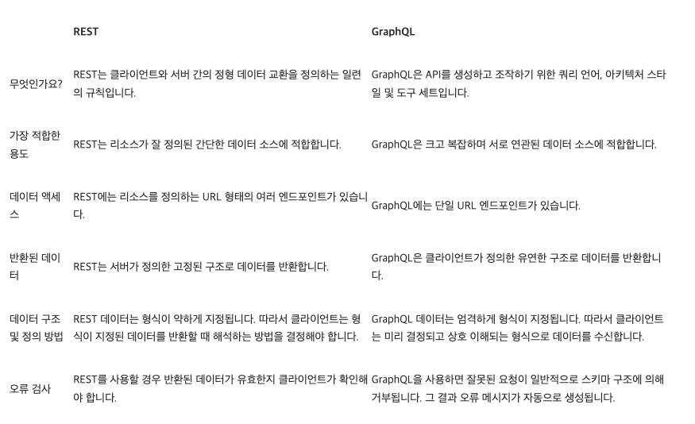

# 1. React Component

## REST API와 GraphQL

REST API

- GET, POST, PUT/PATCH, DELETE (CRUD)
- Resource 중심

GraphQL

- Graph 자료 구조
- Query에서 얻고자 하는 걸 지정
- Query(Read), Mutation(Command: Create, Update, Delete), Subscription(Event)

### - [REST](https://ko.wikipedia.org/wiki/REST) API란 무엇인가

#### [REST API(RESTful API)](https://aws.amazon.com/ko/what-is/restful-api/)

두 컴퓨터 시스템이 인터넷을 통해 정보를 안전하게 교환하기 위해 사용하는 인터페이스다. 대부분의 비즈니스 애플리케이션은 다양한 task를 수행하기 위해 다른 내부 애플리케이션 및 서드 파티 애플리케이션과 통신해야 한다. 예를 들어 월간 급여 명세서를 생성하려면 인보이스 발행을 자동화하고 내부의 근무 시간 기록 애플리케이션과 통신하기 위해 내부 계정 시스템이 데이터를 고객의 뱅킹 시스템과 공유해야 한다. RESTful API는 안전하고 신뢰할 수 있으며 효율적인 소프트웨어 통신 표준을 따르므로 이러한 정보 교환을 지원한다.

#### API

애플리케이션 프로그래밍 인터페이스(API)는 다른 소프트웨어 시스템과 통신하기 위해 따라야 하는 규칙을 정의한다. 개발자는 다른 애플리케이션이 프로그래밍 방식으로 애플리케이션과 통신할 수 있도록 API를 표시하거나 생성한다. 예를 들어, 근무 시간 기록 애플리케이션은 직원의 전체 이름과 날짜 범위를 요청하는 API를 표시한다. 이 정보가 수신되면 내부적으로 직원의 근무 시간 기록을 처리하고 해당 날짜 범위에서 근무한 시간을 반환한다.
웹 API는 클라이언트와 웹 리소스 사이의 게이트웨이라고 생각할 수 있다.

##### * 클라이언트

클라이언트는 웹에서 정보에 액세스하려는 사용자이다. 클라이언트는 API를 사용하는 사람이거나 소프트웨어 시스템일 수 있다. 예를 들어 개발자는 날씨 시스템에서 날씨 데이터에 액세스하는 프로그램을 작성할 수 있다. 또는 사용자가 날씨 웹 사이트를 직접 방문할 때 브라우저에서 동일한 데이터에 액세스할 수 있다.

##### * 리소스

리소스는 다양한 애플리케이션이 클라이언트에게 제공하는 정보이다. 리소스는 이미지, 동영상, 텍스트, 숫자 또는 모든 유형의 데이터일 수 있다. 클라이언트에 리소스를 제공하는 시스템을 서버라고도 한다. 조직은 API를 사용하여 리소스를 공유하고 보안, 제어 및 인증을 유지하면서 웹 서비스를 제공한다. 또한 API는 특정 내부 리소스에 액세스할 수 있는 클라이언트를 결정하는 데 도움이 된다.

#### REST

REST(Representational State Transfer)는 API 작동 방식에 대한 조건을 부과하는 소프트웨어 아키텍처이다. REST는 처음에 인터넷과 같은 복잡한 네트워크에서 통신을 관리하기 위한 지침으로 만들어졌다. REST 기반 아키텍처를 사용하여 대규모의 고성능 통신을 안정적으로 지원할 수 있다. 쉽게 구현하고 수정할 수 있어 모든 API 시스템을 파악하고 여러 플랫폼에서 사용할 수 있다.  
API 개발자는 여러 아키텍처를 사용하여 API를 설계할 수 있다. REST 아키텍처 스타일을 따르는 API를 REST API라고 한다. REST 아키텍처를 구현하는 웹 서비스를 RESTful 웹 서비스라고 한다. RESTful API라는 용어는 일반적으로 RESTful 웹 API를 나타낸다. 하지만 REST API와 RESTful API라는 용어는 같은 의미로 사용할 수 있다.

### - GraphQL은 왜 등장했는가?

#### [GraphQL](https://ko.wikipedia.org/wiki/GraphQL)

페이스북이 2012년에 개발하여 2015년에  공개적으로 발표된 데이터 질의어이다.  
그래프QL은 REST 및 부속 웹서비스 아키텍처를 대체할 수 있다. 클라이언트는 필요한 데이터의 구조를 지정할 수 있으며, 서버는 정확히 동일한 구조로 데이터를 반환한다. 그래프QL은 사용자가 어떤 데이터가 필요한 지 명시할 수 있게 해주는 강타입 언어이다. 이러한 구조를 통해 불필요한 데이터를 받게 되거나 필요한 데이터를 받지 못하는 문제를 피할 수 있다.

#### [API를 위한 쿼리 언어](https://graphql-kr.github.io/)

GraphQL은 API를 위한 쿼리 언어이며 이미 존재하는 데이터로 쿼리를 수행하기 위한 런타임이다. GraphQL은 API에 있는 데이터에 대한 완벽하고 이해하기 쉬운 설명을 제공하고 클라이언트에게 필요한 것을 정확하게 요청할 수 있는 기능을 제공하며 시간이 지남에 따라 API를 쉽게 진화시키고 강력한 개발자 도구를 지원한다.

##### 필요한 것을 구체적으로 요청하세요

API에 GraphQL 쿼리를 보내고 필요한 것만 정확히 얻어라. GraphQL 쿼리는 항상 예측 가능한 결과를 반환한다. GraphQL을 사용하는 앱은 서버가 아닌 데이터를 제어하기 때문에 빠르며 안정적이다.

##### 단일 요청으로 많은 데이터를 얻으세요

GraphQL 쿼리는 하나의 리소스 속성에 액세스할 뿐만 아니라 이 리소스 간의 참조를 자연스럽게 이해한다. 일반적인 REST API는 여러 URL에서 데이터를 받아와야 하지만 GraphQL API는 한번의 요청으로 앱에 필요한 모든 데이터를 가져온다. GraphQL을 사용하는 앱은 느린 모바일 네트워크 연결에서도 빠르게 수행할 수 있다.

##### 타입 시스템으로 가능한 것을 살펴보세요

GraphQL API는 엔드포인트가 아닌 타입과 필드로 구성된다. 단일 엔드포인트에서 데이터의 모든 기능에 접근하라. GraphQL은 타입 시스템을 사용하여 앱이 가능한 것을 요청하고 명확하고 유용한 오류를 제공하는 것을 보장한다. 앱은 타입을 사용하여 수동 파싱 코드 작성을 피할 수 있다.

##### 강력한 개발자 도구를 사용해보세요

이제 편집기를 벗어나지 않고도 API에서 요청할 수 있는 데이터를 정확히 파악하고, 쿼리를 보내기 전에 잠재적인 문제를 표시해주며, 향상된 코드 인텔리전스를 활용할 수 있다. GraphQL을 사용하면 API의 타입 시스템을 활용하여 GraphiQL과 같은 강력한 도구를 쉽게 만들 수 있다.

##### 버전 없이 API를 진화시키세요

기존 쿼리에 영향을 주지 않고 GraphQL API에 새로운 필드와 타입을 추가하라. 오래된 필드는 더 이상 사용되지 않도록 도구에서 숨길 수 있다. 진화하는 단일 버전을 사용함으로써 GraphQL API는 새로운 기능에 대한 지속적인 엑세스를 제공하고 보다 깨끗하고 유지보수가 쉬운 서버 코드를 작성하도록 도와준다.

##### 기존 데이터와 코드를 사용하세요

GraphQL은 특정 데이터베이스에 제한받지 않고 전체 애플리케이션에 걸쳐 균일한 API를 생성한다. 다양한 언어로 제공되는 GraphQL 엔진으로 기존 데이터 및 코드를 활용하는 GraphQL API를 작성해보자. 타입 시스템의 각 필드에 대한 함수를 제공하고 GraphQL은 이를 최적, 동시적으로 호출한다.

### - [REST API vs GraphQL](https://aws.amazon.com/ko/compare/the-difference-between-graphql-and-rest/)

#### 차이점

GraphQL과 REST는 인터넷을 통한 데이터 교환을 위한 API를 설계하는 두 가지 접근 방식이다.  
REST를 사용하면 클라이언트 애플리케이션이 HTTP 동사를 사용하여 서버와 데이터를 교환할 수 있으며, 이는 인터넷의 표준 통신 프로토콜이다.  
반면 GraphQL은 클라이언트 애플리케이션이 원격 서버로부터 데이터를 요청하는 방법에 대한 사양을 정의하는 API 쿼리 언어이다. 요청을 정의하는 데 서버 측 애플리케이션에 의존하지 않고도 GraphQL을 API 호출에 사용할 수 있다.



#### 유사점

GraphQL과 REST는 모두 클라이언트-서버 모델에서 서로 다른 서비스 또는 애플리케이션 간에 데이터를 교환할 수 있는 널리 사용되는 API 아키텍처 스타일이다.  
API는 다음과 같은 데이터 액세스 및 데이터 작업을 지원한다.  

1. 클라이언트가 서버의 엔드포인트 또는 여러 엔드포인트에 API 요청을 전송  

2. 서버가 데이터, 데이터 상태 또는 오류 코드가 포함된 응답을 제공

REST 및 GraphQL을 사용하면 API를 통해 별도의 애플리케이션, 서비스 또는 모듈에서 데이터를 생성, 수정, 업데이트 및 삭제할 수 있다. REST를 사용하여 개발된 API를 RESTful API 또는 REST API라고 한다. GraphQL로 개발된 API는 그냥 GraphQL API라고 한다.  
프런트엔드 및 백엔드 팀은 이러한 API 아키텍처를 사용하여 모듈식 애플리케이션 및 접근성이 뛰어난 애플리케이션을 만든다. API 아키텍처를 사용하면 시스템을 안전하고 모듈화되고 확장 가능한 상태로 유지할 수 있다. 또한 시스템의 성능이 향상되고 다른 시스템과의 통합이 더 쉬워진다.

##### 아키텍처

REST와 GraphQL 모두 몇 가지 일반적인 API 아키텍처 원칙을 구현한다.

- 둘 다 상태를 저장하지 않으므로 서버가 요청 간에 응답 기록을 저장하지 않는다.
- 둘 다 클라이언트-서버 모델을 사용하므로 단일 클라이언트에서 요청하면 단일 서버에서 응답한다.
- 둘 다 기반 통신 프로토콜인 HTTP를 기반으로 한다.

##### 리소스 기반 설계

REST와 GraphQL은 모두 리소스를 중심으로 데이터 교환을 설계한다. 리소스는 클라이언트가 API를 통해 액세스하고 조작할 수 있는 모든 데이터 또는 객체를 말한다. 각 리소스마다 고유한 식별자(URI)와 클라이언트가 해당 리소스에 대해 수행할 수 있는 작업 세트(HTTP 메서드)가 있다.  
사용자가 게시물을 만들고 관리하는 소셜 미디어 API를 예를 들어보겠다. 리소스 기반 API에서 게시물은 리소스가 된다. 게시물에는 고유한 식별자가 있다. (예: /posts/1234) 또한 REST에서 게시물을 검색하는 GET이나 GraphQL에서 게시물을 검색하는 query와 같은 일련의 작업이 있다.

##### 데이터 교환

REST와 GraphQL 모두 유사한 데이터 형식을 지원한다. JSON은 모든 언어, 플랫폼 및 시스템이 인식하는 가장 널리 사용되는 데이터 교환 형식이다. 서버는 JSON 데이터를 클라이언트에 반환한다. XML 및 HTML을 비롯한 다른 데이터 형식을 사용할 수 있지만 일반적으로 사용되지는 않는다.  

마찬가지로, REST와 GraphQL은 모두 캐싱을 지원한다. 따라서 클라이언트와 서버는 자주 액세스하는 데이터를 캐싱하여 통신 속도를 높일 수 있다.

##### 언어 및 데이터베이스 중립성

GraphQL과 REST API 모두 클라이언트 측과 서버 측의 모든 데이터베이스 구조 및 프로그래밍 언어를 지원한다. 따라서 모든 애플리케이션과의 상호 운용성이 뛰어나다.

#### GraphQL은 REST의 어떤 한계를 극복하려고 하는지?

GraphQL은 떠오르는 소셜 미디어 플랫폼의 속도 요구 사항에 대응하여 2012년에 등장했다. 개발자들은 REST와 같은 기존 API 아키텍처가 너무 길고 정형화되어 있어서 뉴스 피드를 효율적으로 생성할 수 없다는 사실을 알게 되었다.  
다음으로, 개발자들이 직면했던 몇 가지 문제에 대해 알아보자.

##### 고정 구조 데이터 교환

REST API는 클라이언트 요청이 고정된 구조를 따라야 리소스를 수신할 수 있다. 이 엄격한 구조는 사용하기 쉽지만 필요한 데이터를 정확히 교환하기에 항상 가장 효율적인 수단인 것은 아니다.

##### 오버페칭 및 언더페칭

REST API는 항상 전체 데이터 세트를 반환한다. 예를 들어 REST APP의 person 객체로부터는 그 사람의 이름, 생년월일, 주소 및 전화번호를 받게 된다. 전화번호만 있으면 이 모든 데이터를 얻을 수 있다.  
마찬가지로, 개인의 전화번호와 마지막 구매 내역을 알려면 여러 개의 REST API 요청이 필요하다. /person이라는 URL은 전화번호를 관리하고 /purchase라는 URL은 구매 내역을 반환한다.  
소셜 미디어 개발자는 API 요청을 처리학 위해 많은 양의 코드를 작성해야 했고, 이는 성능과 사용자 경험에 영향을 미쳤다.  
그런데 GraphQL이 쿼리 기반 솔루션으로 부상했다. 쿼리는 한 번의 API 요청 및 응답 교환에서만 정확한 데이터를 반환할 수 있다.

## [JSON](https://ko.wikipedia.org/wiki/JSON)


JSON(제이슨, JavaScript Object Notation)은 속성-값 쌍(attribute-value pairs), 배열 자료형(array data types) 또는 기타 모든 시리얼화 가능한 값(serializable value) 또는 키-값 쌍으로 이루어진 데이터 오브젝트를 전달하기 위해 인간이 읽을 수 있는 텍스트를 사용하는 개방형 표준 포맷이다. 비동기 브라우저/서버 통신(AJAX)을 위해, 넓게는 XML(AJAX가 사용)을 대체하는 주요 데이터 포맷이다. 특히 인터넷에서 자료를 주고 받을 때 그 자료를 표현하는 방법으로 알려져 있다. 자료의 종류에 큰 제한은 없으며, 특히 컴퓨터 프로그램의 변수값을 표현하는 데 적합하다.

### [JSON 개요](https://www.json.org/json-ko.html)

JSON은 경량의 FATA-교환 형식이다. 이 형식은 사람이 읽고 쓰기게 용이하며, 기계가 분석하고 생성함에도 용이하다.

JSON은 두 개의 구조를 기본으로 두고 있다:

name/value 형태의 쌍으로 colletion 타입. 다양한 언어들에서, 이는 object, record, struct(구조체), dictionary, hash table, 키가 있는 list, 또는 연상배열로서 실현 되었다.

이러한 것들은 보편적인 DATA 구조이다. 사실상 모든 현대의 프로그래밍 언어들은 어떠한 형태로든 이것들을 지원한다. 프로그래밍 언어들을 이용하여 호환성 있는 DATA 형식이 이러한 구조들을 근간에 두고 있는 것은 당연하다.

JSON에서 이러한 형식들을 가져간다:


object는 name/value 쌍들의 비순서화된 SET이다. object는 `{`로 시작하고 `}`로 끝내어 표현한다. 각 name 뒤에 `:`을 붙이고 `,`로 name/value 쌍들 간을 구분한다.


array는 값들의 순서화된 collection이다. array는 `[`로 시작해서 `]`로 끝내어 표현한다. `,`로 array의 값들을 구분한다.


value는 큰따옴표 안에 string, number, true, false, null, object, array이 올 수 있다.


string은 큰따옴표 안에 둘러싸인 zero 이상 Unicode 문자들의 조합이며, 쌍따옴표 안에 감싸지며, backslash escape가 적용된다. 하나의 문자(character)로서 표현된다. string은 C 또는 Java 문자열처럼 매우 많이 비슷하다.


number는 8진수와 16진수 형식을 사용하지 않는 것을 제외하면 C와 Java number처럼 매우 많이 비슷하다.


토큰들의 어떤 쌍 사이에 공백을 삽입할 수 있다.

### [JSON으로 작업하기](https://developer.mozilla.org/ko/docs/Learn/JavaScript/Objects/JSON)

JSON은 JavaScript 객체 문법으로 구조화된 데이터를 표현하기 위한 문자 기반의 표준 포맷이다. 웹 어플리케이션에서 데이터를 전송할 때 일반적으로 사용한다. (서버에서 클라이언트로 데이터를 전송하여 표현하려거나 반대의 경우)

JSON은 [Douglas Crockford](https://en.wikipedia.org/wiki/Douglas_Crockford)가 널리 퍼뜨린 Javascript 객체 문법을 따르는 문자 기반의 데이터 포맷이다. JSON이 JavaScript 객체 문법과 매우 유사하지만 딱히 JavaScript가 아니더라도 JSON을 읽고 쓸 수 있는 기능이 다수의 프로그래밍 환경에서 제공된다.

JSON은 문자열 형태로 존재한다 - 네트워크를 통해 전송할 때 아주 유용하다.

위에서 설명했듯이 JSON은 JavaScript 객체 리터럴 문법을 따르는 문자열이다. JSON 안에는 마찬가지로 JavaScript의 기본 데이터 타입인 문자열, 숫자, 배열, 불리언 그리고 다른 객체를 포함할 수 있다.

## [DSL(Domain-Specific Language) : 도메인 특화 언어](https://ko.wikipedia.org/wiki/%EB%8F%84%EB%A9%94%EC%9D%B8_%ED%8A%B9%ED%99%94_%EC%96%B8%EC%96%B4)

도메인 특화 언어는 특정한 도메인을 적용하는 데 특화된 컴퓨터 언어이다. 이는 어느 도메인에서나 적용 가능한 범용 언어(General-purpose language)와는 반대되는 개념이다. 도메인 특화 언어에는 매우 넓은 다양성이 존재한다.  
HTML과 같이 웹페이지 분야에서 널리 쓰이는 언어가 있는가 하면, GNU Emacs 와 XEmacs를 위한 Emacs Lisp와 같이 한정된 분야에서 사용되는 언어도 있다. 도메인 특화 언어는 또한 언어의 종류로 세분화될 수 있다. 특정한 목적을 가지는 컴퓨터 프로그래밍 언어는 컴퓨터 역사에서 항상 존재해 왔으나, "도메인 특화 언어"라는 용어는 도메인 특화 모델링의 수요 증가로 더 알려지게 되었다.  
범용 언어와 도메인 특화 언어의 경계선은 그리 분명하진 않다. 한 언어가 특정 도메인을 위해 특화된 기능을 가지고 있을 지라도 넓게 적용될 수 있고, 역으로 원칙적으로는 넓은 적용을 위한 설계였을 지라도 특정 도메인에서만 주로 사용될 수도 있다. 예를 들어, 펄은 원래 텍스트 프로세싱과 글루(glue) 언어를 위해 개발되었지만, 범용 프로그래밍 언어로 사용되었다. 반대로 PostScript는 튜링 완전한 언어로 원칙상으로는 어떤 작업에서도 사용 가능하지만 실제로는 페이지 설명 언어로 매우 좁은 분야에서 사용된다.

### 장점

- 도메인 특화 언어는 도메인 수준에서 검증, 확인이 가능하다. 언어의 구조가 안정적이라면, 그 언어에서 쓰여진 문장은 그 분야의 사람들이 이해하는데 불편함이 없다.
- 도메인 특화 언어는 비즈니스 정보 체계의 개발을 전통적인 소프트웨어 개발자들에게서 도메인에 깊은 지식을 가지고 있는 더 큰 도메인 전문가 그룹으로 옮기는 데 도움을 준다.

### 단점

- 새로운 언어를 배워야 한다는 초기 비용과 매우 좁은 적용분야.
- 도메인 특화 언어를 설계, 구현, 유지 하는 데 드는 비용. 또한 그것으로 개발하기 위한 툴 개발 비용.

## [선언형 프로그래밍](https://ko.wikipedia.org/wiki/%EC%84%A0%EC%96%B8%ED%98%95_%ED%94%84%EB%A1%9C%EA%B7%B8%EB%9E%98%EB%B0%8D)

한 정의에 따르면, 프로그램이 어떤 방법으로 해야 하는지를 나타내기보다 무엇과 같은지를 설명하는 경우에 "선언형"이라고 한다. 예를 들어, 웹 페이지는 선언형인데 웹 페이지는 제목, 글꼴, 본문, 그림과 같이 "무엇"이 나타나야하는지를 묘사하는 것이지 "어떤 방법으로" 컴퓨터 화면에 페이지를 나타내야 하는지를 묘사하는 것이 아니기 때문이다.  
이것은 전통적인 포트란과 C, 자바와 같은 명령형 프로그래밍 언어와는 다른 접근방식인데, 명령형 프로그래밍 언어는 프로그래머가 실행될 알고리즘을 명시해주어야 하는 것이다. 간단히 말하여, 명령형 프로그램은 알고리즘을 명시하고 목표는 명시하지 않는 데 반해 선언형 프로그램은 목표를 명시하고 알고리즘을 명시하지 않는 것이다.

또 다른 정의에 따르면, 프로그램이 함수형 프로그래밍 언어, 논리형 프로그래밍 언어, 혹은 제한형 프로그래밍 언어로 쓰인 경우에 "선언형"이라고 한다. 여기서 "선언형 언어"라는 것은 명령형 언어와 대비되는 이런 프로그래밍 언어들을 통칭하는 것이다.

이 두가지 정의는 서로 겹치는 부분도 있다. 특히, 제한형 프로그래밍과 논리형 프로그래밍은 필요한 해의 특성을 설명하고(무엇) 그 해를 찾는 데 사용하는 실제 알고리즘은 설명하지 않는다(어떤 방법). 그러나 대부분의 논리형과 제한혀 언어들은 알고리즘을 설명할 수 있고, 상세한 부분을 구현할 수 있어서 첫 번째 정의를 따르는 엄밀한 의미의 선언형 프로그래밍 언어는 아니다.

마찬가지로, 명령형 프로그래밍 언어로 선언형으로 프로그램을 작성할 수도 있다. 라이브러리나 프레임워크 내부의 비선언형 부분을 캡슐화하여 이렇게 할 수 있다. 이런 형태의 예가 제이유닛 유닛 테스트 프레임워크에 반영되어 쓰이고 있는데, 이것은 정의만 되어 있으면 프레임워크로 등록하여 유닛을 테스트하는 것을 가능하게 한다.

선언형 프로그램에서는 그 언어의 표준 알고리즘으로 처리되는 자료 구조를 작성하거나 선언한다. 예를 들어서 웹 페이지를 작성한다고 하면, 페이지가 HTML에서 무어슬 보여주어야 하는지를 선언하고 브라우저의 절차적 알고리즘이 이것을 화면에 표시할 점들로 변환한다.

선언형 언어는 다른 언어와 같이 문법을 가지고 있고 언어의 단어들이 어떻게 결합되어야 하는지 설명하고 있으며, 어떻게 프로그램의 출력에 맞게 할 것인지를 언어의 문장으로 설명하는 의미구조가 있다.

### 선언형 프로그래밍은 특수 분야 언어(도메인 특화 언어)의 형태로 자주 사용된다

여기서 "분야"라는 것은 "언어의 사용 분야"(즉, 그 언어가 표현하는 소재)을 의미한다. 예를 들어, HTML은 특수 분야 언어이며, HTML의 영역은 웹페이지와 하이퍼텍스트이다. 특수 분야 언어의 다른 예로 설정 파일, 스프레드시트, 그리고 심지어는 전자 메일까지도 들 수 있다.

특수 분야 언어의 한 가지 특징은 [튜링 완전성](https://ko.wikipedia.org/wiki/%ED%8A%9C%EB%A7%81_%EC%99%84%EC%A0%84)이 보장하지 않는다는 것이다. 따라서 특수 분야 언어들은 보통 범용 언어에 내장된다. 이렇게 하면 프로그래머가 특수 분야 언어가 힘을 발휘하는 분야에서 이것을 이용할 수 있고, 특수 분야 언어로 하기 어렵거나 불가능한 문제는 범용 언어를 이용할 수 있다.

범용 언어에 내장되지 않는 특수 분야 언어는 같은 프로그램을 작성할 때 내장된 언어보다 더 사용하기 쉬운 경우가 많은 데 범용 언어가 지우는 복잡한 개념이 잘 추가되지 않기 때문이다.

### 선언형 프로그래밍을 포함한 프레임워크

- [루비 온 레일](https://ko.wikipedia.org/wiki/%EB%A3%A8%EB%B9%84_%EC%98%A8_%EB%A0%88%EC%9D%BC%EC%A6%88)
- [제이유닛](https://ko.wikipedia.org/wiki/JUnit)

### 선언형 프로그래밍을 지원하는 특수 분야 언어

- XSLT : XML 문서를 변환하는 선언형 언어
- SQL : 관계형 데이터베이스 질의문의 선언형
- TK Solver

### 선언형 프로그래밍을 지원하는 함수형/논리형/제한형 프로그래밍 언어

- 함수형: 하스켈, 리스프
- 논리형: 프롤로그
- 제한형: 오즈

### [선언형 프로그래밍 언어](https://ko.wikipedia.org/wiki/%EC%84%A0%EC%96%B8%ED%98%95_%ED%94%84%EB%A1%9C%EA%B7%B8%EB%9E%98%EB%B0%8D_%EC%96%B8%EC%96%B4)

선언형 프로그래밍을 사용하여 해법을 정의하기보다는 문제를 설명하는 고급언어이다. 명령형 프로그래밍 언어는 "어떤 방법"으로 할 것인지에 중점을 두는 반면에, 선언형 프로그래밍 언어는 "무엇"을 할 것인지에 중점을 두고 있다.

선언형 프로그래밍 언어를 선언형이라고 하는 데에는 여러 의미가 있다. 프롤로그는 프로그래머가 어떤 방법으로 답을 계산해야 하는지를 정의하지 않고 관계를 정하거나 서로의 관계를 묻는 질문을 하기 때문에 선언형이다. 함수형 프로그래밍 언어는 어떤 연산도 정해진 순서로 계산되어야 한다는 것이 정의되지 않고 함수들의 입력과 출력이 서로 연결되어 있기 때문에 선언형이다. 자료지향 프로그래밍 언어와 질의 언어는 질의문들이 어떤 방법으로 자료를 찾아야 하는지가 주어지지 않고 대신에 원하는 자료의 기준만 주어지기 때문이다. (SQL이 그 예이다.)

가장 이상한 프로그래밍 언어의 예는 완전히 선언형이라는 것이다. HTML은 순서대로 일어나는 사건이 없기 때문에 진정한 선언형이다. 자바스크립트를 추가하면 순서대로 화면을 바꿀 수 있기 때문에 선언형의 순수함을 잃는다. 인터페이스 기술 언어는 계산법을 명시하지 않고 관계를 명시하기 때문에 주로 선언형이다. 그러나 이 두 가지 예 모두 아무것도 계산하지 않기 때문에 실제 프로그래밍 언어인지는 전혀 분명하지 않다.

이런 구분은 명확하지 않다. 프롤로그는 재귀법과 cut 연산자를 이용하여 명시적으로 계산을 하는 데 사용할 수 있다. 순수 함수형이 아니거나 모나드를 사용하는 함수들은 연속통과형이나 입출력을 통하여 분명히 확실한 순서대로 연산을 수행한다. SQL의 INSERT와 DELETE 명령은 순서의 영향을 받는다. 반면에 어셈블리어는 낮은 수준의 지시문을 순서대로 나열하는 것이 가능하지만 정적 메모리 할당과 매크로와 같은 선언적 특징도 있다.

## [명령형 프로그래밍](https://ko.wikipedia.org/wiki/%EB%AA%85%EB%A0%B9%ED%98%95_%ED%94%84%EB%A1%9C%EA%B7%B8%EB%9E%98%EB%B0%8D)

컴퓨터 과학에서 명령형 프로그래밍은 선언형 프로그래밍과 반대되는 개념으로, 프로그래밍의 상태와 상태를 변경시키는 구문의 관점에서 연산을 설명하는 프로그래밍 페러다임의 일종이다. 자연 언어에서의 명령법이 어떤 동작을 할 것인지를 명령으로 표현하듯이, 명령형 프로그램은 컴퓨터가 수행할 명령들을 순서대로 써 놓은 것이다.  
명령형 프로그래밍 언어는 함수형 프로그래밍이나 논리형 프로그래밍 언어와 같은 다른 형태의 언ㅇ와 다르다. 하스켈 같은 함수형 프로그래밍 언어는 구문들을 순서대로 써 놓은 것이 아니며, 명령형 프로그래밍 언어와는 다르게 전역적인 상태가 없다. 프롤로그와 같은 논리 프로그래밍 언어는 "어떻게" 계산을 할지보다는 "무엇"이 계산될 것인지를 정의한다는 생각으로 작성된다.

### 명령형 프로그래밍 언어

명령형 프로그래밍의 전형적인 예는 포트란과 알골이다. 파스칼, C, 에이다는 또 다른 예이다.

## [SRP : Single Responsibility Principle (단일 책임 원칙)](https://ko.wikipedia.org/wiki/%EB%8B%A8%EC%9D%BC_%EC%B1%85%EC%9E%84_%EC%9B%90%EC%B9%99)

객체 지향 프로그래밍에서 단일 책임 원칙이란 모든 클래스는 하나의 책임만 가지며, 클래스는 그 책임을 완전히 캡슐화해야 함을 일컫는다. 클래스가 제공하는 모든 기능은 이 책임과 주의 깊게 부합해야 한다.  
로버트 마틴은 `책임`을 `변경하려는 이유`로 정의하고, 어떤 클래스나 모듈은 변경하려는 단 하나 이유만을 가져야한다고 결론 짓는다. 예를 들어서 보고서를 편집하고 출력하는 모듈을 생각해 보자. 이 모듈은 두 가지 이유로 변경될 수 있다. 첫 번째로 보고서의 내용 때문에 변경될 수 있다. 두 번째로 보고서의 형식 때문에 변경될 수 있다. 이 두 가지 변경은 하나는 실질적이고 다른 하나는 꾸미기 위한 매우 다른 원인에 기인한다. 단일 책임 원칙에 의하면 이 문제의 두 측면이 실제로 분리된 두 책임 때문이며, 따라서 분리된 클래스나 모듈로 나누어야 한다. 다른 시기에 다른 이유로 변경되어야 하는 두 가지를 묶는 것은 나쁜 설계일 수 있다.  
한 클래스를 한 관심사에 집중하도록 유지하는 것이 중요한 이유는, 이것이 클래스를 더욱 튼튼하게 만들기 때문이다. 앞서 든 예를 계속 살펴보면, 편집 과정에 변경이 일어나면, 같은 클래스의 일부로 있는 출력 코드가 망가질 위험이 대단히 높다.

## [Atomic Design](https://bradfrost.com/blog/post/atomic-web-design/)

우리가 잘 알고 있는 계층형 구조를 몇 가지 카테고리로 묶은 방법.

"우리는 페이지를 디자인하는 것이 아니라 구성 요소로 이루어진 시스템을 디자인하고 있다." - [Stephen Hay](https://bradfrost.com/blog/post/bdconf-stephen-hay-presents-responsive-design-workflow/)

웹 디자인 기술이 계속 발전함에 따라 단순한 웹 페이지 모음을 만드는 것이 아니라 사려 깊은 디자인 시스템을 개발해야 할 필요성을 인식하고 있다.

[디자인 시스템](https://24ways.org/2012/design-systems/)을 만드는 것에 대해 많은 이야기가 나왔고, 그 대부분은 색상, 타이포그래피, 그리드, 텍스처 등의 기초를 확립하는 데 초점을 맞추고 있다. 이러한 사고방식은 분명 중요하지만, 궁극적으로 이러한 측면은 항상 주관적일 수밖에 없기 때문에 이러한 측면에 관심이 조금 적다. 최근에는 인터페이스를 구성하는 요소와 보다 체계적인 방식으로 디자인 시스템을 구축하는 방법에 더 관심이 많다.

영감과 유사점을 찾다 보니 계속 화학으로 돌아왔다. 모든 물질(고체, 액체, 기체, 단순, 복합 등)은 원자로 구성되어 있다는 생각이다. 이러한 원자 단위가 서로 결합하여 분자를 형성하고, 이 분자는 다시 더 복잡한 유기체로 결합하여 궁극적으로 우주의 모든 물질을 만들어낸다.

마찬가지로 인터페이스는 더 작은 구성 요소로 이루어져 있다. 즉, 전체 인터페이스를 기본적인 구성 요소로 분해하고 거기서부터 작업할 수 있다. 이것이 atomic design의 기본 요지다.


*Josh Duck의 HTML 주기율표는 웹 디자이너의 원자 요소에 대한 훌륭한 분석을 제공한다.*

### what is atomic design

atomic design은 디자인 시스템을 만드는 방법론이다. atomic design에는 다섯 가지 레벨이 있다.

1. Atoms (원자)
2. Molecules (분자)
3. Organisms (유기체)
4. Templates (템플릿)
5. Pages (페이지)


#### atoms

atoms는 물질의 기본 구성 요소이다. 웹 인터페이스에 적용되는 atoms는 form label, input 또는 button과 같은 HTML 태그이다.


atoms에는 색상 팔레트, 글꼴과 같은 보다 추상적인 요소와 애니메이션과 같은 인터페이스의 보이지 않는 측면도 포함될 수 있다.

atoms도 자연계의 atoms와 마찬가지로 상당히 추상적이며 그 자체로는 그다지 유용하지 않은 경우가 많다. 하지만 모든 글로벌 스타일을 한 눈에 볼 수 있으므로 패턴 라이브러리의 맥락에서 참조하기에는 좋다.

#### molecules

atoms를 서로 결합하기 시작하면 상황이 더 흥미롭고 실체적으로 보이기 시작한다. 분자는 서로 결합된 원자 그룹으로 화합물의 가장 작은 기본 단위이다. 이러한 분자는 고유한 특성을 가지며 디자인 시스템의 중추 역할을 한다.  
예를 들어 form label, input 또는 button은 그 자체로는 그다지 유용하지 않지만 form으로 결합하면 실제로 함께 무언가를 할 수 있다.


atoms로부터 molecules를 구축하는 것은 "한 가지 일을 잘 해내자"는 사고방식을 장려한다. molecules는 복잡할 수 있지만, 경험상 molecules는 재사용을 위해 만들어진 atoms의 비교적 단순한 조합이다.

#### organisms

molecules는 우리에게 작업할 수 있는 몇 가지 구성 요소를 제공하며, 이제 우리는 분자를 결합하여 organisms를 형성할 수 있다. organisms는 비교적 복잡하고 뚜렷한 인터페이스 부분을 형성하기 위해 서로 결합된 molecules 그룹이다.


점점 더 구체화되기 시작했다. 클라이언트는 디자인 시스템의 molecules에 큰 관심이 없을수도 있지만, organisms를 통해 최종 인터페이스가 구체화되기 시작하는 것을 볼 수 있다.

organisms는 유사하거나 다른 molecule 유형으로 구성될 수 있다. 예를 들어, masthead organism은 logo, primary navigation, search form, 그리고 list of social media channels와 같은 다양한 구성요소로 구성될 수 있다. 그러나 "product grid" organism은 동일한 molecule(제품 이미지, 제품 제목 및 가격)가 계속해서 반복되는 형태로 구성될 수 있다.

molecules에서 organisms까지 구축하면 독립적이고, 휴대할 수 있고, 재사용 가능한 구성 요소를 만드는 것이 좋다.

#### templates

template 단계에서는 화학에 대한 비유를 깨고 고객과 최종 결과물에 더 이해가 잘 되는 언어로 표현한다. 템플릿은 대부분 페이지를 구성하기 위해 스티칭 된 organism 그룹으로 구성된다. 이 단계에서 디자인이 완성되기 시작하고 레이아웃과 같은 것들이 실제로 작동하기 시작한다.


템플릿은 매우 구체적이며 상대적으로 추상적인 molecules와 organisms에 대한 context를 제공한다. 템플릿은 고객이 최종 디자인을 보기 시작하는 곳이기도 하다. 이 방법론으로 작업한 경험에 따르면 템플릿은 HTML wireframe으로 시작하지만 시간이 지남에 따라 충실도를 높여 최종 결과물로 완성된다. 피츠버그의 Bearded Studio도 비슷한 프로세스를 따르는데, 디자인이 회색조와 레이아웃이 없는 상태로 시작하지만 최종 디자인이 완성될 때까지 서서히 충실도를 높여간다.

#### pages

페이지는 템플릿의 특정 인스턴스이다. 여기에서는 placeholder 컨텐츠가 실제 대표 컨텐츠로 대체되어 사용자에게 최종적으로 표시되는 내용을 정확하게 묘사할 수 있다.


페이지는 가장 충실도가 높고 가장 가시적이기 때문에 일반적으로 프로세스에서 대부분의 사람들이 가장 많은 시간을 보내는 곳이며 대부분의 리뷰가 페이지에 집중된다.

페이지 단계는 디자인 시스템의 효율성을 테스트 하는 곳이기 때문에 필수적이다. 모든 것을 context에서 보면 디자인의 실제 context에 더 잘 맞도록 molecules, organisms 그리고 templates을 반복해서 수정할 수 있다.

페이지는 템플릿의 변형을 테스트할 수 있는 곳이기도 하다. 예를 들어, 40자로 구성된 헤드라인이 어떻게 보이는지 명확하게 표현하고 싶을 때 340자로 구성된 헤드라인도 보여줄 수 있다. 사용자가 장바구니에 품목이 1개일 때와 할인 코드가 적용된 품목이 10개일 때는 어떻게 보일까? 다시 말하지만, 이러한 구체적인 사례는 시스템을 반복하고 구성하는 방식에 영향을 미친다.

### why atomic design

atomic 디자인은 디자인 시스템을 만들기 위한 명확한 방법론을 제공한다. 고객과 팀원들은 눈앞에 펼쳐진 단계를 실제로 보면서 디자인 시스템의 개념을 더 잘 이해할 수 있다.

atomic design은 추상적인 것에서 구체적인 것으로 넘어갈 수 있는 능력을 제공한다. 따라서 일관성과 확장성을 촉진하는 동시에 최종 context에서 사물을 보여주는 시스템을 만들 수 있다. 또한 분해가 아닌 조립을 위해 사후에 패턴을 고르는 대신 처음부터 시스템을 제작하고 있다.

## [Extract Function](https://refactoring.com/catalog/extractFunction.html)

아주 흔히 쓰이는 SRP를 위한 수단. 변화의 크기(영향 범위)를 제약한다.  
일단 길게 코드를 작성하고, 적절히 자를 수 있는 부누이 보일 때 "함수로 추출"한다.  
또는 코드를 작성하기 어려운 상황에 직면했을 때 함수로 추출. 바로 다른 파일을 만들어야 한다고 생각하지 않아도 됨.  
컴포넌트 나누는 기준이 애매하면 다시 하나의 컴포넌트로 합쳤다가 (inline Method) 다시 나눠줘도 됨.


```javaScript
function printOwing(invoice) {
  printBanner();
  let outstanding  = calculateOutstanding();

  //print details
  console.log(`name: ${invoice.customer}`);
  console.log(`amount: ${outstanding}`);  
}
```

⬇️

```javaScript
function printOwing(invoice) {
  printBanner();
  let outstanding  = calculateOutstanding();
  printDetails(outstanding);

  function printDetails(outstanding) {
    console.log(`name: ${invoice.customer}`);
    console.log(`amount: ${outstanding}`);
  }
}
```

💡 inverse of Inline Function (인라인 함수의 역함수)

## [Inline Function](https://refactoring.com/catalog/inlineFunction.html)


```javaScript
function getRating(driver) {
  return moreThanFiveLateDeliveries(driver) ? 2 : 1;
}

function moreThanFiveLateDeliveries(driver) {
  return driver.numberOfLateDeliveries > 5;
}
```

⬇️

```javaScript
function getRating(driver) {
  return (driver.numberOfLateDeliveries > 5) ? 2 : 1;
}
```

💡 inverse of Extract Function (추출 함수의 역함수)

## React component와 props

컴포넌트를 통해 UI를 재사용 가능한 개별적인 여러 조각으로 나누고, 각 조각을 개별적으로 살펴볼 수 있다.

개념적으로 컴포넌트는 JavaScript 함수와 유사하다. "props"라고 하는 임의의 입력을 받은 후, 화면에 어떻게 표시되는지를 기술하는 React 엘리먼트를 반환한다.

### 함수 컴포넌트와 클래스 컴포넌트

컴포넌트를 정의하는 가장 간단한 방법은 JavaScript 함수를 작성하는 것이다.

```javaScript
function Welcome(props) {
  return <h1>Hello, {props.name}</h1>;
}
```

이 함수는 데이터를 가진 하나의 "props" (props는 속성을 나타내는 데이터이다.) 객체 인자를 받은 후 React 엘리먼트를 반환하므로 유효한 React 컴포넌트이다. 이러한 컴포넌트는 JavaScript 함수이기 때문에 말 그대로 "함수 컴포넌트"라고 호칭한다.

또한 [ES6 class](https://developer.mozilla.org/en-US/docs/Web/JavaScript/Reference/Classes)를 사용하여 컴포넌트를 정의할 수 있다.

```javaScript
class Welcome extends React.Component {
  render() {
    return <h1>Hello, {this.props.name}</h1>;
  }
}
```

React의 관점에서 볼 때 위 두 가지 유형의 컴포넌트는 동일하다.

### props는 읽기 전용이다

함수 컴포넌트나 클래스 컴포넌트 모두 컴포넌트의 자체 props를 수정해서는 안 된다. 다음 sum 함수를 살펴보자.

```javaScript
function sum(a, b) {
  return a + b;
}
```

이런 함수들은 [순수 함수](https://en.wikipedia.org/wiki/Pure_function)라고 호칭한다. 입력값을 바꾸려 하지 않고 항상 동일한 입력값에 대해 동일한 결과를 반환하기 때문이다.

반면에 다음 함수는 자신의 입력값을 변경하기 때문에 순수 함수가 아니다.

```javaScript
function withdraw(account, amount) {
  account.total -= amount;
}
```

React는 매우 유연하지만 한 가지 엄격한 규칙이 있습니다.

모든 React 컴포넌트는 자신의 props를 다룰 때 반드시 순수 함수처럼 동작해야 한다.

물론 애플리케이션 UI는 동적이며 시간에 따라 변한다. React 컴포넌트는 state를 통해 위 규칙을 위반하지 않고 사용자 액션, 네트워크 응답 및 다른 요소에 대한 응답으로 시간에 따라 자신의 출력값을 변경할 수 있다.

** Props

나눠진 컴포넌트를 서로 연결하는 방법.  
TypeScript를 잘 쓰거나 잘못 쓰게 되는 포인트 중 하나. 적절한 균형점을 잡는 게 중요하다.  
테스트 코드를 작성하면 재사용성을 평가하기 쉬워짐.
