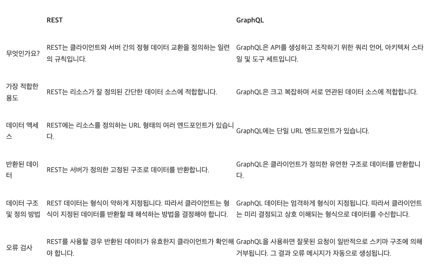

# Keynote

## REST API와 GraphQL

### - REST API(RESTful API)란 무엇인가

두 컴퓨터 시스템이 인터넷을 통해 정보를 안전하게 교환하기 위해 사용하는 인터페이스  

REST 아키텍처 스타일을 따르는 API

### API (애플리케이션 프로그래밍 인터페이스)

다른 소프트웨어 시스템과 통신하기 위해 따라야 하는 규칙

### REST(Representational State Transfer)

API 작동 방식에 대한 조건을 부과하는 소프트웨어 아키텍처

네트워크 아키텍처 원리(자원을 정의하고 자원에 대한 주소를 지정하는 방법 전반)의 모음

웹 상의 자료를 HTTP 위에서 SOAP이나 쿠키를 통한 세션 트랙킹 같은 별도의 전송계층 없잉 전송하기 위한 아주 간단한 인터페이스

### GraphQL

API를 위한 쿼리 언어

클라이언트는 필요한 데이터의 구조를 지정할 수 있으며, 서버는 정확히 동일한 구조로 데이터를 반환한다.

### - GraphQL은 왜 등장했는가?

GraphQL은 떠오르는 소셜 미디어 플랫폼의 속도 요구 사항에 대응하여 2012년에 등장했다.  
개발자들은 REST와 같은 기존 API 아키텍처가 너무 길고 정형화되어 있어서 뉴스 피드를 효율적으로 생성할 수 없다는 사실을 알게 되었다.

- REST API는 클라이언트 요청이 고정된 구조를 따라야 리소스를 수신할 수 있다. 이 엄격한 구조는 사용하기 쉽지만 필요한 데이터를 정확히 교환하기에 항상 가장 효율적인 수단인 것은 아니다.
- REST API는 항상 전체 데이터 세트를 반환한다.
  - 예를 들어 REST APP의 person 객체로부터는 그 사람의 이름, 생년월일, 주소 및 전화번호를 받게 된다. 전화번호만 있으면 이 모든 데이터를 얻을 수 있다.
  - 마찬가지로, 개인의 전화번호와 마지막 구매 내역을 알려면 여러 개의 REST API 요청이 필요하다. /person이라는 URL은 전화번호를 관리하고 /purchase라는 URL은 구매 내역을 반환한다.

소셜 미디어 개발자는 API 요청을 처리하기 위해 많은 양의 코드를 작성해야 했고, 이는 성능과 사용자 경험에 영향을 미쳤다.

이에 따라 GraphQL이 쿼리 기반 솔루션으로 부상하게 되었다. 쿼리는 한 번의 API 요청 및 응답 교환에서만 정확한 데이터를 반환할 수 있다.

### - REST API vs GraphQL

## JSON

JSON(제이슨, JavaScript Object Notation)은 속성-값 쌍(attribute-value pairs), 배열 자료형(array data types) 또는 기타 모든 시리얼화 가능한 값(serializable value) 또는 키-값 쌍으로 이루어진 데이터 오브젝트를 전달하기 위해 인간이 읽을 수 있는 텍스트를 사용하는 개방형 표준 포맷

 특히 인터넷에서 자료를 주고 받을 때 그 자료를 표현하는 방법으로 알려져 있다.

## DSL(Domain-Specific Language) : 도메인 특화 언어

특정한 도메인을 적용하는 데 특화된 컴퓨터 언어

## 선언형 프로그래밍

프로그램이 어떤 방법으로 해야 하는지를 나타내기보다 무엇과 같은지를 설명하는 프로그래밍

## 명령형 프로그래밍

알고리즘을 명시하고 목표를 명시하지 않는 프로그래밍

## SRP(단일 책임 원칙)

모든 클래스는 하나의 책임만 가지며, 클래스는 그 책임을 완전히 캡슐화 해야 한다는 원칙

### Extract Function

아주 흔히 쓰이는 SRP를 위한 수단

일단 길게 코드를 작성하고, 적절히 자를 수 있는 부분이 보일 때 "함수로 추출"한다.

💡 inverse of Inline Function (인라인 함수의 역함수)

### Inline Function

💡 inverse of Extract Function (추출 함수의 역함수)

## Atomic Design

디자인 시스템을 만드는 방법론

## React component와 props

### component

자바스크립트 함수와 비슷함.

임의의 입력 ("props"라고 부르는)을 받아들이고 어떤게 화면에 나타나야 하는지를 설명하는 React 요소를 반환한다.

컴포넌트를 사용하면 UI를 독립적이고 재사용 가능한 부분으로 분리하고 각 부분을 독립적으로 생각할 수 있다.

### props

나눠진 컴포넌트를 서로 연결하는 방법

상위 컴포넌트가 하위 컴포넌트에 값을 전달할 때 사용하는 속성

수정할 수 없다는 특징(읽기 전용)이 있다.

## React state란?

"변경"을 다루기 위한 요소

어떤 컴포넌트의 state가 바뀌면 해당 컴포넌트와 하위 컴포넌트를 다시 렌더링하게 된다.

### React state의 조건

1. 변경돼야 함. 변경되지 않는 건 state로 다룰 가치가 없다.
2. 부모 컴포넌트가 props를 통해 전달한다면 state가 아님.
3. 다른 state나 props를 이용해 계산 가능하다면 state가 아님.

## DRY 원칙

중복 배제(Don't repeat yourself; DRY)

모든 형태의 정보 중복을 지양하는 원리

## SSOT(Single Source of Truth : 단일 진실 공급원)

정보 모형과 관련된 데이터 스키마를 (모든 데이터 요소를) 한 곳에서만 제어 또는 편집하도록 조직하는 관례

## useState

컴포넌트에 상태 변수를 추가할 수 있는 React Hook

## 1급 객체 / 1급 함수 (first-class object)란?

다른 변수처럼 다루어지는 함수

1급 함수는 다른 함수들에 전달 인자로 제공되고, 다른 함수에 의해 반환될 수 있으며, 변수에 값으로서 할당될 수 있다.

## Lifting State Up

State 끌어올리기

종종 동일한 데이터에 대한 변경사항을 여러 컴포넌트에 반영해야 할 필요가 있다. 이럴 때는 가장 가까운 공통 조상으로 state를 끌어올리는 것이 좋다.
