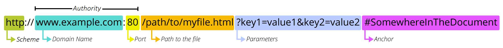
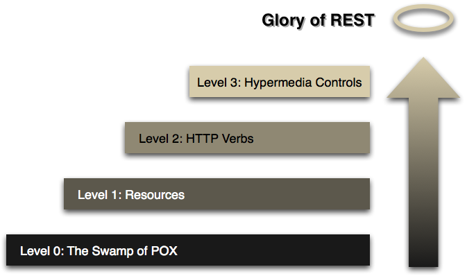
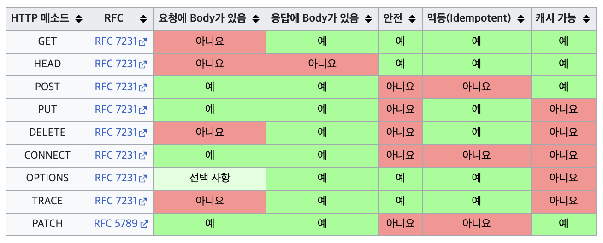

# 1. Express

## 💡 [Express 란](https://expressjs.com/ko/)

Node.js를 위한 빠르고 개방적인 간결한 웹 프레임워크

- 웹 애플리케이션  
Express는 웹 및 모바일 애플리케이션을 위한 일련의 강력한 기능을 제공하는 간결하고 유연한 Node.js 웹 애플리케이션 프레임워크다.
- API  
자유롭게 활용할 수 있는 수많은 HTTP 유틸리티 메소드 및 미들웨어를 통해 쉽고 빠르게 강력한 API를 작성할 수 있다.
- 성능  
Express는 기본적인 웹 애플리케이션 기능으로 구성된 얇은 계층을 제공하여, 여러분이 알고 있고 선호하는 Node.js 기능을 모호하게 만들지 않는다.
- Frameworks  
많은 유명한 프레임워크들이 Express를 기반으로 하고 있다.

---

[https://ko.wikipedia.org/wiki/Express.js](https://ko.wikipedia.org/wiki/Express.js)

Express.js, 또는 간단히 익스프레스(Express)는 Node.js를 위한 웹 프레임워크의 하나로, MIT 허가서로 라이선스되는 자유-오픈 소스 소프트웨어로 출시되었다. 웹 애플리케이션, API 개발을 위해 설계되었다. Node.js의 사실상의 표준 서버 프레임워크로 불리고 있다.

원 제작자 TJ Holowaychuk는 이 소프트웨어를 시나트라에 영향을 받은 서버로 기술하고 있으며 이는 플러그인으로 이용 가능한 수많은 기능들을 갖추면서 크기는 상대적으로 최소한임을 의미한다. 익스프레스는 몽고DB 데이터베이스 소프트웨어, AngularJS 프론트엔드 프레임워크와 함께 MEAN 스택의 백엔드 구성 요소이다.

Express.js는 폭스 스포츠, 우버, IBM을 포함한 수많은 기업들이 사용하고 있다. 익스프레스는 npm-stat.com에 따르면 현재 500,000,000건 이상의 다운로드 수를 기록하였다. (2018년 12월 4일 기준)

---

[Express.js란 무엇인가?](https://wikibook.co.kr/article/what-is-expressjs/)

Express.js는 Node.js의 핵심 모듈인 http와 Connect 컴포넌트를 기반으로 하는 웹 프레임워크다. 그러한 컴포넌트를 미들웨어(middleware)라고 하며, 설정보다는 관례(convention over configuration)와 같은 프레임워크의 철학을 지탱하는 주춧돌에 해당한다. 즉, 개발자들은 특정 프로젝트에 필요한 라이브러리를 어떤 것이든 자유롭게 선택할 수 있으며, 이는 개발자들에게 유연함과 수준 높은 맞춤식 구성을 보장한다.

Node.js의 핵심 모듈만 이용해서 중요 앱을 작성한다면 다음과 같은 비슷한 작업을 위해 동일한 코드를 지속적으로 작성함으로써 바퀴를 재발명할 가능성이 높다.

- HTTP 요청 본문 파싱
- 쿠키 파싱
- 세션 관리
- URL 경로와 HTTP 요청 메서드를 기반으로 한 복잡한 if 조건을 통해 라우팅을 구성
- 데이터 타입을 토대로 한 적절한 응답 헤더 결정

Express.js는 이러한 문제를 비롯해 다른 여러 문제를 해결함과 동시에 웹 앱에 MVC 형태의 구조를 제공한다. 이 같은 앱은 백엔드만 갖춘 REST API에서부터 온갖 기능을 제공하는 고도로 확장 가능한 풀스택(jade-browser와 [Socket.IO](https://ko.wikipedia.org/wiki/Socket.IO)를 포함하는) 실시간 웹 앱에 이르기까지 다양하다.

루비에 익숙한 일부 개발자들은 Express.js를 루비 온 레일스 프레임워크에 굉장히 다른 방식으로 접근하는 시나트라(Sinatra)와 비교하기도 한다.

[Express 예제](https://expressjs.com/ko/starter/hello-world.html)

---

### ✨ [ts-node](https://github.com/TypeStrong/ts-node)

node.js용 TypeScript 실행 및 REPL

이 엔진은 타입스크립트를 자바스크립트로 JIT 변환하여 사전 컴파일 없이 Node.js에서 타입스크립트를 직접 실행할 수 있게 해준다. 이는 노드의 모듈 로딩 API를 후킹하여 수행되므로 다른 Node.js 도구 및 라이브러리와 함께 원활하게 사용할 수 있다.

## 💡 [URL 구조](https://developer.mozilla.org/ko/docs/Learn/Common_questions/Web_mechanics/What_is_a_URL)

하이퍼텍스트와 HTTP에서 URL은 웹의 핵심 개념 중 하나이다. URL은 웹에 게시된 리소스를 검색하기 위해 브라우저에서 사용하는 메커니즘이다.

URL은 Uniform Resource Locator의 약자이다. URL은 웹에서 주어진 고유 리소스 주소에 지나지 않는다. 이론적으로 각각의 유효한 URL은 고유한 리소스를 가리킨다. 이러한 리소스는 HTML 페이지, CSS 문서, 이미지 등이 될 수 있다. 실제로는 몇 가지 예외가 있으며 가장 일반적인 예외는 더 이상 존재하지 않거나 이동된 리소스를 가리키는 URL이다. URL로 표시되는 리소스와 URL 자체는 웹 서버에서 처리되므로 해당 리소스와 관련 URL을 신중하게 관리하는 것은 웹 서버 소유자에게 달려 있다.

### URL 분석

```text
https://developer.mozilla.org
https://developer.mozilla.org/ko/docs/Learn/
https://developer.mozilla.org/en-US/search?q=URL
```

해당 URL 중 하나를 브라우저의 주소창에 입력하면 연결된 페이지(리소스)를 로드할 수 있다.

URL은 여러 부분으로 구성되며 일부는 필수이고 일부는 선택 사항이다. 가장 중요한 부분은 아래 URL에 강조표시되어 있다(자세한 내용은 다음 섹션에서 다룸).



참고: URL은 일반 우편 주소와 비슷하다고 생각할 수 있다. scheme(스키마)는 사용하려는 우편 서비스, domain name(도메인 이름)은 시 또는 마을, port(포트)는 우편 번호, path(경로)는 메일이 배달되어야 하는 건물, parameters(매개변수)는 건물의 아파트 번호와 같은 추가 정보, 마지막으로 anchor(앵커)는 메일을 보낸 실제 사람을 나타낸다.

#### Scheme

URL의 첫 번째 부분은 브라우저가 리소스를 요청하는 데 사용해야 하는 프로토콜을 나타낸다.(프로토콜은 컴퓨터 네트워크에서 데이터를 교환하거나 전송하기 위한 설정 방법이다). 일반적으로 웹사이트의 경우 프로토콜은 HTTPS 또는 HTTP(보안되지 않은 버전)이다.

#### Domain Name & Port

그 다음에는 권한(authority)이 뒤따르며 문자 패턴 ://에 의해 스키마와 구분된다. 만약 존재한다면 권한에는 콜론으로 구분된 도메인`(예: www.example.com)`과 포트`(80)`가 모두 포함된다.

도메인은 요청하는 웹 서버를 나타낸다. 도메인은 일반적으로 도메인 이름 (en-US)이지만 IP 주소도 사용될 수 있다. (그러나 이것은 훨씬 불편하기 때문에 자주 사용하지는 않는다.)
포트는 웹 서버의 리소스에 접근하는 데 사용되는 기술적인 "게이트"를 나타낸다. 웹 서버가 리소스에 대한 액세스 권한을 부여하기 위해 HTTP 프로토콜의 표준 포트(HTTP의 경우 80, HTTPS의 경우 443)를 사용하는 경우엔 일반적으로 생략한다. 그렇지 않으면 필수이다.

참고: 스키마와 권한 사이의 구분 기호는 ://이다. 콜론은 스키마를 URL의 다음 부분과 구분하고 //는 URL의 다음 부분이 권한임을 나타낸다.

권한을 사용하지 않는 URL의 한 예시는 메일 클라이언트(mailto:foobar)이다. 스키마는 포함하지만 권한 구성 요소는 사용하지 않는다. 따라서 콜론 뒤에 두 개의 슬래시가 오지 않고 콜론은 스키마와 메일 주소 사이의 구분 기호 역할만 한다.

#### Path to resource

`/path/to/myfile.html`은 웹 서버에 있는 리소스의 경로이다. 웹 초기에는 이와 같은 경로가 웹 서버의 실제 파일 위치를 나타냈다. 요즘에는 대부분 물리적 실체가 없는 웹 서버가 추상적으로 처리한다.

#### Parameters

`?key1=value1&key2=value2`는 웹 서버에 제공되는 추가 매개변수이다. 이러한 매개변수는 & 기호로 구분된 키/값 쌍 목록이다. 웹 서버는 리소스를 반환하기 전에 이러한 매개변수를 사용하여 추가 작업을 수행할 수 있다. 각 웹 서버에는 매개변수에 관한 고유한 규칙이 있으며 특정 웹 서버가 매개변수를 처리하는지 알 수 있는 신뢰할 수 있는 유일한 방법은 웹 서버 소유자에게 물어보는 것이다.

#### Anchor

`#SomewhereInTheDocument`는 리소스 자체의 어떤 부분에 대한 앵커이다. 앵커는 리소스 내부에서 일종의 "책갈피" 역할을 하며, 브라우저에 해당 "책갈피" 지점의 콘텐츠를 표시하도록 지시한다. 예를 들어 HTML 문서에서는 브라우저가 앵커가 정의된 지점으로 스크롤한다. 비디오 또는 오디오 문서에서 브라우저는 앵커가 나타내는 시간으로 이동하려고 시도한다. 프래그먼트 식별자라고도 하는 # 뒤의 부분은 요청과 함께 서버로 전송되지 않는다는 점은 주목할 가치가 있다.

## 💡 REST API

Roy Fielding - [“Architectural Styles and the Design of Network-based Software Architectures” (2000)](https://www.ics.uci.edu/~fielding/pubs/dissertation/top.htm)

REST API는 REST 아키텍처 스타일을 따르는 API이다.

REST(Representational State Transfer)는 월드 와이드 웹과 같은 분산 하이퍼미디어 시스템을 위한 소프트웨어 아키텍처의 한 형식이다. 이 용어는 로이 필딩(Roy Fielding)의 2000년 박사학위 논문에서 소개되었다. 필딩은 HTTP의 주요 저자 중 한 사람이다. 이 개념은 네트워킹 문화에 널리 퍼졌다.

### [✨ Richardson Maturity Model](https://martinfowler.com/articles/richardsonMaturityModel.html) : 리처드슨 성숙도 모델

레너드 리처드슨이 개발한 모델은 REST 접근 방식의 주요 요소를 세 단계로 분류한다. 여기에는 리소스, http 동사 및 하이퍼미디어 제어가 소개된다.



RMM은 REST의 요소에 대해 생각하는 좋은 방법이지만 REST의 수준 자체를 정의하는 것은 아니라는 점을 강조하고 싶다. 로이 필딩은 레벨 3 RMM이 REST의 전제 조건이라는 점을 분명히 했다. 소프트웨어의 많은 용어와 마찬가지로 REST에 대한 정의도 다양하지만, 로이 필딩이 이 용어를 만들었기 때문에 그의 정의에 더 많은 비중을 두어야 한다.

이 RMM이 유용한 이유는 restful thinking의 기본 아이디어를 단계별로 이해할 수 있는 좋은 방법을 제공하기 때문이다. 따라서 이 개념이 어떤 평가 메커니즘에 사용되어야 하는 것이 아니라 개념을 배우는 데 도움이 되는 도구라고 생각한다. restful thinking이 시스템을 통합하는 올바른 방법이라고 확신하기에는 아직 충분한 사례가 없다고 생각하지만, 매우 매력적인 접근 방식이며 대부분의 상황에서 권장하고 싶은 접근 방식이라고 생각한다.

이안 로빈슨과 이 문제에 대해 이야기하면서 그는 Leonard Richardson이 이 모델을 처음 발표했을 때 이 모델에서 매력적으로 느꼈던 점은 일반적인 디자인 기법과의 관계였다고 강조했다.

- 레벨 1은 divide 및 conquer을 사용하여 대규모 서비스 엔드포인트를 여러 리소스로 분할함으로써 복잡성을 처리하는 문제를 해결한다.
- 레벨 2는 표준 동사 집합을 도입하여 유사한 상황을 동일한 방식으로 처리하여 불필요한 변형을 제거한다.
- 레벨 3은 검색 기능을 도입하여 프로토콜을 보다 자체적으로 문서화할 수 있는 방법을 제공한다.

그 결과, 제공하고자 하는 HTTP 서비스의 종류에 대해 생각하고 해당 서비스와 상호 작용하고자 하는 사람들의 기대치를 설정하는 데 도움이 되는 모델이 탄생했다.

---

대개는 “필딩 제약 조건” 4가지를 모두 만족하지 않고, Resource와 HTTP Verb만 도입하는 수준으로 사용.

- 이렇게 안 하고: /write-post
- 이렇게 하자: /posts → 뭔가를 한다 (CRUD)

CRUD에 대해 HTTP Method를 대입. Read는 Collection(복수)과 Item(Element)(단수)로 나뉨.

기본 리소스 URL: /products

1. Read (Collection) → GET /products ⇒ 상품 목록 확인
2. Read (Item) → GET /products/{id} ⇒ 특정 상품 정보 확인
3. Create (Collection Pattern 활용) → POST /products ⇒ 상품 추가 (JSON 정보 함께 전달)
4. Update (Item) → PUT 또는 PATCH /products/{id} ⇒ 특정 상품 정보 변경 (JSON 정보 함께 전달)
5. Delete (Item) → DELETE /products/{id} ⇒ 특정 상품 삭제

## 💡[HTTP Method(CRUD)](https://developer.mozilla.org/en-US/docs/Web/HTTP/Methods)

HTTP 메서드란 클라이언트와 서버 사이에 이루어지는 요청(Request)과 응답(Response) 데이터를 전송하는 방식을 일컫는다. 쉽게 말하면 서버에 주어진 리소스에 수행하길 원하는 행동, 서버가 수행해야 할 동작을 지정하는 요청을 보내는 방법이다.

HTTP는 주어진 리소스에 대해 수행해야 할 작업을 나타내는 일련의 요청 메서드를 정의한다. 이러한 요청 메서드는 명사일 수도 있지만 HTTP 동사라고 부르기도 한다. 각 요청 메서드는 서로 다른 의미를 구현하지만, 요청 메서드 그룹이 공유하는 몇 가지 공통된 기능(예: 요청 메서드는  safe, idempotent, or cacheable.)이 있다.



✔️ `GET`
GET 메서드는 지정된 리소스의 표현을 요청한다. GET을 사용한 요청은 데이터만 검색해야 한다.

`HEAD`
HEAD 메서드는 GET 요청과 동일하지만 응답 본문이 없는 응답을 요청한다.

✔️ `POST`
POST 메서드는 지정된 리소스에 엔티티를 제출하므로 종종 서버에 상태 변경이나 부작용을 일으킨다.

✔️ `PUT`
PUT 메서드는 대상 리소스의 모든 현재 표현을 요청 페이로드로 대체한다.

✔️ `DELETE`
DELETE 메서드는 지정된 리소스를 삭제한다.

`CONNECT`
CONNECT 메서드는 대상 리소스로 식별된 서버에 터널을 설정한다.

`OPTIONS`
옵션 메서드는 대상 리소스에 대한 통신 옵션을 설명한다.

`TRACE`
TRACE 메서드는 대상 리소스에 대한 경로를 따라 메시지 루프백 테스트를 수행한다.

✔️ `PATCH`
PATCH 메서드는 리소스에 부분적인 수정을 적용한다.
