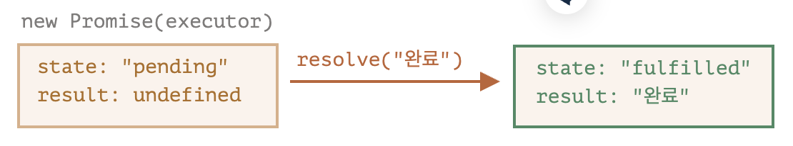

# 2. Fetch API & CORS

## 💡 [Fetch API 란](https://developer.mozilla.org/ko/docs/Web/API/Fetch_API)

Fetch API는 네트워크 통신을 포함한 리소스 취득을 위한 인터페이스를 제공하며, XMLHttpRequest보다 강력하고 유연한 대체제이다.

Fetch API는 Request와 Response 객체, 그리고 기타 네트워크 요청에 관련된 것들을 사용하고, CORS와 HTTP Origin 헤더 행동 등 관련한 개념도 포함하고 있다.

요청을 생성하고 리소스를 취득하려면 fetch 메서드를 사용하면 된다. fetch()는 Window와 Worker (en-US) 컨텍스트 양쪽에서 모두 사용할 수 있는 전역 메서드이다. 그러므로 리소스를 취득할 상황이 생기는 거의 모든 컨텍스트에서 사용할 수 있다.

fetch() 메서드는 하나의 필수 매개변수로 가져오려는 리소스 경로를 받는다. 반환 값은 해당 요청에 대한 Response로 이행하는 Promise인데, 서버가 헤더를 포함한 응답을 하는 순간 이행한다. 이는 서버가 HTTP 오류 응답 코드로 응답해도 이행한다는 뜻이다. 선택 사항으로, 두 번째 매개변수에 init 옵션 객체를 제공할 수 있다.

Response를 가져온 후에는 본문 콘텐츠의 유형과 처리 방법을 정의할 수 있는 다양한 메서드를 사용할 수 있다.

Request()와 Response() (en-US) 생성자를 직접 호출해서 요청과 응답을 생성할 수 있지만, 이런 사용법은 흔치 않다. 보통 이 두 객체는 다른 API(예를 들어, 서비스 워커의 FetchEvent.respondWith() (en-US))에 의해 생성된다.

### Fetch Interfaces

`fetch()`
리소스를 취득하기 위한 fetch() 메서드이다.

`Headers (en-US)`
요청/응답 헤더를 나타낸다. 헤더를 질의하고 그 결과에 따라 다양한 동작을 취하기 위해 사용할 수 있다.

`Request`
리소스 요청을 나타낸다.

`Response`
요청에 대한 응답을 나타낸다.

### [Fetch API 사용하기](https://developer.mozilla.org/ko/docs/Web/API/Fetch_API/Using_Fetch)

Fetch API는 HTTP 파이프라인을 구성하는 요청과 응답 등의 요소를 JavaScript에서 접근하고 조작할 수 있는 인터페이스를 제공한다. Fetch API가 제공하는 전역 fetch() 메서드로 네트워크의 리소스를 쉽게 비동기적으로 취득할 수도 있다.

콜백 기반 API인 XMLHttpRequest와 달리, Fetch API는 서비스 워커에서도 쉽게 사용할 수 있는 프로미스 기반의 개선된 대체제이다. 또한 Fetch API는 CORS를 포함한 고급 개념을 HTTP 확장으로 정의한다.

기본적인 리소스 취득 요청은 이렇게 생겼다.

```javaScript
async function logJSONData() {
  const response = await fetch("http://example.com/movies.json");
  const jsonData = await response.json();
  console.log(jsonData);
}
```

위 코드는 네트워크를 통해 JSON 파일을 취득해서 콘솔에 출력한다. 가장 단순한 형태의 fetch()는 가져오고자 하는 리소스의 경로를 나타내는 하나의 인수만 받는다. 응답은 Response 객체로 표현되며, JSON 응답 본문을 바로 반환하지는 않는다.

Response 객체 역시 JSON 응답 본문을 그대로 포함하지는 않는다. Response는 HTTP 응답 전체를 나타내는 객체로, JSON 본문 콘텐츠를 추출하기 위해서는 json() (en-US) 메서드를 호출해야 한다. json()은 응답 본문 텍스트를 JSON으로 파싱한 결과로 이행하는, 또 다른 프로미스를 반환한다.

취득 요청은 가져오려는 리소스의 지시문이 아닌, Content-Security-Policy (en-US) 헤더의 connect-src 지시문에 의해 제어된다.

## 💡 [Promise](https://ko.javascript.info/promise-basics)

본인을 아주 유명한 가수라고 가정해 보자. 그리고 탑 가수인 본인이 밤, 낮으로 다음 싱글 앨범이 언제 나오는지 물어보는 팬들을 상대해야 한다고 해 보자.

당신은 앨범이 출시되면 팬들이 자동으로 소식을 받아볼 수 있도록 해 부하를 덜 것이다. 구독 리스트를 하나 만들어 팬들에게 전달해 이메일 주소를 적게 하고, 앨범이 준비되면 리스트에 있는 팬들에게 메일을 보내 앨범 관련 소식을 바로 받아볼 수 있게 하는 식으로 말이다. 이렇게 하면 녹음 스튜디오에 화재가 발생해서 출시 예정인 앨범이 취소되는 불상사가 발생해도 관련 소식을 팬들에게 전달 할 수 있다.

이제 모두가 행복해졌다. 밤낮으로 질문을 하는 팬이 사라졌고, 팬들은 앨범 출시를 놓치지 않을 수 있게 되었으니까 말이다.

이 비유는 코드를 작성하면서 자주 만나는 상황을 실제 일어날 법한 일로 바꾼 것이다. 바로 아래 같은 상황 말이다.

'제작 코드(producing code)'는 원격에서 스크립트를 불러오는 것 같은 시간이 걸리는 일을 한다. 위 비유에선 '가수’가 제작 코드에 해당한다.  
'소비 코드(consuming code)'는 '제작 코드’의 결과를 기다렸다가 이를 소비한다. 이때 소비 주체(함수)는 여럿이 될 수 있다. 위 비유에서 소비 코드는 '팬’이다.  
프라미스(promise) 는 '제작 코드’와 '소비 코드’를 연결해 주는 특별한 자바스크립트 객체이다. 위 비유에서 프라미스는 '구독 리스트’이다. '프라미스’는 시간이 얼마나 걸리든 상관없이 약속한 결과를 만들어 내는 '제작 코드’가 준비되었을 때, 모든 소비 코드가 결과를 사용할 수 있도록 해준다.  
사실 프라미스는 구독 리스트보다 훨씬 복잡하기 때문에, 위 비유가 완벽하게 들어맞지는 않는다. 프라미스엔 더 많은 기능이 있고, 한계도 있다.  

promise 객체는 아래와 같은 문법으로 만들 수 있다.

```javaScript
let promise = new Promise(function(resolve, reject) {
  // executor (제작 코드, '가수')
});
```

new Promise에 전달되는 함수는 executor(실행자, 실행 함수) 라고 부른다. executor는 new Promise가 만들어질 때 자동으로 실행되는데, 결과를 최종적으로 만들어내는 제작 코드를 포함한다. 위 비유에서 '가수’가 바로 executor이다.

executor의 인수 resolve와 reject는 자바스크립트에서 자체 제공하는 콜백이다. 개발자는 resolve와 reject를 신경 쓰지 않고 executor 안 코드만 작성하면 된다.

대신 executor에선 결과를 즉시 얻든 늦게 얻든 상관없이 상황에 따라 인수로 넘겨준 콜백 중 하나를 반드시 호출해야 한다.

- resolve(value) — 일이 성공적으로 끝난 경우 그 결과를 나타내는 value와 함께 호출
- reject(error) — 에러 발생 시 에러 객체를 나타내는 error와 함께 호출
요약하면 다음과 같다. executor는 자동으로 실행되는데 여기서 원하는 일이 처리된다. 처리가 끝나면 executor는 처리 성공 여부에 따라 resolve나 reject를 호출한다.

한편, new Promise 생성자가 반환하는 promise 객체는 다음과 같은 내부 프로퍼티를 갖는다.

- state — 처음엔 "pending"(보류)이었다 resolve가 호출되면 "fulfilled", reject가 호출되면 "rejected"로 변한다.
- result — 처음엔 undefined이었다 resolve(value)가 호출되면 value로, reject(error)가 호출되면 error로 변한다.
따라서 executor는 아래 그림과 같이 promise의 상태를 둘 중 하나로 변화시킨다.


promise 생성자와 간단한 executor 함수로 만든 예시를 살펴보자. setTimeout을 이용해 executor 함수는 약간의 시간이 걸리도록 구현해 보았다.

```javaScript
let promise = new Promise(function(resolve, reject) {
  // 프라미스가 만들어지면 executor 함수는 자동으로 실행됩니다.

  // 1초 뒤에 일이 성공적으로 끝났다는 신호가 전달되면서 result는 '완료'가 됩니다.
  setTimeout(() => resolve("완료"), 1000);
});
```

위 예시를 통해서 우리가 알 수 있는 것은 두 가지이다.

executor는 new Promise에 의해 자동으로 그리고 즉각적으로 호출된다.

executor는 인자로 resolve와 reject 함수를 받는다. 이 함수들은 자바스크립트 엔진이 미리 정의한 함수이므로 개발자가 따로 만들 필요가 없다. 다만, resolve나 reject 중 하나는 반드시 호출해야 한다.

executor '처리’가 시작 된 지 1초 후, resolve("완료")이 호출되고 결과가 만들어진다. 이때 promise 객체의 상태는 다음과 같이 변한다.



이처럼 일이 성공적으로 처리되었을 때의 프라미스는 'fulfilled promise(약속이 이행된 프라미스)'라고 불린다.

이번에는 executor가 에러와 함께 약속한 작업을 거부하는 경우에 대해 살펴보자.

```javaScript
let promise = new Promise(function(resolve, reject) {
  // 1초 뒤에 에러와 함께 실행이 종료되었다는 신호를 보냅니다.
  setTimeout(() => reject(new Error("에러 발생!")), 1000);
});
```

1초 후 `reject(...)`가 호출되면 `promise`의 상태가 `"rejected"`로 변한다.


지금까지 배운 내용을 요약해 보자. executor는 보통 시간이 걸리는 일을 수행한다. 일이 끝나면 resolve나 reject 함수를 호출하는데, 이때 프라미스 객체의 상태가 변화한다.

이행(resolved) 혹은 거부(rejected) 상태의 프라미스는 ‘처리된(settled)’ 프라미스라고 부른다. 반대되는 프라미스로 '대기(pending)'상태의 프라미스가 있다.

프라미스 객체는 executor(‘제작 코드’ 혹은 ‘가수’)와 결과나 에러를 받을 소비 함수(‘팬’)를 이어주는 역할을 한다. 소비함수는 .then, .catch, .finally 메서드를 사용해 등록(구독)된다.

## 💡 [ReableStream](https://developer.mozilla.org/ko/docs/Web/API/ReadableStream)

Streams API의 ReadableStream 인터페이스는 바이트 데이터를 읽을수 있는 스트림을 제공한다. Fetch API는 Response 객체의 body 속성을 통하여 ReadableStream의 구체적인 인스턴스를 제공한다.

### Constructor

`ReadableStream() (en-US)`
읽을 수 있는 스트림 객체를 생성하고 리턴한다.

### Properties

`ReadableStream.cancel() (en-US)`
스트림을 취소하여, 소비자가 스트림에 대해 관심이 없음을 알린다.

`ReadableStream.getReader() (en-US)`
Reader를 만들고 스트림을 그 Reader에 고정 시킨다. 스트림이 고정되어 있는 동안에는 다른 Reader를 얻을 수 없다.

`ReadableStream.pipeThrough() (en-US)`
현재 스트림을 transform stream이나 다른 writable/readable pair를 통해 파이핑할 수 있는 체인 방식을 제공한다.

`ReadableStream.pipeTo() (en-US)`
인자로 넘기는 WritableStream과 현재의 ReadableStream을 연결하고 프로미스를 리턴한다. 이 프로미스는 파이핑 프로세스가 성공적으로 완료될때 fulfil되며 에러가 발생했을때 reject된다.

`ReadableStream.tee() (en-US)`
티 메서드는 이 읽기 가능한 스트림을 티핑하여 결과 분기 두 개를 포함하는 두 요소 배열을 새 ReadableStream 인스턴스로 반환한다. 이러한 각 스트림은 동일한 수신 데이터를 수신한다.

### Examples

아래 예시에서, 다른 리소스에서 fetch된 HTML 조각들을 스트림 하기 위해 가공의 Response를 만든다. 이것은 Uint8Array (en-US)로 구성된 ReadableStream의 사용법을 보여준다.

```javaScript
fetch("https://www.example.org/").then((response) => {
  const reader = response.body.getReader();
  const stream = new ReadableStream({
    start(controller) {
      // 아래 함수는 각 data chunck를 다룬다.
      function push() {
        // "done"은 Boolean 이며 value는 "Uint8Array이다."
        reader.read().then(({ done, value }) => {
          // 더이상 읽은 데이터가 없는가?
          if (done) {
            // 브라우저에게 데이터 전달이 끝났다고 알린다.
            controller.close();
            return;
          }

          // 데이터를 얻고 컨트롤러를 통하여 그 데이터를 브라우저에 넘긴다.
          controller.enqueue(value);
          push();
        });
      }

      push();
    },
  });

  return new Response(stream, { headers: { "Content-Type": "text/html" } });
});
```

### [✨ 텍스트 디코더와 텍스트 인코더](https://ko.javascript.info/text-decoder)

#### 텍스트 디코더

이진 데이터가 문자열이라면 어떨지 생각해보자. 예를 들어 텍스트 데이터가 있는 파일을 받았다고 가정하겠다.

내장 객체, TextDecoder는 주어진 버퍼와 인코딩으로 값을 실제 자바스크립트 문자열로 읽을 수 있게 해준다.

첫 번째로 객체를 생성한다.

```javaScript
let decoder = new TextDecoder([label], [options]);
```

- label – 기본적인 인코딩 방식은 utf-8이지만 big5, windows-1251 및 다른 인코딩 방식도 지원된다.
- options – 선택 항목이다.
  - fatal – 불린 값. true인 경우, 잘못된 글자(디코딩 불가능한 글자)를 대상으로 예외를 던진다. false(기본값)인 경우, 글자를 \uFFFD로 대체한다.
  - ignoreBOM – 불린 값이 true인 경우 사용되지 않는 바이트 순서 표식(Byte Order Mark, BOM)을 무시한다.

그런 다음 생성했던 객체를 디코딩한다.

```javaScript
let str = decoder.decode([input], [options]);
```

- input – 디코딩할 BufferSource를 입력한다.
- options – 선택 항목이다.
  - stream – 많은 양의 데이터를 받아들여 decoder를 반복적으로 호출할 때도 decoding이 반복적으로 실행된다. 이런 경우 멀티 바이트 문자가 많은 데이터로 분할될 수 있다. 이 옵션은 데이터 분할을 방지하기 위해 TextDecoder에 “unfinished” 문자를 입력시키고 다음 데이터가 오면 디코딩하도록 지시한다.

##### 예시

```javaScript
let uint8Array = new Uint8Array([72, 101, 108, 108, 111]);

alert( new TextDecoder().decode(uint8Array) ); // Hello
```

```javaScript
let uint8Array = new Uint8Array([228, 189, 160, 229, 165, 189]);

alert( new TextDecoder().decode(uint8Array) ); // 你好
```

버퍼의 하위 배열 뷰를 생성하여 버퍼의 일부를 디코딩 할 수 있다.

```javaScript
let uint8Array = new Uint8Array([0, 72, 101, 108, 108, 111, 0]);

// 문자열을 나타내는 배열의 요소는 중간에 존재합니다.
// 배열의 복사 없이 문자열을 출력할 수 있습니다.
let binaryString = uint8Array.subarray(1, -1);

alert( new TextDecoder().decode(binaryString) ); // Hello
```

#### 텍스트 인코더

TextEncoder는 반대로 문자열을 바이트로 변환한다.

```javaScript
let encoder = new TextEncoder();
```

TextEncoder는 인코딩 시 'utf-8’만 지원한다.

2가지 메서드가 있다.

- encode(str) – Uint8Array에 문자열을 반환한다.
- encodeInto(str, destination) – Uint8Array 구조 형태로 문자열 str를 destination에 인코딩한다.

```javaScript
let encoder = new TextEncoder();

let uint8Array = encoder.encode("Hello");
alert(uint8Array); // 72,101,108,108,111
```

## 💡 [Unicode](https://ko.wikipedia.org/wiki/%EC%9C%A0%EB%8B%88%EC%BD%94%EB%93%9C)


유니코드(영어: Unicode)는 전 세계의 모든 문자를 컴퓨터에서 일관되게 표현하고 다룰 수 있도록 설계된 산업 표준이다. 유니코드는 유니코드 협회(Unicode Consortium)가 제정한다. 또한 이 표준에는 ISO 10646 문자 집합, 문자 인코딩, 문자 정보 데이터베이스, 문자들을 다루기 위한 알고리즘 등을 포함하고 있다.

또한 유니코드의 목적은 현존하는 문자 인코딩 방법들을 모두 유니코드로 교체하려는 것이다. 기존의 인코딩들은 그 규모나 범위 면에서 한정되어 있고, 다국어 환경에서는 서로 호환되지 않는 문제점이 있었다. 유니코드가 다양한 문자 집합들을 통합하는 데 성공하면서 유니코드는 컴퓨터 소프트웨어의 국제화와 지역화에 널리 사용되게 되었으며, 비교적 최근의 기술인 XML, 자바, 그리고 최신 운영 체제 등에서도 지원하고 있다.

유니코드에서 한국어 발음을 나타날 때는 예일 로마자 표기법의 변형인 ISO/TR 11941을 사용하고 있다.

### 기원 및 개발

유니코드의 기원은 1987년으로 거슬러 올라가며, 이 때 제록스의 조 베커와 애플의 리 콜린스, 마크 데이비스가 통일된 문자 집합을 만드는 것을 탐구하기 시작하였다. 1988년 조 베커는 유니코드라는 이름의 국제/다언어 문자 인코딩 시스템(international/multilingual text character encoding system, tentatively called Unicode)를 위한 초안을 출판하였다.

### 유니코드 변환 형식과 국제 문자 세트

유니코드는 2가지 매핑 방식이 있다: 유니코드 변환 형식(Unicode Transformation Format, UTF) 인코딩, 국제 문자 세트(Universal Coded Character Set, UCS) 인코딩.

## 💡 [CORS(Cross-Origin Resource Sharing : 교차 출처 리소스 공유)란](https://developer.mozilla.org/ko/docs/Web/HTTP/CORS)

교차 출처 리소스 공유(Cross-Origin Resource Sharing, CORS)는 추가 HTTP 헤더를 사용하여, 한 출처에서 실행 중인 웹 애플리케이션이 다른 출처의 선택한 자원에 접근할 수 있는 권한을 부여하도록 브라우저에 알려주는 체제이다. 웹 애플리케이션은 리소스가 자신의 출처(도메인, 프로토콜, 포트)와 다를 때 교차 출처 HTTP 요청을 실행한다.

교차 출처 요청의 예시: `https://domain-a.com`의 프론트 엔드 JavaScript 코드가 XMLHttpRequest를 사용하여 `https://domain-b.com/data.json`을 요청하는 경우.

보안 상의 이유로, 브라우저는 스크립트에서 시작한 교차 출처 HTTP 요청을 제한한다. 예를 들어, XMLHttpRequest와 Fetch API는 동일 출처 정책을 따른다. 즉, 이 API를 사용하는 웹 애플리케이션은 자신의 출처와 동일한 리소스만 불러올 수 있으며, 다른 출처의 리소스를 불러오려면 그 출처에서 올바른 CORS 헤더를 포함한 응답을 반환해야 한다.


CORS 체제는 브라우저와 서버 간의 안전한 교차 출처 요청 및 데이터 전송을 지원한다. 최신 브라우저는 XMLHttpRequest 또는 Fetch와 같은 API에서 CORS를 사용하여 교차 출처 HTTP 요청의 위험을 완화한다.

### [✨ 동일 출처 정책](https://developer.mozilla.org/ko/docs/Web/Security/Same-origin_policy)

동일 출처 정책은 어떤 출처에서 불러온 문서나 스크립트가 다른 출처에서 가져온 리소스와 상호 작용할 수 있는 방법을 제한하는 중요한 보안 메커니즘이다.

잠재적 악성 문서를 격리하여 가능한 공격 벡터를 줄이는 데 도움이 된다. 예를 들어 인터넷의 악의적인 웹사이트가 브라우저에서 JS를 실행하여 (사용자가 로그인 한) 타사 웹메일 서비스나 회사 인트라넷(공용 IP 주소가 없어 공격자의 직접적인 접근으로부터 보호)에서 데이터를 읽고 공격자에게 전달하는 것을 방지한다.

---
웹 브라우저는 Same Origin Policy에 따라 웹 페이지와 리소스를 요청한 곳(여기서는 REST API 서버)이 서로 다른 출처(포트까지 포함)일 때 서버에서 얻은 결과를 사용할 수 없게 막는다. 서버에 요청하고 응답을 받아오는 것까지는 이미 진행이 다 된 상황이란 점에 주의!

REST API 서버에서 Headers에 “Access-Control-Allow-Origin” 속성을 추가하면 된다.

Express에선 그냥 [CORS 미들웨어](https://expressjs.com/en/resources/middleware/cors.html)를 설치해서 사용하면 됨.

패키지 설치

```bash
npm i cors
npm i -D @types/cors
```

CORS 미들웨어 사용

```jsx
import express from 'express';
**import cors from 'cors';**

const app = express();

**app.use(cors());**
```

정교한 설정은 공식 문서 참고.
