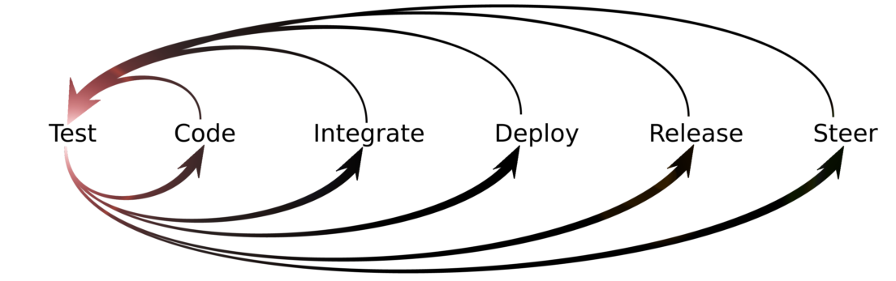
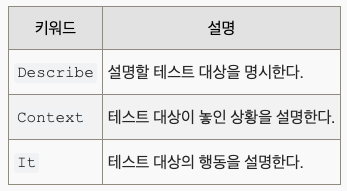
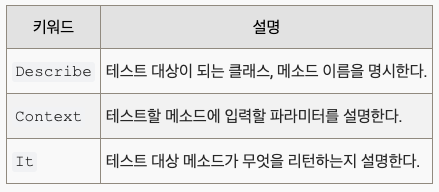

# 1. TDD

⚠️ TDD 에 대해서 주의할 점
테스트 코드를 작성한다고 해서 TDD가 아니다.
TDD Cycle 에 따라 테스트 코드를 먼저 작성하고, 구현하고, 리팩터링 하는 과정을 엄격하게 지켜서 개발을 진행해야 TDD 라고 할 수 있다.
당장은 TDD 보다 테스트 코드 작성에 익숙해지고 어떻게 하면 테스트 코드를 잘 작성할 수 있을까에 초점을 맞춰 공부하면 좋다.

## [💡 TDD(Test Driven Development)란](https://github.com/ahastudio/til/blob/main/agile/test-driven-development.md)

```text
테스트 코드를 먼저 작성하는,  
즉 구현보다 인터페이스와 스펙을 먼저 정의함으로써 개발을 진행하는 방식.
```

TDD Cycle

1. Red → 실패하는 테스트 코드를 작성. 인터페이스와 스펙에 집중한다.
2. Green → 재빨리 테스트를 통과시킨다. 올바른 방법이 아니어도 괜찮다.
3. Refactor → 리팩터링을 통해 코드를 올바르게 만든다. TDD에서 가장 중요한 부분이지만, 간과될 때가 많다.

작은 단계를 찾고, 코드에서 피드백을 얻는 게 (어렵고) 중요하다. 2번이 어렵다면 1번으로 돌아가서 더 작고 쉬운 문제를 정의하고, 3번을 위해 의도를 드러내고 중복을 찾아 제거하는 연습을 해야 한다. 이 둘이 익숙하지 않으면 TDD를 하는 게 거의 불가능하고, 사실 이 둘이 어려우면 일반적인 개발 또는 클린 코드를 작성하는 것 또한 매우 힘들다.

### [Test Driven Development](http://wiki.c2.com/?TestDrivenDevelopment)



코딩할 때 이러한 활동을 번갈아 가며 수행하라:

- 테스트를 추가하고, 실패하도록 하고, 테스트를 통과하는 코드를 작성한다.([DoSimpleThings](http://wiki.c2.com/?DoSimpleThings), [CodeUnitTestFirst](http://wiki.c2.com/?CodeUnitTestFirst))

- 중복을 제거한다.([OnceAndOnlyOnce](http://wiki.c2.com/?OnceAndOnlyOnce), [DontRepeatYourself](http://wiki.c2.com/?DontRepeatYourself), [ThreeStrikesAndYouAutomate](http://wiki.c2.com/?ThreeStrikesAndYouAutomate))

테스트는 품질, 비용, 이전에 설치된 기능의 존재 여부에 대한 약속을 지키는 데 도움이 된다.

이 시스템을 사용하면 모든 코드가 이미 클라이언트와 테스트 rigs라는 두 명의 사용자를 가지고 있기 때문에 고도로 분리되어 재사용이 용이하다. 클래스는 일반적으로 한 명의 사용자에서 두 명의 사용자로 전환하는 데 저항하지만 나머지는 쉽다. 매우 빠른 코딩의 부수적인 효과로 재사용을 쉽게 만든다.

그런 다음 '중복 제거' 단계에서는 가상 메서드 및 기타 기법을 통해 표현할 수 있는 잠재적 추상화가 있는지 코드를 검토하여 자연스럽게 코드를 더 확장 가능하게 만든다. 이것이 바로 1980년대에 유행했던 '재사용'이다.

- 무엇을 하고 싶은지 생각하라.
- 어떻게 테스트할지 생각하라.
- 간단한 테스트를 작성한다. 원하는 API에 대해 생각하라.
- 테스트에 실패할 만큼만 코드를 작성한다.
- 테스트를 실행하고 실패하는 것을 지켜본다. (JUnit과 같은 것을 사용하는 경우 테스트 실행기는 "빨간색 막대"를 표시한다.) 이제 테스트가 실행된다는 것을 알았다.
- 테스트를 통과할 수 있을 만큼만 코드를 작성하라.(그리고 이전 테스트도 모두 통과해야 한다.)
- 실행하고 모든 테스트가 통과되는지 확인한다. (JUnit 등을 사용하는 경우 테스트 실행기에 "녹색 막대"가 표시된다.) 통과하지 못하면 뭔가 잘못한 것이므로 방금 작성한 내용일 테니 지금 수정하라.
- 중복되는 로직이 있거나 표현력이 부족한 코드가 있다면 리팩터링하여 중복을 제거하고 표현력을 높여라. 여기에는 결합을 줄이고 응집력을 높이는 작업이 포함된다.
- 테스트를 다시 실행하면 여전히 녹색 막대가 표시되어야 한다. 빨간색 막대가 표시되면 리팩터링에 실수가 있는 것이다. 지금 수정하고 다시 실행하라.
- 새 코드 작성을 유도하는 테스트를 더 이상 찾을 수 없을 때까지 위의 단계를 반복한다.

첫 번째 항목이 가장 어렵고 그 다음이 두 번째 항목이라는 점에 유의하라. 하지만 이 두 가지를 할 수 없다면 코드 작성을 시작하지 않는 것이 좋다. 나머지 목록은 매우 쉽지만 처음 두 항목은 매우 중요하다.
항목 1은 Onsite Customer가 계속 외치는 내용이고, 항목 2는 항목 1을 뒤집어서 설명한 것이다. 특히 이 순서대로 하면 모두 쉽다.
현장 고객의 말을 듣는 것과 그 의미를 이해하는 것 사이에는 큰 차이가 있다. 비즈니스 명세서를 기술 언어로 번역하는 것은 어려운 작업이 될 수 있으며 그 어려움을 존중해야 한다. 항목 2는 코드를 테스트하려면 최종 사용자가 반드시 필요로 하지 않는 일부 사항을 노출해야 하는 경우가 많다는 점을 인식한다. 사용자가 필요로 하는 것을 넘어 테스트에 필요한 것까지 고려해야 하는 단계가 있다.

### [Xper:Test Driven Development](https://web.archive.org/web/20070628064054/http://xper.org/wiki/xp/TestDrivenDevelopment)

#### TDD란 무엇인가?

작성해야하는 프로그램에 대한 테스트를 먼저 작성하고 이 테스트를 통과할 수 있도록 실제 프로그램의 코드를 작성한다. 여기서 만드는 테스트도 그 자체로 하나의 프로그램이며 프로그램의 요구사항을 반영할 수 있게 만든다. 예를 들어 두 수를 더하는 add 함수를 만들어야 한다면 add 함수부터 만드는 것이 아니라 다음과 같은 testAdd 함수를 먼저 만든다.

```javaScript
int testAdd() { 
  assert 5 + 4 == add(5, 4) 
  assert -4 + 9 == add(-4, 9) 
} 
```

그리고 나서 이 테스트를 통과하도록 add 함수를 만드는 것이다. 만약 testAdd를 실행했는데 add 함수에 문제가 있으면 assert에서 에러가 발생할 것이다. 테스트를 통과하면 add 함수는 5 + 4와 -4 + 9를 정확하게 계산해낸다는 것을 보증할 수 있다. 이처럼 테스트에 요구사항이 제대로 동작함을 입증할 수 있는 코드를 작성하고 이 테스트를 만족하는 실제 프로그램을 써나가는 것이 TestDrivenDevelopment이다.

#### TDD의 과정

1. 테스트를 작성한다.
2. 작성한 테스트를 통과할 수 있도록 가장 빠른 방법으로 코드를 작성한다. 이 과정에 중복된 코드를 만들어도 상관 없다.
3. 테스트를 수행한다.
4. 테스트를 통과하면 작성한 코드에서 중복을 제거한다. 아니면 2번으로 돌아간다.
5. 테스트를 수행한다.
6. 테스트를 통과하면 완성. 다음 테스트를 1번부터 시작한다. 실패하면 4로 돌아가서 디버깅한다.

#### 왜 TDD를 하는가?

1. 테스트를 먼저 작성하고 실제 코드를 작성하기 때문에 테스트 되지 않는 코드가 없어진다. 즉, 프로그램의 모든 코드가 테스트되기 때문에 버그의 발생 가능성이 줄어든다.
2. 테스트 자체가 요구사항을 분명하게 드러나게 해주는 효과가 있고 테스트에 맞게 코딩하다보면 자연스럽게 프로그램의 디자인이 SimpleDesign이 되는 경향이 있다.
3. 테스트가 잘 작성되어 있으면 프로그램에 여러 가지 변경 작업을 할 때 그 변경으로 인해 다른 부분에서 예상치 못한 문제가 발생하는 것을 쉽게 알아차릴 수 있으므로 변경 작업을 두려움 없이 쉽게 할 수 있게 되어 개발 과정의 유연성이 높아진다. 그래서 최종적으로 생산성 향상에 기여한다.

## [💡 Jest](https://jestjs.io/)


Jest는 단순성에 중점을 둔 유쾌한 JavaScript 테스트 프레임워크다.  
바벨, 타입스크립트, 노드, 리액트, 앵귤러, 뷰 등을 사용하는 프로젝트에서 작동한다.

### Jest 장점 및 특징

- zero config
Jest는 대부분의 자바스크립트 프로젝트에서 설정 없이 바로 사용할 수 있는 것을 목표로 한다.

- snapshots
큰 개체를 쉽게 추적하는 테스트를 만들 수 있다. 스냅샷을 테스트와 함께 라이브 또는 인라인으로 임베드할 수 있다.

- isolated
테스트는 성능을 극대화하기 위해 자체 프로세스에서 실행하여 병렬화된다.

- great api
From `it` to `expect` - Jest는 전체 툴킷을 한곳에 모았다. 잘 문서화되어 있고, 유지 관리되며, 훌륭하다.

- FAST AND SAFE
테스트가 고유한 전역 상태를 갖도록 함으로써 Jest는 테스트를 안정적으로 병렬로 실행할 수 있다. 작업을 빠르게 처리하기 위해 Jest는 이전에 실패한 테스트를 먼저 실행하고 테스트 파일에 걸리는 시간에 따라 실행을 재구성한다.

- CODE COVERAGE
`--coverage` 플래그를 추가하여 코드 커버리지를 생성한다. 추가 설정이 필요하지 않는다. Jest는 테스트되지 않은 파일을 포함하여 전체 프로젝트에서 코드 커버리지 정보를 수집할 수 있다.

- EASY MOCKING
Jest는 테스트에서 imports에 사용자 정의 resolver를 사용하므로 테스트 범위를 벗어난 모든 객체를 간편하게 모의 테스트할 수 있다. 풍부한 모의 함수 API와 함께 모의 imports를 사용하여 가독성 있는 테스트 구문으로 함수 호출을 감시할 수 있다.

- GREAT EXCEPTIONS
테스트가 실패할 경우 Jest는 그 이유를 풍부한 컨텍스트로 제공한다.

### Jest Core Team의 철학

Jest는 모든 JavaScript 코드베이스의 정확성을 보장하기 위해 설계된 JavaScript 테스트 프레임워크이다. 접근하기 쉽고 친숙하며 풍부한 기능을 갖춘 API로 테스트를 작성하여 신속하게 결과를 얻을 수 있다.  
Jest는 잘 문서화되어 있고 구성이 거의 필요하지 않으며 요구 사항에 맞게 확장할 수 있다.  
Jest는 테스트를 즐겁게 만든다.

## [💡 Describe - Context - It 패턴](https://johngrib.github.io/wiki/junit5-nested/)

BDD(Behavior-driven development : 행위 주도 개발) 테스트 코드 작성 패턴  
코드의 행동을 설명하는 테스트 코드를 작성한다.  
다른 BDD 패턴인 Given-When-Then과 비슷한 철학을 갖고 있지만 미묘하게 다른 점이 있다.  
`Describe` - `Context` - `It` 은 상황을 설명하기보다는 테스트 대상을 주인공 삼아 행동을 더 섬세하게 설명하는 데에 적합하다.  



- 영어로 Context 문을 작성할 때에는 반드시 with 또는 when으로 시작하도록 한다.
- It 구문은 It retruns true, It response 404와 같이 심플하게 설명할수록 좋다.

이 방식은 다음과 같은 장점이 있다.

- 테스트 코드를 계층 구조로 만들어 준다.
- 테스트 코드를 추가하거나 읽을 때 스코프 범위만 신경쓰면 된다.
- 빠뜨린 테스트 코드를 찾기 쉽다. (높은 테스트 커버리지가 필요한 경우 큰 도움이 된다.)
- 재미있다. 중독성이 있다.



## [💡 단위테스트란](https://ko.wikipedia.org/wiki/%EC%9C%A0%EB%8B%9B_%ED%85%8C%EC%8A%A4%ED%8A%B8)

유닛 테스트(unit test)는 컴퓨터 프로그래밍에서 소스 코드의 특정 모듈이 의도된 대로 정확히 작동하는지 검증하는 절차다. 즉, 모든 함수와 메소드에 대한 테스트 케이스(Test case)를 작성하는 절차를 말한다. 이를 통해서 언제라도 코드 변경으로 인해 문제가 발생할 경우, 단시간 내에 이를 파악하고 바로 잡을 수 있도록 해준다. 이상적으로, 각 테스트 케이스는 서로 분리되어야 한다. 이를 위해 가짜 객체(Mock object)를 생성하는 것도 좋은 방법이다. 유닛 테스트는 (일반적인 테스트와 달리) 개발자(developer) 뿐만 아니라 보다 더 심도있는 테스트를 위해 테스터(tester)에 의해 수행되기도 한다.

### 단위 테스트 장점

- 문제점 발견  
유닛 테스트의 목적은 프로그램의 각 부분을 고립 시켜서 각각의 부분이 정확하게 동작하는지 확인하는 것이다. 즉, 프로그램을 작은 단위로 쪼개서 각 단위가 정확하게 동작하는지 검사하고 이를 통해 문제 발생 시 정확하게 어느 부분이 잘못되었는지를 재빨리 확인할 수 있게 해준다. 따라서 프로그램의 안정성이 높아진다. 유닛 테스트는 일견 개발 시간을 증가 시키는 것처럼 보이지만 개발 기간 중 대부분을 차지하는 디버깅 시간을 단축시킴으로써 여유로운 프로그래밍을 가능케 한다.

- 변경이 쉽다  
프로그래머는 언제라도 유닛 테스트를 믿고 리팩토링을 할 수 있다. 리팩토링 후에도 해당 모듈이 의도대로 작동하고 있음을 유닛 테스트를 통해서 확신할 수 있다. 이를 회귀 테스트(Regression testing)라 한다. 어떻게 코드를 고치더라도 문제점을 금방 파악할 수 있고 수정된 코드가 정확하게 동작하는지 쉽게 알 수 있게 되므로 프로그래머들은 더욱 더 의욕적으로 코드를 변경할 수 있게 된다. 좋은 유닛 테스트 디자인은 그 유닛이 사용되는 모든 경로를 커버할 수 있는 테스트 케이스를 만들어 준다.  
지속적인 유닛 테스트 환경을 구축하면 어떠한 변화가 있더라도 코드와 그 실행이 의도대로 인지를 확인하고 검증 할 수 있게 된다. 확립된 개발 방법과 유닛 테스트의 범위에 따라서 프로그램의 정확성이 좌우된다.

- 통합이 간단하다  
유닛 테스트는 유닛 자체의 불확실성을 제거해주므로 상향식(bottom-up) 테스트 방식에서 유용하다. 먼저 프로그램의 각 부분을 검증하고 그 부분들은 합쳐서 다시 검증하는 통합 테스트에서 더욱 더 빛을 발한다.

### TDD와 단위테스트의 차이점

단위 테스트는 구현에 대한 테스트를 의미한다. TDD는 자동화된 단위 테스트 코드를 먼저 작성함으로써 테스트가 개발을 이끌어나가도록 하는 방식이다.
