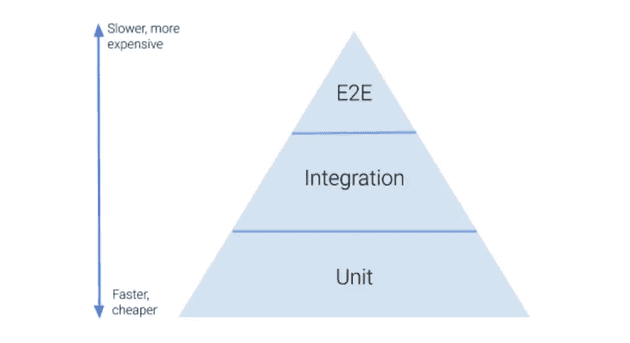
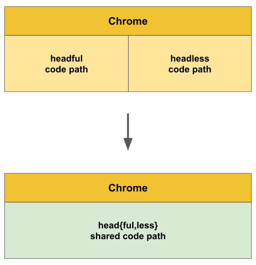
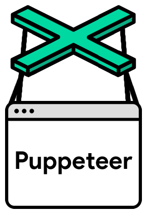

# 4. Playwright

## [💡 E2E(End to End) Test](https://fe-developers.kakaoent.com/2023/230209-e2e/)

E2E 테스트는 End To End 테스트의 약자로 애플리케이션의 흐름을 처음부터 끝까지 테스트하는 것을 의미한다. 유닛 테스트나 통합 테스트는 모듈의 무결성을 증명할 수 있는 강력한 테스트이지만, 모듈의 무결성이 애플리케이션 동작의 무결성까지는 증명해 줄 수 없다. 그래서 E2E 테스트 과정에서는 실제 사용자의 시나리오를 테스트함으로써 애플리케이션 동작을 테스트하게 되고, 이 테스트를 통과함으로써 애플리케이션의 무결성을 증명할 수 있게 된다.



다만 사용자의 시나리오를 검증한다는 것은 그만큼 테스트 과정이 길고 다양하다는 것을 의미한다. 위 그림은 단계별 테스트의 비중과 비용에 대해서 잘 나타내주는 테스트 피라미드라는 그림이다. 테스트 비용에 따라 E2E 테스트 10%, 통합 테스트 30%, 유닛 테스트 60% 와 같이 비중을 조절해야 한다는 의미이다. 물론 이는 테스트를 관리하는 데 사용되는 수많은 이론 중 하나일 뿐이지만(실제로는 모래시계형처럼 통합테스트가 제일 적은 경우도 발생합니다), E2E 테스트는 비용이 많이 드는 만큼 꼭 필요한 테스트만 수행해야 한다는 사실에는 대부분 이견이 없을 듯 하다.

## [💡 Headless Chrome](https://developer.chrome.com/articles/new-headless/)

2017년에 Chrome 59에는 눈에 보이는 UI 없이 무인 환경에서 브라우저를 실행할 수 있는 이른바 'Headless Mode'가 도입되었다. 한마디로 크롬 없이 크롬을 실행하는 것이다!

Headless Mode는 Puppeteer나 ChromeDriver와 같은 프로젝트를 통한 브라우저 자동화에 널리 사용된다. 다음은 헤드리스 모드를 사용하여 주어진 URL의 PDF 파일을 만드는 최소한의 명령줄 예제이다.

```bash
chrome --headless --print-to-pdf https://developer.chrome.com/
```

최근의 headless 개선 사항을 살펴보기 전에 "이전" headless가 어떻게 작동했는지 이해하는 것이 중요하다. 앞서 보여준 명령줄 스니펫은 `--headless` 명령줄 플래그를 사용하여 headless가 일반 Chrome 브라우저의 작동 모드일 뿐이라는 것을 암시한다. 놀랍게도 이것은 사실이 아니다. 엄밀히 말해, 이전 headless는 동일한 Chrome 바이너리의 일부로 제공된 별도의 대체 브라우저 구현이었다. 이 브라우저는 `//chrome`에서 Chrome 브라우저 코드를 공유하지 않습니다.

상상할 수 있듯이 별도의 headless 브라우저를 구현하고 유지 관리하려면 많은 엔지니어링 오버헤드가 발생했지만 이것이 유일한 문제는 아니었다. headless는 별도의 구현이었기 때문에 headless 크롬에는 없는 자체 버그와 기능이 있었다. 이로 인해 자동화된 브라우저 테스트가 headful 모드에서는 통과하지만 headless 모드에서는 실패하거나 그 반대의 경우가 발생하는 혼란스러운 상황이 발생했으며, 이는 자동화 엔지니어에게 큰 골칫거리였다. 또한, 예를 들어 브라우저 확장 프로그램 설치에 의존하는 자동화 테스트는 모두 제외되었다. 다른 브라우저 수준의 기능도 마찬가지다. headless에 별도의 구현이 없는 한 지원되지 않았다.

2021년에 Chrome 팀은 이 문제를 해결하고 headless와 headful 모드를 완전히 통합하기 시작했다.



이제 Chrome 112에서 새로운 headless 모드를 사용할 수 있다. 이 모드에서는 Chrome이 플랫폼 창을 만들지만 표시하지 않는다. 다른 모든 기존 및 향후 기능은 제한 없이 사용할 수 있다.

## [💡 Puppeteer](https://developer.chrome.com/docs/puppeteer/)



Puppeteer는 개발자 도구 프로토콜을 통해 headless 크롬 또는 크롬을 제어할 수 있는 하이레벨 API를 제공하는 노드 라이브러리이다. full(headless가 아닌) Chrome 또는 Chromium을 사용하도록 구성할 수도 있다.

### What can I do?

브라우저에서 수동으로 할 수 있는 대부분의 작업은 퍼펫티어를 사용하여 수행할 수 있다! 다음은 시작하는 데 도움이 되는 몇 가지 예시이다.

- 페이지의 스크린샷 및 PDF 생성.
- SPA(단일 페이지 애플리케이션)를 크롤링하여 미리 렌더링된 콘텐츠("SSR"(서버 측 렌더링))를 생성한다.
- 양식 제출, UI 테스트, 키보드 입력과 같은 작업을 자동화한다.
- 자동화된 최신 테스트 환경을 구축하라. 최신 자바스크립트 및 브라우저 기능을 사용하여 최신 버전의 Chrome에서 직접 테스트를 실행할 수 있다.
- 사이트의 타임라인 추적을 캡처하여 성능 문제를 진단할 수 있다.
- Chrome 확장 프로그램 테스트.

## 💡 Playwright

```bash
웹 브라우저 기반 E2E 테스트 자동화 도구.
Headless Chrome을 기반으로 한 Puppeteer를 계승하면서, 더 많은 웹 브라우저를 지원한다.
```

### [Playwright](https://playwright.dev/)

Playwright를 사용하면 최신 웹 앱에 대한 안정적인 end-to-end 테스트를 수행할 수 있다.

Playwright 테스트는 end-to-end 테스트의 요구 사항을 수용하기 위해 특별히 제작되었다. Playwright는 Chromium, WebKit, Firefox를 포함한 모든 최신 렌더링 엔진을 지원한다. 로컬 또는 CI, 헤드리스 또는 안드로이드 및 모바일 사파리용 구글 크롬의 네이티브 모바일 에뮬레이션을 통해 Windows, Linux, macOS에서 테스트할 수 있다.

### [Playwright Configuration](https://playwright.dev/docs/test-configuration)

Playwright에는 테스트 실행 방식을 구성할 수 있는 다양한 옵션이 있다. 이러한 옵션은 구성 파일에서 지정할 수 있다. test runner options는 top-level이므로 `use` section에 넣지 말 것!

### [Ashal의 Playwright](https://github.com/ahastudio/til/blob/main/test/playwright.md)

### [https://github.com/microsoft/playwright](https://github.com/microsoft/playwright)

Playwright는 웹 테스트 및 자동화를 위한 프레임워크이다. 이 프레임워크를 사용하면 단일 API로 Chromium, Firefox 및 WebKit을 테스트할 수 있다. Playwright는 항상 친환경적이고, 성능이 뛰어나며, 안정적이고, 빠른 크로스 브라우저 웹 자동화를 지원하도록 제작되었다.

### [Microsoft Announces Playwright Alternative to Puppeteer](https://www.infoq.com/news/2020/01/playwright-browser-automation/)

Microsoft, Puppeteer를 대체할 Playwright 발표

Playwright는 단일 API를 통해 Chromium, Firefox 및 WebKit 기반 브라우저를 자동화하기 위해 Microsoft에서 시작한 오픈 소스 Node.js 라이브러리이다. Playwright의 주요 목표는 자동화된 UI 테스트를 개선하는 것이다.

Playwright는 Puppeteer와 임무가 비슷하지만 Puppeteer는 Chromium 기반 브라우저만 지원한다. Playwright 팀의 설명에 따르면

```bash
저희는 원래 구글에서 Puppeteer를 만들었던 팀과 같은 팀이지만, 그 이후 다른 곳으로 옮겼습니다. Puppeteer는 항상 친환경적이고 유능하며 신뢰할 수 있는 차세대 자동화 드라이버에 대한 관심이 많다는 것을 증명했습니다. 이제 한 걸음 더 나아가 모든 인기 렌더링 엔진에 동일한 기능을 제공하고자 합니다. 또한, 벤더 중립적이고 공유 관리되는 Playwright가 되기를 바랍니다.
```

Playwright 팀은 Puppeteer를 통해 얻은 교훈과 도전 과제를 통해 더욱 테스트 친화적인 API를 만들기 위해 노력하고 있다.

또한, 브라우저 컨텍스트 추상화를 통해 클라우드 네이티브를 지향하여 브라우저 컨텍스트가 로컬에서 생성되거나 서비스로 제공될 수 있도록 한다.

Playwright 팀은 핵심 개념과 API의 유사성으로 인해 Puppeteer와 Playwright 간의 마이그레이션이 간단해야 한다고 믿는다.

또한 Playwright는 웹 자동화 및 테스트를 위한 현재 W3C 표준인 WebDriver의 대안이기도 하다. Playwright 팀은 Puppeteer가 WebDriver를 양방향 커뮤니케이션 채널로 유도함으로써 WebDriver 표준에 영향을 미쳤다고 언급한다. Playwright 팀은 추가 브라우저 기능 지원, 보다 인체공학적인 API, 테스트 안정성 향상 등 다양한 프로그레시브 웹 앱(PWA) 기능을 지원하기 위해 향후 WebDriver 표준을 형성하기를 희망한다.

Playwright는 Chromium의 업스트림 버전을 지원하며, npm 릴리스 주기를 Chromium 안정 채널 릴리스와 동기화할 계획이다.

웹킷을 지원하기 위해 Playwright는 웹코어와 웹킷2를 수정하여 웹킷의 원격 디버깅 기능과 Playwright API를 확장한다. 팀은 이러한 변경을 통해 WebKit의 업스트림 버전에 의존하는 대신 WebKit에서 이러한 변경을 수행하기를 희망한다.

또한 Playwright는 콘텐츠 스크립트 디버깅, 워커, CSP, 에뮬레이션, 네트워크 차단 등과 같은 기능을 위해 Firefox를 수정한다. WebKit과 마찬가지로 Playwright 팀은 이러한 변경 사항을 곧 Firefox에 적용하기를 희망한다.

Playwright는 Windows, macOS, Linux에서 각 브라우저 엔진을 지원한다. 헤드리스 모드는 지원되는 모든 브라우저와 플랫폼에서 사용할 수 있다.

Playwright는 Apache 2 라이선스에 따라 제공되는 오픈 소스 소프트웨어이다. Microsoft 행동 강령에 따라 Playwright 기여 가이드라인을 통해 기여를 환영한다.

## 💡 CodeceptJS

인간 친화적인 E2E 테스팅 도구로 CodeceptJS가 있다.

### [CodeceptJS](https://codecept.io/)  

CodeceptJS는 오픈소스 MIT 라이선스 테스트 프레임워크이다.

### [CodeceptJS 3 시작하기](https://github.com/ahastudio/til/blob/main/test/20201207-codeceptjs.md)

단위 테스트만으로는 시스템이 올바르게 작동하는지 알 수 없고, 사용자가 유용하게 사용할 수 있는지 미리 정의하는 것도 쉽지 않다. 결정적으로, 사용자(또는 고객)와 소통하기 위한 교차점이 마련되지 않는다. 따라서 우리에겐 인수 테스트가 필요하다.  
인수 테스트는 여러 방식으로 작성할 수 있다. 최근에 가장 인기 있는 E2E 테스트를 CodeceptJS로 시작해 볼 수 있다.

CodeceptJS의 가장 큰 장점은 JavaScript를 DSL처럼 활용하고 있기 때문에 프로그래머가 아니라도 작성 또는 검토가 가능하다는 점이다. 누군가에게 완전히 떠넘기지 말고, 협력적으로 인수 테스트를 작성하면 우리가 함께 만들고 있는 게 어떤 건지 명확히 공유할 수 있을 것이다.

### [CodeceptJS 사용](https://github.com/ahastudio/CodingLife/tree/main/20211012/react#codeceptjs-사용)
