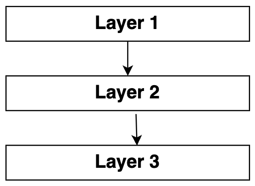

# 1. External Store

## [💡 관심사의 분리(separation of concerns, SoC)](https://ko.wikipedia.org/wiki/%EA%B4%80%EC%8B%AC%EC%82%AC_%EB%B6%84%EB%A6%AC)

```text
하나의 시스템은 작은 부품이 모여서 만들어진다. 우리는 이미 작은 컴포넌트를 합쳐서 더 큰 컴포넌트를 만드는 방식으로 개발하고 있다.

어떤 기준을 사용할 수 있을까? 흔히 사용되는 Layered Architecture에선 사용자에게 가까운 것과 사용자에게서 먼 것으로 구분한다. 가장 가까운 건 UI를 다루는 부분, 그 다음엔 Business Logic을 다루는 부분, 그 너머에는 데이터에 접근하고 저장하는 부분으로 나눌 수 있게 된다. 각 부분은 하나의 역할, 하나의 관심사로 격리됨으로써 복잡도를 낮추게 된다.

거대한 프로그램이 아니라고 해도 흔히 Input → Process → Output이란 3단계로 코드를 적절히 구분만 해도 코드를 이해하고 유지보수하는데 크게 도움이 된다. 하나의 Output은 다시 사용자에게 Input을 요청하게 되고, 일반적인 프로그램은 다음과 같이 계속 순환하는 구조가 된다.

1. Input: 프로그램 시작
2. Process: 프로그램 초기화
3. Output: 사용자에게 초기 UI 보여주기
4. Input: 사용자의 입력
5. Process: 사용자의 입력에 따라 처리
6. Output: 처리 결과 보여주기
7. Input: 사용자의 또 다른 입력
8. …반복…

널리 알려진 MVC로 거칠게 매핑하면 다음과 같다.

- Model → Process
- View → Output
- Controller → Input
```

### 1. 용어의 정의(정확한 정의)

컴퓨터 프로그램을 구별된 부분으로 분리시키는 디자인 원칙으로, 각 부문은 개개의 관심사를 해결한다.

### 2. 역사 또는 왜 필요한가/왜 생겼는가

관심사를 분리하여 코드를 작성하게 되면, 독립된 특정 기능에 집중할 수 있기 때문에 코드를 파악하는데 수월하며 특정 기능을 변경하거나 추가할 때도 그 부분만 교체하면 되기 때문에 훨씬 간단하게 문제를 해결할 수 있다.

### 3. 특징 (또는 장/단점)

#### 장점

관심사 분리를 이용하면 프로그램의 설계, 디플로이, 이용의 일부 관점에 더 높은 정도의 자유가 생긴다. 이 가운데 일반적인 것은 코드의 단순화 및 유지보수의 더 높은 수준의 자유이다. 관심사가 잘 분리될 때 독립적인 개발과 업그레이드 외에도 모듈 재사용을 위한 더 높은 정도의 자유가 있다. 모듈이 인터페이스 뒤에서 이러한 관심사의 세세한 부분을 숨기기 때문에 자유도가 높아짐으로써 다른 부분의 세세한 사항을 모르더라도, 또 해당 부분들에 상응하는 변경을 취하지 않더라도 하나의 관심사의 코드 부분을 개선하거나 수정할 수 있게 된다. 또, 모듈은 각기 다른 버전의 인터페이스를 노출할 수 있으며, 이를 통해 중간의 기능 손실 없이 단편적인 방식으로 복잡한 시스템을 업그레이드하는 자유도를 높여준다.

#### 단점

관심사 분리는 추상화의 일종이다. 대부분의 추상화에서처럼 인터페이스의 추가는 필수이며 실행에 쓰이는 더 순수한 코드가 있는 것이 일반적이다. 그러므로 잘 분리된 관심사의 여러 장점에도 불구하고 관련 실행에 따른 불이익이 있기도 하다.

### 4. 사용방법 또는 사용 경험

관심사의 분리는 정보를 잘 정의된 인터페이스가 있는 코드 부분 안에 캡슐화시킴으로써 달성한다.

### 5. 개인적인 생각(추가적인 질문 또는 인사이트)

### 6. 레퍼런스 모음

> [관심사 분리](https://ko.wikipedia.org/wiki/%EA%B4%80%EC%8B%AC%EC%82%AC_%EB%B6%84%EB%A6%AC)  
> [더 나은 객체지향 개발을 위한 아이디어: 관심사의 분리부터 제어의 역전까지](https://teamdable.github.io/techblog/SoC-to-IoC)

## [💡 Layered Architecture](https://www.baeldung.com/cs/layered-architecture)



### 1. 용어의 정의(정확한 정의)

소프트웨어 개발에서 가장 일반적이고 널리 사용되는 아키텍처 프레임워크다. Layered architecture는  n-tier architecture라고도 하며, 하나의 소프트웨어 단위로 함께 작동하는 여러 개의 개별 수평 계층으로 구성된 아키텍처 패턴을 설명한다. 계층은 구성 요소 또는 코드를 논리적으로 분리한 것이다. 이러한 프레임워크에서는 관련성이 있거나 유사한 구성 요소가 일반적으로 동일한 레이어에 배치된다. 그러나 각 계층은 서로 다르며 전체 시스템의 다른 부분에 기여한다.

### [2. 역사 또는 왜 필요한가/왜 생겼는가](https://herbertograca.com/2017/08/03/layered-architecture/)

2000년 훨씬 이전에 만들어진 이 아키텍처는 그 무렵 웹 애플리케이션에서 널리 사용되기 시작했다.

### 3. 특징 (또는 장/단점)

#### 특징

- 이 프레임워크의 가장 큰 특징은 레이어가 바로 아래 레이어에만 연결된다는 것이다. 앞선 그림에서 레이어 1은 레이어 2에만 연결되고, 레이어 2는 레이어 3에 연결되며, 레이어 1은 레이어 2를 통해서만 레이어 3에 연결된다.

- 또 다른 특징은 격리 레이어라는 개념이다. 즉, 레이어를 수정할 수 있으며 변경 사항이 다른 레이어에 영향을 미치지 않는다. 즉, 변경 사항은 변경되는 특정 레이어에만 격리된다.

- 단일 레이어의 모듈이 함께 하나의 기능을 수행하는 방식이라는 점도 특징이다.

#### 장점

- 간단하고 배우고 구현하기에 쉽다.
- 각 레이어의 기능이 다른 레이어와 분리되어 있기 때문에 의존성이 줄어든다.
- 분리된 구성 요소로 인해 테스트가 더 쉬우며, 각 구성 요소를 개별적으로 테스트할 수 있다.
- 비용 오버헤드가 상당히 낮다.

#### 단점

- 프레임워크의 구조가 성장을 허용하지 않기 때문에 확장이 어렵다.
- 유지 관리가 어려울 수 있다. 단일 레이어가 단일 단위로 작동하기 때문에 단일 레이어의 변경이 전체 시스템에 영향을 미칠 수 있다.
- 한 레이어가 데이터를 수신하기 위해 그 위에 있는 레이어에 의존하기 때문에 레이어 간에 상호 의존성이 있다.
- 병렬 처리가 불가능하다.

### 4. 사용방법 또는 사용 경험 (레이어드 아키텍쳐를 언제 사용하면 좋을까?)

간단한 소규모 애플리케이션을 개발할 때는 계층형 아키텍처가 가장 간단한 프레임워크이므로 이를 구현하는 것이 좋다. 그러나 일부 개발자는 유지 관리가 어려울 수 있으므로 대규모 프로젝트에 적용하는 것이 더 낫다는 의견을 가지고 있다.
그럼에도 불구하고 프레임워크는 학습과 구현이 쉽기 때문에 빠르게 구축해야 하는 애플리케이션에 사용할 수 있다. 또한 개발자가 소프트웨어 아키텍처에 대한 지식이 많지 않거나 어떤 아키텍처를 사용할지 결정하지 못한 경우에도 유용하다.

### 5. 개인적인 생각(추가적인 질문 또는 인사이트)

### 6. 레퍼런스 모음

> [Layered Architecture
](https://www.baeldung.com/cs/layered-architecture)  
> [Layered Architecture
](https://herbertograca.com/2017/08/03/layered-architecture/)  
> [A brief history of application architecture (of the 21st century)](https://dev.to/ib1/a-brief-history-of-application-architecture-of-the-21st-century-23d4)

## 💡 Flux Architecture

```text
Facebook(현 Meta)에서 MVC의 대안으로 내세운 아키텍처. 2-way binding을 썼을 때 생길 수 있는 Model-View의 복잡한 관계(전통적인 MVC에선 이런 상황을 지양한다)를 겨냥해 명확히 “unidirectional data flow”를 강조한다.

1. Action → 이벤트/메시지 같은 객체.
2. Dispatcher → (여러) Store로 Action을 전달. 메시지 브로커와 유사하다.
3. Store (여러 개) → 받은 Action에 따라 상태를 변경. 상태 변경을 알림.
4. View → Store의 상태를 반영.

Redux는 단일 Store를 사용함으로써 좀 더 단순한 그림을 제안한다.

1. Action
2. Store → dispatch를 통해 Action을 받고, 사용자가 정의한 reducer를 통해 State를 변경한다.
3. View → State를 반영.

Action을 어떻게 표현하느냐가 사용성에 큰 차이를 만든다. 하지만 상태를 UI에 반영하는 방법은 모두 동일하다.

3단계 프로세스와 거칠게 매핑하면 다음과 같다.

- Input → Action + dispatch
- Process → reducer
- Output → View(React)
```

### 1. 용어의 정의(정확한 정의)

### 2. 역사 또는 왜 필요한가/왜 생겼는가

### 3. 특징 (또는 장/단점)

### 4. 사용방법 또는 사용 경험

### 5. 개인적인 생각(추가적인 질문 또는 인사이트)

### 6. 레퍼런스 모음

> [Flux](https://facebook.github.io/flux/docs/in-depth-overview/)  
> [Flux (한국어)](https://haruair.github.io/flux/docs/overview.html)  
> [Redux의 핵심](https://ko.redux.js.org/tutorials/essentials/part-1-overview-concepts)  

## 💡 useReducer

### 1. 용어의 정의(정확한 정의)

### 2. 역사 또는 왜 필요한가/왜 생겼는가

### 3. 특징 (또는 장/단점)

### 4. 사용방법 또는 사용 경험

### 5. 개인적인 생각(추가적인 질문 또는 인사이트)

### 6. 레퍼런스 모음

> [forceUpdate와 같은 것이 있습니까?](https://ko.legacy.reactjs.org/docs/hooks-faq.html#is-there-something-like-forceupdate)

## 💡 useCallback

### 1. 용어의 정의(정확한 정의)

### 2. 역사 또는 왜 필요한가/왜 생겼는가

### 3. 특징 (또는 장/단점)

### 4. 사용방법 또는 사용 경험

### 5. 개인적인 생각(추가적인 질문 또는 인사이트)

### 6. 레퍼런스 모음
