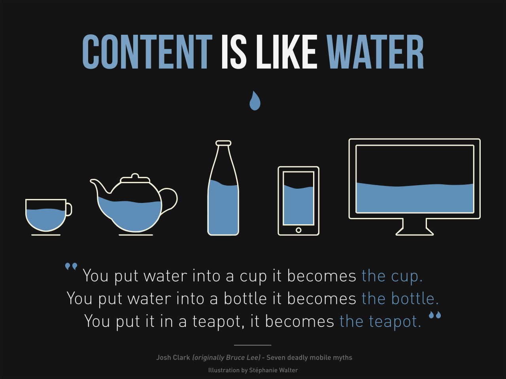
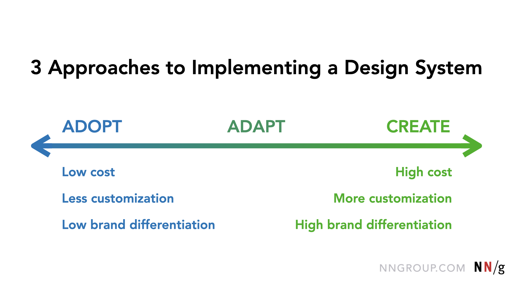

# 1. Design System

## 💡 반응형 웹 디자인(Responsive web design)

### 1. 용어의 정의(정확한 정의)

반응형 웹 디자인(responsive web design, RWD)이란 하나의 웹사이트에서 PC, 스마트폰, 태블릿 PC 등 접속하는 디스플레이의 종류에 따라 화면의 크기가 자동으로 변하도록 만든 웹페이지 접근 기법을 말한다.

### 2. 역사 또는 왜 필요한가/왜 생겼는가

브라우저 뷰포트 너비에 순응하는 레이아웃을 구현한 최초의 사이트는 2001년에 런칭한 Audi.com이다.

### 3. 특징 (또는 장/단점)

웹사이트를 PC용과 모바일용으로 각각 별개로 제작하지 않고, 하나의 공용 웹사이트를 만들어 다양한 디바이스에 대응할 수 있다. PC용 URL과 모바일용 URL이 동일하기 때문에 검색 포털 등 광고를 통한 사용자 접속을 효율적으로 관리할 수 있다. 또한 웹 페이지 내용을 수정할 경우, 하나의 페이지만 수정하면 PC와 모바일 등 다양한 디바이스에서 동일하게 반영된다.

반응형 웹의 핵심 기술은 가변 그리드(fluid grid), 유연한 이미지(flexible images), 미디어 쿼리(media query)이다.

반대말은 디바이스별로 별도의 웹사이트를 제작하는 적응형 웹(adaptive web)이다.

### 4. 사용방법 또는 사용 경험

### 5. 개인적인 생각(추가적인 질문 또는 인사이트)

### 6. 레퍼런스 모음

> [반응형 웹 디자인](https://ko.wikipedia.org/wiki/%EB%B0%98%EC%9D%91%ED%98%95_%EC%9B%B9_%EB%94%94%EC%9E%90%EC%9D%B8)

## [💡 디자인 시스템(Design System)](https://www.nngroup.com/articles/design-systems-101/)

### 1. 용어의 정의(정확한 정의)

디자인 시스템은 재사용 가능한 구성 요소와 패턴을 사용하여 대규모로 디자인을 관리하기 위한 완전한 표준 세트이다.

### 2. 역사 또는 왜 필요한가/왜 생겼는가

UI 디자인이 수년에 걸쳐 발전함에 따라 UI 화면을 만들어야 하는 규모와 속도도 증가했다. 수백만 개의 애플리케이션과 수십억 개의 웹사이트(매년 더 많이 생성됨)가 존재할 뿐만 아니라 각 앱과 웹사이트에는 수백, 수천 개의 페이지(또는 화면)가 있을 수 있다. 이러한 급격한 확장으로 인해 조직은 디자인 작업을 간소화해야 할 필요성이 절실히 요구되고 있다. 따라서 많은 디자인 팀이 대규모 디자인을 관리하기 위해 강력한 디자인 시스템을 활용한다.

### 3. 특징 (또는 장/단점)

#### 왜 디자인 시스템을 사용해야 할까? (장점)

- 디자인(및 개발) 작업을 대규모로 신속하게 생성하고 복제할 수 있다.
- 디자인 리소스에 대한 부담을 덜어 더 크고 복잡한 문제에 집중할 수 있다.
- 여러 부서로 구성된 팀 내부와 팀 간에 통일된 언어가 만들어진다.
- 제품, 채널 및 (잠재적으로 사일로화된) 부서 간에 시각적 일관성을 유지합니다.
- 주니어급 디자이너와 콘텐츠 기여자를 위한 교육 도구 및 참고 자료로도 활용할 수 있다.

#### 디자인 시스템을 사용하지 않는 이유는 무엇일까?

- 디자인 시스템을 만들고 유지 관리하는 일은 전담 팀이 필요한 시간 집약적인 활동이다.
- 다른 사람들에게 디자인 시스템 사용법을 가르치는 데는 시간이 걸린다.
- 프로젝트는 일반적으로 재사용 가능한 구성 요소가 필요하지 않은 정적이고 일회성 창작물이라는 인식이 있을 수 있다.

### 4. 사용방법 또는 사용 경험

- 기존 디자인 시스템 채택
- 기존 디자인 시스템 조정
- 나만의 독점 또는 맞춤형 디자인 시스템 만들기

각각의 장단점이 있지만 일반적으로 디자인 시스템 솔루션이 맞춤화될수록 구현하는 데 더 많은 시간과 비용이 소요된다. 따라서 기존 디자인 시스템을 사용하는 것이 가장 비용이 적게 들고 구현하는 데 시간이 가장 적게 걸리는 방법이다. (하지만 일부 UI 요소를 교체하거나 업데이트하고 표준에 합의해야 하므로 기존대로 디자인을 계속하는 경우보다 더 많은 시간이 필요하다.)

오픈 소스 디자인 시스템으로는 충족할 수 없는 특별한 요구 사항이 있는 조직이라면 커스텀 디자인 시스템에 투자할 가치가 있다. 디자인 시스템에 대한 사용자 지정 및 조정이 증가함에 따라 기존 디자인 시스템을 사용함으로써 얻을 수 있는 비용 절감 효과가 줄어들고 장기적으로는 자체 디자인 시스템을 만드는 것이 더 나을 수 있다. 디자인 시스템 구축에 착수하기 전에 조직에 필요한 것이 무엇인지 파악하고 장단점을 평가해야 한다.

마지막으로, 개념 증명이나 변경 가능성이 있는 초기 프로토타입의 경우, 본격적인 디자인 시스템을 만드는 것은 단기간에 바람직한 ROI를 창출하지 못할 수 있다. 결국 이점은 미래의 디자인 복제 가능성이다. 처음부터 이러한 시스템을 구축하고 싶을 수도 있지만, 디자인 시스템은 작업 포트폴리오가 아니라 디자이너와 개발자가 더 빠르게 작업할 수 있는 기능적인 툴킷 또는 리소스로 생각해야 한다는 점을 명심해야 한다. 디자인 시스템의 유용성에 의문이 든다면 디자인 작업을 평가하는 데 사용할 기간을 고려하는 것이 좋다. 디자인 시스템은 회사가 향후 수년간의 복제 가능한 디자인 작업을 예측할 때 가장 좋다.

### 5. 개인적인 생각(추가적인 질문 또는 인사이트)

### 6. 레퍼런스 모음

> [Laura Kalbag의 “Design Systems” 소개](https://24ways.org/2012/design-systems/)  
> [Laura Kalbag의 “Design Systems” 슬라이드](https://speakerdeck.com/laurakalbag/design-systems-1)  
> [Nielsen Norman Group의 “Design Systems 101”](https://www.nngroup.com/articles/design-systems-101/)

## [💡 Atomic Design](https://yoojungs-organization.gitbook.io/frontend-survival/week3/1.reactComponent#atomic-design)

### 1. 용어의 정의(정확한 정의)

우리가 잘 알고 있는 계층형 구조를 몇 가지 카테고리로 묶은 방법
디자인 시스템을 만드는 방법론

### 2. 역사 또는 왜 필요한가/왜 생겼는가

웹 디자인 기술이 계속 발전함에 따라 단순한 웹 페이지 모음을 만드는 것이 아니라 사려 깊은 디자인 시스템을 개발해야 할 필요성을 인식하고 있다.

디자인 시스템을 만드는 것에 대해 많은 이야기가 나왔고, 그 대부분은 색상, 타이포그래피, 그리드, 텍스처 등의 기초를 확립하는 데 초점을 맞추고 있다. 이러한 사고방식은 분명 중요하지만, 궁극적으로 이러한 측면은 항상 주관적일 수밖에 없기 때문에 이러한 측면에 관심이 조금 적다. 최근에는 인터페이스를 구성하는 요소와 보다 체계적인 방식으로 디자인 시스템을 구축하는 방법에 더 관심이 많다.

영감과 유사점을 찾다 보니 계속 화학으로 돌아왔다. 모든 물질(고체, 액체, 기체, 단순, 복합 등)은 원자로 구성되어 있다는 생각이다. 이러한 원자 단위가 서로 결합하여 분자를 형성하고, 이 분자는 다시 더 복잡한 유기체로 결합하여 궁극적으로 우주의 모든 물질을 만들어낸다.

마찬가지로 인터페이스는 더 작은 구성 요소로 이루어져 있다. 즉, 전체 인터페이스를 기본적인 구성 요소로 분해하고 거기서부터 작업할 수 있다. 이것이 atomic design의 기본 요지다.

#### why atomic design

atomic 디자인은 디자인 시스템을 만들기 위한 명확한 방법론을 제공한다. 고객과 팀원들은 눈앞에 펼쳐진 단계를 실제로 보면서 디자인 시스템의 개념을 더 잘 이해할 수 있다.

atomic design은 추상적인 것에서 구체적인 것으로 넘어갈 수 있는 능력을 제공한다. 따라서 일관성과 확장성을 촉진하는 동시에 최종 context에서 사물을 보여주는 시스템을 만들 수 있다. 또한 분해가 아닌 조립을 위해 사후에 패턴을 고르는 대신 처음부터 시스템을 제작하고 있다.

### 3. 특징 (또는 장/단점)

atomic design에는 다섯 가지 레벨이 있다.

1. Atoms (원자)
2. Molecules (분자)
3. Organisms (유기체)
4. Templates (템플릿)
5. Pages (페이지)

### 4. 사용방법 또는 사용 경험

### 5. 개인적인 생각(추가적인 질문 또는 인사이트)

### 6. 레퍼런스 모음

> [Atomic Design 소개 글](https://bradfrost.com/blog/post/atomic-web-design/)  
> [Atomic Design 전자책](https://atomicdesign.bradfrost.com/)
