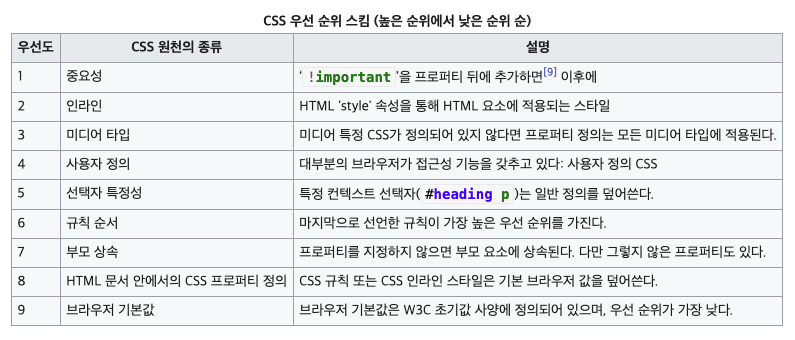

# 3. CSS in JS

## [💡 CSS in JS 란](https://en.wikipedia.org/wiki/CSS-in-JS)

### 1. 용어의 정의(정확한 정의)

CSS-in-JS는 자바스크립트를 사용하여 컴포넌트의 스타일을 지정하는 스타일링 기법이다.

### 2. 역사 또는 왜 필요한가/왜 생겼는가

### 3. 특징 (또는 장/단점)

자바스크립트가 구문 분석되면 CSS가 생성되어(보통 `<style>` 요소로) DOM에 첨부된다. 이를 통해 CSS를 컴포넌트 수준 자체로 추상화할 수 있으며, JavaScript를 사용하여 선언적이고 유지 관리 가능한 방식으로 스타일을 설명할 수 있다.

CSS-in-JS를 통해 얻을 수 있는 일부 결과는 기존 CSS 기술로는 얻을 수 없다. 몇 개의 조건문만으로 스타일을 동적으로 만들 수 있다. 또한 프로그래머는 프로그래머의 JavaScript와 동일한 블록에 CSS를 캡슐화하여 해당 모듈로만 범위를 지정하는 등 보다 모듈화된 코드를 작성할 수도 있다.

#### CSS-in-JS를 사용하면 무슨 장점이 있나요?

- 컴포넌트로 생각하기 — 더 이상 스타일시트의 묶음을 유지보수 할 필요가 없다. CSS-in-JS는 CSS 모델을 문서 레벨이 아니라 컴포넌트 레벨로 추상화한다. (모듈성)
- CSS-in-JS는 JavaScript 환경을 최대한 활용하여 CSS를 향상시킨다.
- "진정한 분리 법칙" — 스코프가 있는 선택자로는 충분하지 않다. CSS에는 명시적으로 정의 하지 않은 경우, 부모 요소에서 자동으로 상속되는 속성이 있다. jss-isolate 플러그인 덕분에 JSS 규칙은 부모 요소의 속성을 상속하지 않는다.
- 스코프가 있는 선택자 — CSS는 하나의 전역 네임스페이스만 있다. 복잡한 애플리케이션 내에서 선택자 충돌을 피할 수 없다. BEM과 같은 네이밍 컨벤션은 한 프로젝트 내에서는 도움이 되지만, 서드파티 코드를 통합할 때는 도움이 되지 않는다. JSS는 JSON으로 표현된 것을 CSS로 컴파일 할 때, 기본적으로 고유한 이름을 생성한다.
- 벤더 프리픽스 — 생성된 CSS 규칙은 자동적으로 벤더 프리픽스가 붙어있으므로 생각할 필요가 없다.
- 코드 공유 — JavaScript와 CSS사이에 상수와 함수를 쉽게 공유할 수 있다.
- 현재 화면에 사용중인 스타일만 DOM에 있다.(react-jss)
- 죽은 코드 제거
- CSS 유닛 테스트!

#### CSS-in-JS를 사용하면 무슨 단점이 있나요?

- 학습 곡선(Learning curve)
- 새로운 의존성
- 신규 팀원이 코드베이스에 적응하기 어렵게 만든다. 프론트엔드를 처음 접하는 사람들은 "더" 많은 것을 배워야한다.
- 현상 유지를 위한 도전 (꼭 단점은 아니다.)

장점이 단점을 크게 앞지른다— CSS-in-JS를 시도해보자! 잃을 것이 없다!

### 4. 사용방법 또는 사용 경험

이 개념은 다음과 같은 라이브러리 형태로 여러 가지 구현이 있다.

- Emotion
- Styled Components
- JSS
- Tailwind CSS

이러한 라이브러리를 사용하면 태그가 지정된 템플릿 리터럴을 사용하여 스타일이 지정된 컴포넌트를 만들 수 있다. 예를 들어, React 프로젝트에서 styled components를 사용하면 다음과 같이 보일 것이다.

```javaScript
import styled from 'styled-components';

// 파란색 텍스트가 있는 <p> 요소를 렌더링하는 컴포넌트를 만든다.
const BlueText = styled.p`
  color: blue;
`;

<BlueText>My blue text</BlueText>
```

### 5. 개인적인 생각(추가적인 질문 또는 인사이트)

### 6. 레퍼런스 모음

> [CSS-in-JS](https://en.wikipedia.org/wiki/CSS-in-JS)  
> [React: CSS in JS (2014)](https://blog.vjeux.com/2014/javascript/react-css-in-js-nationjs.html)  
> [A Unified Styling Language (2017)](https://blog.rhostem.com/posts/2017-06-24-unified-styling-language)  
> [All You Need To Know About CSS-in-JS (2017)](https://d0gf00t.tistory.com/22)  
> [Most popular CSS-in-JS libraries](https://npmtrends.com/aphrodite-vs-emotion-vs-glamorous-vs-jss-vs-radium-vs-styled-components-vs-styletron)  
> [CSS-in-JS와 성능 (2021)](https://hyeonseok.com/blog/877)
> [Why We're Breaking Up with CSS-in-JS (2022)](https://junghan92.medium.com/%EB%B2%88%EC%97%AD-%EC%9A%B0%EB%A6%AC%EA%B0%80-css-in-js%EC%99%80-%ED%97%A4%EC%96%B4%EC%A7%80%EB%8A%94-%EC%9D%B4%EC%9C%A0-a2e726d6ace6)

## 💡 CSS

### 1. 용어의 정의(정확한 정의)

종속형 시트 또는 캐스케이딩 스타일 시트(영어: Cascading Style Sheet)는 마크업 언어가 실제 표시되는 방법을 기술하는 스타일 언어(영어: Style sheet language 스타일 시트 랭귀지)로, HTML과 XHTML에 주로 쓰이며, XML에서도 사용할 수 있다. W3C의 표준이고, 레이아웃과 스타일을 정의할 때의 자유도가 높다. 기본 파일명은 style.css이다.

마크업 언어(ex: HTML)가 웹사이트의 몸체를 담당한다면 CSS는 옷과 액세서리처럼 꾸미는 역할을 담당한다고 할 수 있다. 즉, HTML 구조는 그대로 두고 CSS 파일만 변경해도 전혀 다른 웹사이트처럼 꾸밀 수 있다.

### 2. 역사 또는 왜 필요한가/왜 생겼는가

CSS는 1994년 10월 10일, 하콤 비움 리(Håkon Wium Lie)가 처음 제안하였다.

#### 버전의 변화

CSS는 지속적으로 새로운 버전이 나오고 있다. 1996년에 도입된 CSS 1은 CSS의 바탕이 되었다. CSS의 표준으로는 CSS 2.1이 있으며 이전 버전에 비하여 새로운 기능과 도구가 추가되었다. 대다수의 웹 브라우저는 CSS 3를 잘 지원한다. 현재 W3C에서는 CSS 3를 표준으로 만들고 있다.

CSS는 여러 수준과 프로파일을 가지고 있다. 각 수준의 CSS는 일반적으로 새로운 기능을 담고 있으며 CSS1, CSS2, CSS3, CSS4로 나뉜다. 프로파일들은 일반적으로 특정한 장치나 사용자 인터페이스를 위해 만들어진 하나 이상 수준의 CSS의 하부 집합이다. 현재 휴대용 장치, 프린터, 텔레비전 수상기를 위한 프로파일들이 있다.

CSS1  
첫 CSS 규격은 공식 W3C 권고안이 되었으며 그 이름은 CSS1이다. 1996년 12월에 발표되었다.

CSS2  
CSS2는 W3C가 개발하였으며 1998년 5월에 권고안으로 발표되었다.

CSS3  
CSS3는 2005년 12월 5일 이후 개발 중에 있다. W3C CSS3 로드맵은 요약과 도입부를 제공하고 있다. 전체가 모듈화되어 사용자 에이전트가 모듈에 대한 모든 모듈을 지원하지 않거나 자유롭게 선택할 수 있도록 하고 있으며, 다른 세로 글쓰기와 HTML 이외의 규격에까지 관여하는 내용으로 되어 있다. 현재 어떤 모듈도 권고안까지 이른 것은 없다.

CSS4  
하나의 통합된 CSS4 사양은 없는데, 이는 여러 개의 모듈로 나뉘어 있는데 기인한다. 그러나 "레벨 4" 모듈들이 존재한다.

### 3. 특징 (또는 장/단점)

CSS는 단순한 문법을 가지며, 수많은 영어 키워드를 사용하여 다양한 스타일의 프로퍼티의 이름을 규정한다.

스타일 시트는 규칙의 목록으로 구성된다. 각 규칙이나 규칙 집합은 하나 이상의 셀렉터와 하나의 선언 블록을 이룬다.

#### 선택자

CSS에서 선택자, 또는 셀렉터(영어: Selector)는 어느 부분의 마크업에 스타일을 적용할지 선언한다. 태그명(태그의 이름)과 클래스, ID로 선택할 수 있다. 클래스와 ID들은 대소문자를 구분하며 문자로 시작해야 하고 영숫자와 언더바(_)를 포함할 수 있다. 클래스는 어떠한 요소의 어떠한 수의 인스턴스에도 적용할 수 있으며, ID는 하나의 요소에만 적용할 수 있다. ID 값은 앞에 #이 붙고, 클래스 값은 앞에 .이 붙는다.

#### 선언 블록

선언 블록은 괄호로 이루어진 선언들의 목록으로 이루어진다. 각 선언은 그 자체가 프로퍼티, 쌍점(:), 값으로 구성된다. 한 블록 안에 여러 선언이 있으면, 쌍반점 (;, 세미콜론)이 개개의 각 선언에 삽입되어야 하며, 단 하나의 선언이라도 세미콜론을 넣지 않으면 동작하지 않는 경우도 있다.

#### 원천

CSS 정보는 다양한 원천으로부터 제공받을 수 있다. 이러한 원천으로는 웹 브라우저, 사용자, 제작자가 될 수 있다. 제작자로부터의 정보는 더 나아가 인라인, 미디어 타입, 중요성, 셀렉터 특정, 규칙 순서, 상속, 프로퍼티 정의로 분류될 수 있다. CSS 스타일은 별도의 문서에 있을 수 있고, HTML 문서에 직접 추가할 수도 있다. 사용하는 화면 크기, 다크 모드 설정, 화면 방향 등에 따라 다른 스타일을 적용할 수 있다.



### 4. 사용방법 또는 사용 경험

### 5. 개인적인 생각(추가적인 질문 또는 인사이트)

### 6. 레퍼런스 모음

> [CSS](https://ko.wikipedia.org/wiki/CSS)
